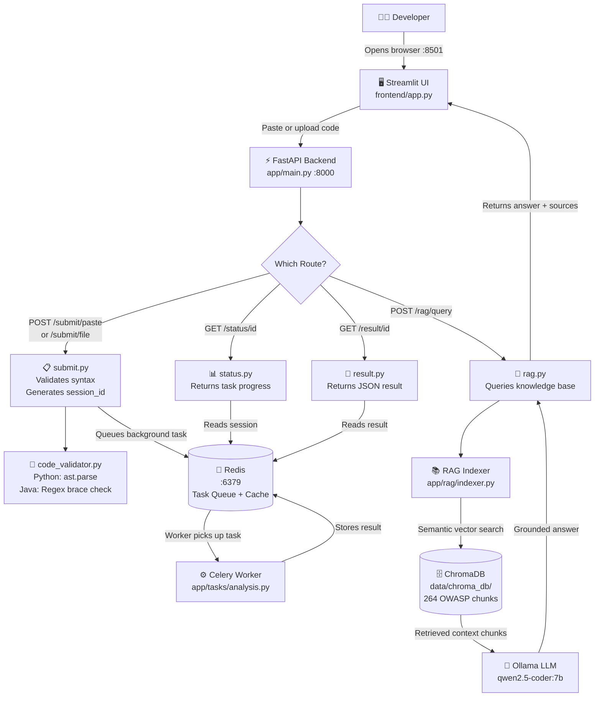

# 📁 Project Directory Structure — AI Code Review & Security Analysis Agent
### Milestone 1 — Complete File & Folder Reference

---

## 🗂️ Full Directory Tree

```
AI-Code-Review-Security-Analysis-Agent-Group2/
│
├── 📄 README.md                    # Main project documentation & setup guide
├── 📄 requirements.txt             # All Python package dependencies (pip install -r)
├── 📄 pyproject.toml               # Project metadata & tool configuration (pytest, linters)
├── 📄 uv.lock                      # Locked dependency versions for reproducible installs
├── 📄 .env.example                 # Template showing all required environment variables
├── 📄 .env                         # Your actual secrets/settings (⚠️ NOT pushed to GitHub)
├── 📄 .gitignore                   # Tells Git which files/folders to never push
│
├── 📁 .github/
│   └── 📁 workflows/
│       └── 📄 ci.yml               # GitHub Actions — auto-runs tests on every push
│
├── 📁 app/                         # 🏗️ Core FastAPI Backend Application
│   ├── 📄 main.py                  # App entry point — registers all routes, starts server
│   ├── 📄 config.py                # Reads .env variables into a typed Settings object
│   ├── 📄 celery_app.py            # Creates the Celery worker instance connected to Redis
│   │
│   ├── 📁 api/routes/              # HTTP API Layer (FastAPI Routers)
│   │   ├── 📄 health.py            # GET /health — checks if server is alive
│   │   ├── 📄 submit.py            # POST /submit/paste & /submit/file — receives code
│   │   ├── 📄 status.py            # GET /status/{id} — polls background job progress
│   │   ├── 📄 result.py            # GET /result/{id} — fetches completed analysis output
│   │   └── 📄 rag.py               # POST /rag/query — queries the OWASP knowledge base
│   │
│   ├── 📁 cache/                   # Session & Result Storage
│   │   ├── 📄 redis_cache.py       # Stores sessions/results in Redis (primary store)
│   │   └── 📄 memory_store.py      # In-memory fallback if Redis is not running
│   │
│   ├── 📁 llm/                     # LLM Provider Abstraction
│   │   └── 📄 factory.py           # Routes LLM calls to Ollama or Gemini based on .env
│   │
│   ├── 📁 models/                  # Pydantic Data Models (strict type contracts)
│   │   ├── 📄 session.py           # SubmissionRequest, SubmissionResponse, TaskStatus
│   │   ├── 📄 findings.py          # AnalysisFinding model (severity, line_number, etc.)
│   │   └── 📄 report.py            # FinalReport model (overall_score, findings list)
│   │
│   ├── 📁 rag/                     # RAG Pipeline (Retrieval-Augmented Generation)
│   │   └── 📄 indexer.py           # Loads OWASP docs → chunks → embeds → stores in ChromaDB
│   │
│   ├── 📁 tasks/                   # Celery Background Workers
│   │   └── 📄 analysis.py          # The background task that runs the analysis pipeline
│   │
│   └── 📁 utils/                   # Shared Utility Functions
│       ├── 📄 code_validator.py    # Validates Python (AST) and Java (regex) syntax
│       └── 📄 language_detector.py # Auto-detects if submitted code is Python or Java
│
├── 📁 frontend/                    # 🖥️ Streamlit Developer Portal UI
│   └── 📄 app.py                   # Full UI — tabs: Paste Code, Upload, History, Ask Assistant
│
├── 📁 data/                        # 📚 Local Data Storage
│   ├── 📁 knowledge_base/          # 12 OWASP Markdown security guideline documents
│   │   ├── 📄 sql_injection_prevention.md
│   │   ├── 📄 xss_prevention.md
│   │   ├── 📄 session_management.md
│   │   ├── 📄 input_validation.md
│   │   ├── 📄 cryptographic_storage.md
│   │   ├── 📄 deserialization_prevention.md
│   │   ├── 📄 logging.md
│   │   ├── 📄 query_parameterization.md
│   │   ├── 📄 owasp_top10_reference.md
│   │   ├── 📄 cwe_top25_reference.md
│   │   ├── 📄 asvs_v5_validation_encoding.md
│   │   └── 📄 asvs_v6_cryptography.md
│   │
│   └── 📁 chroma_db/               # ChromaDB vector store (264 embedded chunks)
│                                   # ⚠️ NOT pushed to GitHub — generated locally by build_index.py
│
├── 📁 scripts/                     # 🔧 One-Time Setup & Utility Scripts
│   ├── 📄 build_index.py           # Embeds knowledge_base docs into ChromaDB
│   ├── 📄 download_kb.py           # Downloads OWASP docs if not already present
│   └── 📄 test_rag.py              # CLI test — asks the RAG a question to verify it works
│
└── 📁 tests/                       # 🧪 Automated Test Suite
    ├── 📁 unit/
    │   ├── 📄 test_code_validator.py   # 15 tests for Python/Java syntax validation
    │   └── 📄 test_frontend.py         # Streamlit UI startup & session state tests
    └── 📁 integration/
        └── 📄 test_submit_api.py       # End-to-end tests for the /submit API endpoints
```

---

## 🔄 Runtime Flow Diagram



---

## 📦 Layer Summary Table

| Layer | Folder | Technology | Role |
|---|---|---|---|
| **Frontend** | `frontend/` | Streamlit | Developer UI — code input, results, RAG chat |
| **API** | `app/api/routes/` | FastAPI | HTTP endpoints — submit, status, result, RAG |
| **Config** | `app/config.py` | Pydantic Settings | Reads `.env` into typed Python objects |
| **Validation** | `app/utils/` | AST + Regex | Syntax checks before analysis is queued |
| **Cache** | `app/cache/` | Redis + In-Memory | Session storage with automatic fallback |
| **Task Queue** | `app/celery_app.py` | Celery + Redis | Runs analysis in background, non-blocking |
| **LLM Router** | `app/llm/factory.py` | Ollama / Gemini | Abstracts which AI model is used |
| **RAG** | `app/rag/indexer.py` | LlamaIndex + ChromaDB | Embeds OWASP docs, enables semantic search |
| **Data Models** | `app/models/` | Pydantic | Strict typed contracts between all layers |
| **Knowledge Base** | `data/knowledge_base/` | Markdown | 12 OWASP security guidelines (source docs) |
| **Vector Store** | `data/chroma_db/` | ChromaDB | 264 embedded mathematical vectors (local) |
| **Tests** | `tests/` | Pytest | Unit + integration automated tests |
| **Scripts** | `scripts/` | Python CLI | Setup tools (build index, test RAG) |
| **CI/CD** | `.github/workflows/` | GitHub Actions | Auto-tests every push to GitHub |

---

## 🏗️ Architectural Design Principles

### 1. The Gatekeeper Pattern (Fail-Fast)
We strictly enforce a **Gatekeeper Pattern** during the code submission phase. 
- **Rule:** If submitted code is in an unsupported language (via Magika ML) or contains syntax errors (via `javalang` / `ast`), the pipeline **must halt immediately**.
- **Reason:** We do *not* pass broken or unsupported code to the AI / LLM Agent layer (Celery queue). Sending invalid code to LLMs wastes API tokens, takes exponentially longer (10 seconds vs 1 millisecond), and severely degrades the quality of the AI's logic and security analysis.
- **Enforcement:** Validation happens instantly in both the Streamlit UI (for UX) and the FastAPI backend (`app/utils/code_validator.py`) before tasks are queued.

---

## 🔑 Quick Command Reference

| Task | Command |
|---|---|
| Start the backend | `uv run uvicorn app.main:app --reload` |
| Start the frontend | `uv run streamlit run frontend/app.py` |
| Build the RAG vector index | `uv run python scripts/build_index.py` |
| Test the RAG is working | `uv run python scripts/test_rag.py` |
| Run all automated tests | `uv run pytest tests/ -v` |
| Download OWASP docs | `uv run python scripts/download_kb.py` |
