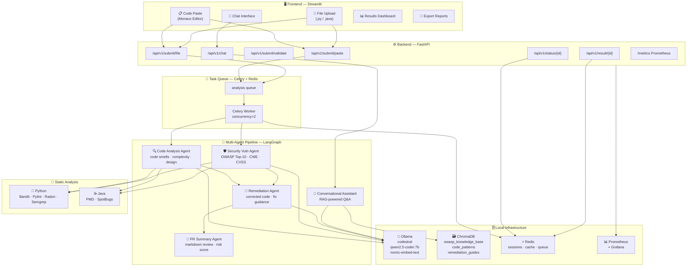
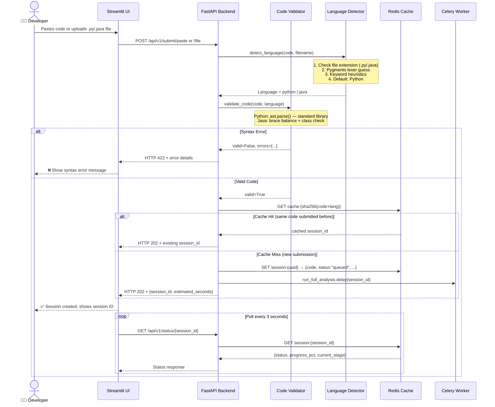
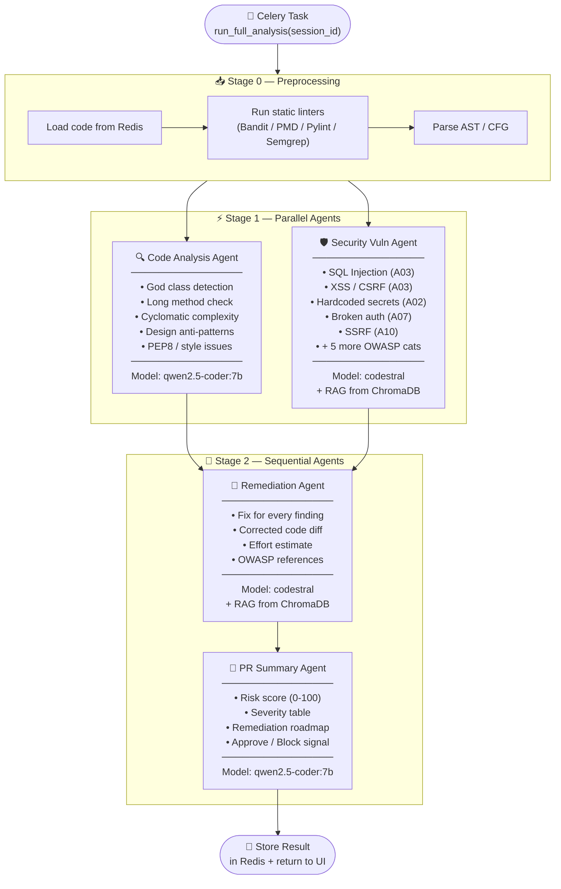
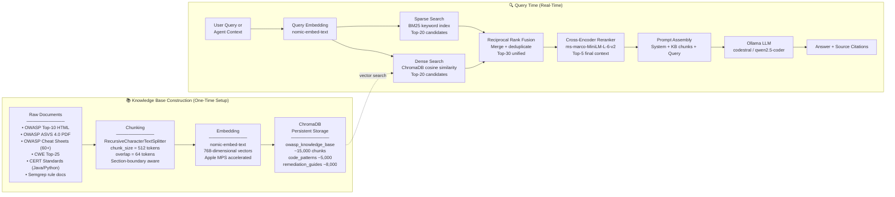
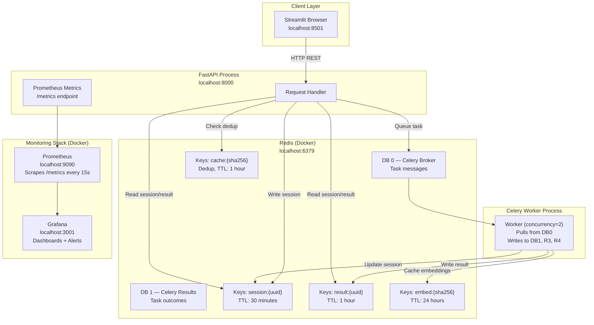
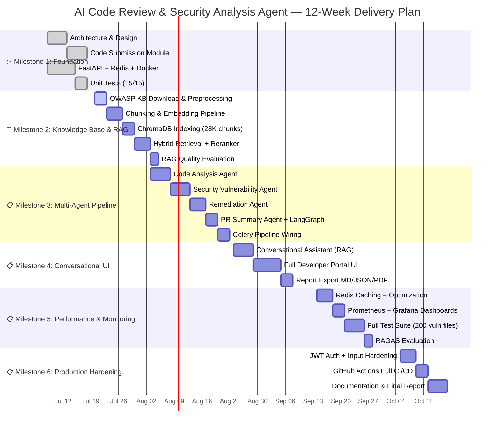

<div align="center">

# 🔍 AI Code Review & Security Analysis Agent

### A Production-Grade, Multi-Agent, RAG-Powered Platform for Automated Code Security and Quality Analysis

[](https://github.com/shubham0915/AI-Code-Review-Security-Analysis-Agent-Group2/actions)


> **100% Open-Source · Zero External API Cost · Runs Entirely on Apple M4**

---

### 🎯 One-Line Summary

> *Paste or upload Python/Java code → five AI agents automatically detect OWASP vulnerabilities, code smells, and generate corrected code — all powered by local LLMs with no cloud dependency.*

</div>

---

## 🛑 Current Project State & Architecture Evolution

> **NOTE:** The architecture and structure detailed below represent the **exact working state** of the project today (Milestone 1). All future aspects, pipelines, and agents defined *after* the Table of Contents represent the complete long-term vision of the platform.

### 🏗️ Architecture Evolution (How We Built This)

| Feature | Phase 1: The Initial Approach | Phase 2: The Current State (Latest) | Phase 3: What Can Be Improved? |
| :--- | :--- | :--- | :--- |
| **Language Detection** | **Regex Keyword Matching:** Scanned code for hardcoded keywords (`def`, `import`). *Flaw:* `import` matched both Java and Python, causing misclassification. | **Google Magika (Machine Learning):** Uses a tiny ONNX neural network to identify file contents instantly based on statistical structures. Supported by strict fallback heuristics. | **Fine-Tuned LLM Classifier:** Passing snippets to a specialized small-parameter model to understand mixed-language contexts or custom frameworks. |
| **Python Syntax Validation** | **`ast.parse()`:** Built-in Python standard library used to parse the code into an Abstract Syntax Tree. | **`ast.parse()`:** (Unchanged). It remains the fastest, most precise, and natively supported way to check Python syntax in a Python backend. | **Linting integration:** Adding `ruff` or `flake8` to detect deeper logical errors (e.g. unused imports, bad scoping) rather than just syntax formatting. |
| **Java Syntax Validation** | **Regex Heuristics & `javac` Subprocess:** Initially just counted `{}` braces. Then upgraded to writing temporary files to disk and booting up the heavy Java Compiler (`javac`). *Flaw:* Very slow and requires the server to have a Java JDK installed. | **`javalang` (Pure Python AST):** We replaced the heavy `javac` subprocess with a lightweight, pure Python library. It instantly parses Java code in-memory just like Python's `ast.parse()`, with 0 millisecond delay. | **Tree-sitter:** Upgrading to `tree-sitter-java`, which is the industry standard (used by VS Code / GitHub) for ultra-fast, robust, error-tolerant syntax parsing. |
| **File Upload Security** | **Blind Extension Trust:** Relied purely on the uploaded file's extension (e.g. `.py` was assumed to be Python). *Flaw:* Vulnerable to spoofing (e.g., uploading a `virus.exe` renamed to `main.py`). | **Magic Byte Content Sniffing:** We pass the raw file bytes through Magika AI. If the file claims to be Python (`.py`) but the AI detects C++ or Executable binaries, we instantly block it with an `Extension Mismatch` error. | **Deep Content Scanning:** Pre-scanning the file for known malware signatures or shell-code patterns before even running the language detection layer. |
| **UI Gatekeeper UX** | **Reactive Validation:** The "Submit" button was always clickable, but would throw an error *after* you clicked it if the code was invalid. | **Proactive Fail-Fast UX:** The "Submit" buttons are now dynamically bound to the live syntax state. If there is a syntax error or mismatch, the buttons become **completely disabled and greyed out**. | **Inline Editor Diagnostics:** Highlighting the exact character inside the Monaco code editor with a red squiggly line, rather than just showing the error below the editor. |
| **RAG Chunking Strategy** | **`SentenceSplitter`:** Chunked markdown files by exactly 512 tokens. *Flaw:* Cut technical documents randomly in the middle of sections, causing the AI to lose critical `## Headers` and structural context. | **`MarkdownNodeParser`:** Reads the raw `.md` file structure. Groups chunks logically by headers and bullet points. Automatically injects the structural header path directly into the chunk's AI context metadata. | **Semantic Chunking:** Passing the documents through an Embedding Model during chunking to dynamically detect and split paragraphs exactly when the "topic" logically shifts. |
| **Vector Embedding & Storage** | **Cloud APIs (OpenAI / Gemini):** Sending chunks over the internet to be embedded, requiring API keys, recurring costs, and exposing proprietary security guidelines to external servers. | **Local Embeddings (Ollama + ChromaDB):** Using local `nomic-embed-text` (a RAG-optimized model) to convert chunks into mathematical vectors for free, and storing them in an embedded `ChromaDB` SQLite-like local database. | **Dedicated Vector Cloud:** Using a dedicated, managed Vector Database (like Pinecone or Qdrant) if the knowledge base scales to millions of documents requiring distributed enterprise search. |

### 📁 Project Structure (Current State)

```text
AI-Code-Review-Security-Analysis-Agent-Group2/
│
├── 📄 README.md                    # Main project documentation & setup guide
├── 📄 requirements.txt             # All Python package dependencies (pip install -r)
├── 📄 pyproject.toml               # Project metadata & tool configuration (pytest, linters)
├── 📄 uv.lock                      # Locked dependency versions for reproducible installs
├── 📄 .env.example                 # Template showing all required environment variables
├── 📄 .env                         # Your actual secrets/settings (⚠️ NOT pushed to GitHub)
├── 📄 .gitignore                   # Tells Git which files/folders to never push
│
├── 📁 .github/
│   └── 📁 workflows/
│       └── 📄 ci.yml               # GitHub Actions — auto-runs tests on every push
│
├── 📁 app/                         # 🏗️ Core FastAPI Backend Application
│   ├── 📄 main.py                  # App entry point — registers all routes, starts server
│   ├── 📄 config.py                # Reads .env variables into a typed Settings object
│   ├── 📄 celery_app.py            # Creates the Celery worker instance connected to Redis
│   │
│   ├── 📁 api/routes/              # HTTP API Layer (FastAPI Routers)
│   │   ├── 📄 health.py            # GET /health — checks if server is alive
│   │   ├── 📄 submit.py            # POST /submit/paste & /submit/file — receives code
│   │   ├── 📄 status.py            # GET /status/{id} — polls background job progress
│   │   ├── 📄 result.py            # GET /result/{id} — fetches completed analysis output
│   │   └── 📄 rag.py               # POST /rag/query — queries the OWASP knowledge base
│   │
│   ├── 📁 cache/                   # Session & Result Storage
│   │   ├── 📄 redis_cache.py       # Stores sessions/results in Redis (primary store)
│   │   └── 📄 memory_store.py      # In-memory fallback if Redis is not running
│   │
│   ├── 📁 llm/                     # LLM Provider Abstraction
│   │   └── 📄 factory.py           # Routes LLM calls to Ollama or Gemini based on .env
│   │
│   ├── 📁 models/                  # Pydantic Data Models (strict type contracts)
│   │   ├── 📄 session.py           # SubmissionRequest, SubmissionResponse, TaskStatus
│   │   ├── 📄 findings.py          # AnalysisFinding model (severity, line_number, etc.)
│   │   └── 📄 report.py            # FinalReport model (overall_score, findings list)
│   │
│   ├── 📁 rag/                     # RAG Pipeline (Retrieval-Augmented Generation)
│   │   └── 📄 indexer.py           # Loads OWASP docs → chunks → embeds → stores in ChromaDB
│   │
│   ├── 📁 tasks/                   # Celery Background Workers
│   │   └── 📄 analysis.py          # The background task that runs the analysis pipeline
│   │
│   └── 📁 utils/                   # Shared Utility Functions
│       ├── 📄 code_validator.py    # Validates Python (AST) and Java (regex) syntax
│       └── 📄 language_detector.py # Auto-detects if submitted code is Python or Java
│
├── 📁 frontend/                    # 🖥️ Streamlit Developer Portal UI
│   └── 📄 app.py                   # Full UI — tabs: Paste Code, Upload, History, Ask Assistant
│
├── 📁 data/                        # 📚 Local Data Storage
│   ├── 📁 knowledge_base/          # 12 OWASP Markdown security guideline documents
│   └── 📁 chroma_db/               # ChromaDB vector store (264 embedded chunks)
│
├── 📁 scripts/                     # 🔧 One-Time Setup & Utility Scripts
│   ├── 📄 build_index.py           # Embeds knowledge_base docs into ChromaDB
│   ├── 📄 download_kb.py           # Downloads OWASP docs if not already present
│   └── 📄 test_rag.py              # CLI test — asks the RAG a question to verify it works
│
└── 📁 tests/                       # 🧪 Automated Test Suite
    ├── 📁 unit/
    │   ├── 📄 test_code_validator.py   # 15 tests for Python/Java syntax validation
    │   └── 📄 test_frontend.py         # Streamlit UI startup & session state tests
    └── 📁 integration/
        └── 📄 test_submit_api.py       # End-to-end tests for the /submit API endpoints
```

---

## 📖 Table of Contents

1. [What This Project Does](#-what-this-project-does)
2. [Quick Visual Overview](#-quick-visual-overview)
3. [System Architecture](#-system-architecture)
   - [Top-Level Architecture](#1-top-level-architecture)
   - [Code Submission Flow](#2-code-submission-flow-milestone-1--implemented)
   - [Multi-Agent Pipeline](#3-multi-agent-pipeline-milestone-3--planned)
   - [RAG Pipeline](#4-rag-pipeline-milestone-2--planned)
   - [Data & Cache Flow](#5-data--cache-flow)
4. [What Is Implemented (Milestone 1)](#-what-is-implemented-milestone-1)
5. [Complete Tech Stack](#-complete-tech-stack)
   - [Local Dev vs Production Comparison](#-local-dev-vs-production-comparison)
6. [Project Directory Structure](#-project-directory-structure)
7. [API Reference](#-api-reference)
8. [Quick Start Guide](#-quick-start-guide)
9. [Running Tests](#-running-tests)
10. [Milestone Roadmap](#-milestone-roadmap)
11. [Design Decisions & Rationale](#-design-decisions--rationale)
12. [Contributing](#-contributing)

---

## 🎯 What This Project Does

Software teams lose thousands of engineering hours to **manual code reviews**, **late-discovered security bugs**, and **inconsistent quality standards**. This platform solves all three with an AI-driven pipeline:

| Problem | Our Solution |
|---|---|
| Security vulnerabilities missed in review | Security Vulnerability Agent scans OWASP Top-10 automatically |
| Manual review is slow & subjective | 5 AI agents analyze code in parallel, producing consistent results |
| Developers lack security expertise | RAG-powered chatbot answers secure coding questions with OWASP evidence |
| Fix guidance is vague | Remediation Agent generates actual corrected code, not just warnings |
| Review reports are hard to share | Structured export: JSON (CI/CD), Markdown (PRs), PDF (audits) |

### Supported Languages
- 🐍 **Python** — Full AST-based syntax validation + Bandit + Pylint + Radon
- ☕ **Java** — Structural validation + PMD + SpotBugs

### What Happens When You Submit Code

```
You paste code or upload a file
        ↓
Language detected automatically (Python / Java)
        ↓
Syntax validated before queuing
        ↓
5 AI agents analyze in parallel/sequence:
  [1] Code Analysis Agent   → finds code smells, complexity issues
  [2] Security Vuln Agent   → detects OWASP Top-10 vulnerabilities
  [3] Remediation Agent     → writes corrected code for every finding
  [4] PR Summary Agent      → produces human-readable PR review
  [5] Conversational Bot    → answers follow-up questions with OWASP citations
        ↓
Dashboard shows findings with severity scores
        ↓
Export as JSON / Markdown / PDF
```

---

## 🖼️ Quick Visual Overview

```
┌─────────────────────────────────────────────────────────────────┐
│                    WHAT YOU INTERACT WITH                       │
│                                                                 │
│   Browser → Streamlit UI (http://localhost:8501)                │
│             ┌─────────────┬──────────────┬───────────────┐      │
│             │ Paste Code  │ Upload File  │  Chat / Q&A   │      │
│             └─────────────┴──────────────┴───────────────┘      │
└─────────────────────────────────────────────────────────────────┘
                              │
                    REST API (FastAPI)
                              │
┌─────────────────────────────────────────────────────────────────┐
│                    HOW IT PROCESSES YOUR CODE                   │
│                                                                 │
│   Redis Queue → Celery Worker → LangGraph Agent Pipeline        │
│                                                                 │
│   ┌──────────────────┐    ┌──────────────────────────────────┐  │
│   │  Static Linters  │    │         LLM Agents               │  │
│   │  (fast, rule-    │ ── │  Code Analysis  Security Vuln    │  │
│   │   based)         │    │  Remediation    PR Summary        │  │
│   └──────────────────┘    └──────────────────────────────────┘  │
└─────────────────────────────────────────────────────────────────┘
                              │
┌─────────────────────────────────────────────────────────────────┐
│                    WHERE KNOWLEDGE COMES FROM                   │
│                                                                 │
│   Ollama (LLM)    ChromaDB (Vector Store)    Redis (Cache)       │
│   codestral       OWASP Top-10              Query results        │
│   qwen2.5-coder   CERT Standards            Session state        │
│                   CWE Top-25                Embeddings           │
└─────────────────────────────────────────────────────────────────┘
```

---

## 🏗️ System Architecture

### 1. Top-Level Architecture



---

### 2. Code Submission Flow *(Milestone 1 — ✅ Implemented)*

> This is the complete flow that is **working right now**.



---

### 3. Multi-Agent Pipeline *(Milestone 3 — 📋 Planned)*

> Shows how the five agents work together once triggered by Celery.



---

### 4. RAG Pipeline *(Milestone 2 — 📋 Planned)*

> How the knowledge base is built and queried by agents.



---

### 5. Data & Cache Flow



---

## ✅ What Is Implemented (Milestone 1)

This section describes **exactly what code exists today**, what it does, and which files implement it.

### Module 1 — Code Submission Module

> **Purpose:** Accept code from a developer (paste or file upload), validate it, create a session, and queue it for analysis.

| Component | File | What It Does |
|---|---|---|
| Paste submission API | [`app/api/routes/submit.py`](app/api/routes/submit.py) | `POST /api/v1/submit/paste` — accepts JSON `{code, language}` |
| File upload API | [`app/api/routes/submit.py`](app/api/routes/submit.py) | `POST /api/v1/submit/file` — accepts `.py` or `.java` multipart |
| Validate-only API | [`app/api/routes/submit.py`](app/api/routes/submit.py) | `POST /api/v1/submit/validate` — syntax check, no task queued |
| Language detector | [`app/utils/language_detector.py`](app/utils/language_detector.py) | Extension → Pygments → keyword heuristics → default Python |
| Code validator | [`app/utils/code_validator.py`](app/utils/code_validator.py) | Python: `ast.parse()` / Java: brace balance + class check |
| Status polling | [`app/api/routes/status.py`](app/api/routes/status.py) | `GET /api/v1/status/{session_id}` — reads Redis session state |
| Result retrieval | [`app/api/routes/result.py`](app/api/routes/result.py) | `GET /api/v1/result/{session_id}` — returns completed analysis |
| Health check | [`app/api/routes/health.py`](app/api/routes/health.py) | `GET /health/ready` — checks Redis + Ollama connectivity |

**Key implemented behaviours:**
- Deduplication: identical code submissions return a cached result without re-running analysis
- Size limits: max 10,000 lines, max 5 MB file
- File type validation: only `.py` and `.java` accepted
- Estimated time calculation: dynamically computed from lines of code
- Session lifecycle: `queued → running → completed | failed`

---

### Core Infrastructure

| Component | File | What It Does |
|---|---|---|
| FastAPI App | [`app/main.py`](app/main.py) | App factory, CORS, Prometheus middleware, lifespan hooks |
| Settings | [`app/config.py`](app/config.py) | Pydantic-settings, all config from `.env` with typed defaults |
| Redis Client | [`app/cache/redis_cache.py`](app/cache/redis_cache.py) | Async `redis.asyncio` singleton, `get/set/delete` helpers |
| Celery App | [`app/celery_app.py`](app/celery_app.py) | Task queue factory, Redis broker/backend, analysis queue routing |
| Analysis Task | [`app/tasks/analysis.py`](app/tasks/analysis.py) | Celery task stub — session state machine, retry logic (agents wired in M3) |

---

### Data Models (Pydantic)

> All agent I/O is fully typed and ready — agents just need to fill the structures.

| Model File | Models Inside | Purpose |
|---|---|---|
| [`app/models/session.py`](app/models/session.py) | `CodeSubmissionRequest`, `SubmissionResponse`, `TaskStatusResponse` | API request/response shapes |
| [`app/models/findings.py`](app/models/findings.py) | `CodeSmell`, `SecurityVulnerability`, `Remediation`, `PRSummaryResult`, `FullAnalysisResult` | All agent output schemas |
| [`app/models/report.py`](app/models/report.py) | `ReportDocument`, `ExportRequest`, `ExportFormat` | Report generation inputs/outputs |

---

### Frontend — Streamlit Developer Portal

**File:** [`frontend/app.py`](frontend/app.py)

| Tab | What It Shows |
|---|---|
| 📋 Paste Code | Monaco-like code editor (streamlit-ace), language selector, Validate + Analyze buttons |
| 📁 Upload File | File uploader with preview, file size display, submit button |
| 📜 Session History | Live status of last submission, manual session ID lookup |
| ⚙️ Sidebar | System health check, backend connectivity status, milestone progress tracker |

**Design:** Dark glassmorphism theme — gradient background, frosted-glass cards, colour-coded severity badges, Inter + JetBrains Mono fonts.

---

### DevOps & Infrastructure

| File | What It Configures |
|---|---|
| [`docker-compose.yml`](docker-compose.yml) | Redis, Prometheus, Grafana — all local Docker containers |
| [`monitoring/prometheus.yml`](monitoring/prometheus.yml) | Scrapes FastAPI `/metrics` every 15 seconds |
| [`.github/workflows/ci.yml`](.github/workflows/ci.yml) | GitHub Actions: Pylint → Bandit → pytest (unit + integration) |
| [`scripts/setup_ollama.py`](scripts/setup_ollama.py) | One-command Ollama model download (checks existing, handles timeouts) |
| [`.env.example`](.env.example) | All 30+ config options with defaults (Redis, Ollama, JWT, limits) |
| [`pyproject.toml`](pyproject.toml) | pytest config: coverage to HTML, async mode, test discovery |

---

### Tests — 15/15 Passing ✅

**Run:** `pytest tests/unit/ -v`

| Test Class | Tests | What Is Tested |
|---|---|---|
| `TestPythonValidator` | 7 tests | Valid functions, imports, decorators, syntax errors, indentation errors, empty/whitespace code |
| `TestJavaValidator` | 4 tests | Valid classes, missing class declaration, unbalanced braces, imports |
| `TestLanguageDetector` | 4 tests | Extension detection, Pygments fallback, Python keyword heuristics, Java keyword heuristics |

**Integration tests** (Redis-mocked, no live services needed):
- Submit valid Python and Java via paste
- Auto-detect language via `auto` mode
- Reject invalid syntax with HTTP 422
- Reject empty code (Pydantic min_length)
- Reject oversized code (HTTP 413)
- Reject unsupported file extension (HTTP 415)
- Upload `.py` file successfully

---

## 🛠️ Complete Tech Stack

### Layer-by-Layer Breakdown

```mermaid
graph TB
    subgraph PRESENTATION["🖥️ Presentation Layer"]
        ST["Streamlit 1.36\nPython web UI framework\nComponent: Developer Portal\nFile: frontend/app.py"]
        SA["streamlit-ace\nMonaco-like code editor\nin browser"]
    end

    subgraph API_LAYER["⚙️ API Layer"]
        FA["FastAPI 0.111\nAsync REST framework\nComponent: All 6 endpoints\nFile: app/main.py"]
        UV["Uvicorn\nASGI server\nApple Silicon native"]
        PC["prometheus-client\nMetrics exposure\n/metrics endpoint"]
    end

    subgraph TASK_LAYER["📨 Task Layer"]
        CL["Celery 5.4\nDistributed task queue\nComponent: Async pipeline\nFile: app/celery_app.py"]
        RD["Redis 7.2 (Docker)\nMessage broker + cache\nComponent: Queue + Sessions"]
    end

    subgraph AGENT_LAYER["🤖 Agent Layer (Milestone 3)"]
        LG["LangGraph 0.1\nStateful agent graphs\nComponent: 4-agent pipeline\nFile: app/agents/graph.py"]
        LC["LangChain 0.2\nAgent toolkits + chains"]
    end

    subgraph RAG_LAYER["📚 RAG Layer (Milestone 2)"]
        LI["LlamaIndex 0.10\nRAG orchestration\nComponent: QueryEngine\nFile: app/rag/"]
        CH["ChromaDB 0.5\nLocal vector database\nComponent: OWASP KB\nData: data/chroma_db/"]
        ST2["sentence-transformers\nCross-encoder reranker\nModel: ms-marco-MiniLM"]
        BM["rank-bm25\nSparse retrieval\nComponent: BM25 index"]
    end

    subgraph LLM_LAYER["🦙 LLM Layer"]
        OL["Ollama 0.3+\nLocal LLM runtime\nApple MPS / Metal GPU\nNo cloud needed"]
        M1["codestral\nSecurity + Remediation agents\n~7B params, GGUF Q4"]
        M2["qwen2.5-coder:7b\nCode Analysis + PR Summary\nFast inference, ~7B"]
        M3["nomic-embed-text\n768-dim embeddings\nApple MPS accelerated"]
    end

    subgraph STATIC_LAYER["🔬 Static Analysis Layer"]
        BAN["Bandit 1.7\nPython OWASP security linting\nComponent: Security Agent input"]
        PYL["Pylint 3.2\nPython code quality\nComponent: Code Analysis input"]
        RAD["Radon 6.0\nCyclomatic complexity\nMaintainability index"]
        SEM["Semgrep 1.77\nMulti-language OWASP rules\nPython + Java patterns"]
        PMD["PMD (CLI)\nJava code analysis\n700+ built-in rules"]
    end

    subgraph MONITOR_LAYER["📊 Monitoring Layer"]
        PR["Prometheus (Docker)\nMetrics collection\nlocalhost:9090"]
        GR["Grafana (Docker)\nDashboards + Alerts\nlocalhost:3001"]
        PH["Phoenix Arize (local)\nRAG trace visualization\nlocalhost:6006"]
        RG["RAGAS library\nRAG evaluation metrics\nFaithfulness, Recall"]
    end

    PRESENTATION --> API_LAYER
    API_LAYER --> TASK_LAYER
    TASK_LAYER --> AGENT_LAYER
    AGENT_LAYER --> RAG_LAYER
    AGENT_LAYER --> LLM_LAYER
    AGENT_LAYER --> STATIC_LAYER
    RAG_LAYER --> LLM_LAYER
    API_LAYER --> MONITOR_LAYER
```



---

### 📊 Local Dev vs Production Comparison

> This table shows exactly what we chose for local development and what would be swapped in a real enterprise deployment.

| Layer | 🏠 Local Dev (Current) | 🏭 Production Replacement | Why Change? |
|---|---|---|---|
| **LLM** | Ollama (`codestral`, `qwen2.5-coder:7b`) local GGUF | Azure OpenAI (`gpt-4o`, `gpt-4o-mini`) or AWS Bedrock (`claude-3.5-sonnet`) | Higher accuracy, SLA, faster inference at scale |
| **Embedding** | `nomic-embed-text` via Ollama (768-dim) | `text-embedding-3-large` (OpenAI) or `amazon.titan-embed-text-v2` | More dimensions, better retrieval quality |
| **Vector DB** | ChromaDB (in-process, SQLite-backed) | Pinecone, Weaviate Cloud, or Qdrant Cloud | Multi-tenancy, SLA guarantees, auto-scaling, managed backups |
| **Message Broker** | Redis (local Docker) | AWS SQS or Azure Service Bus | Durability, dead-letter queues, managed scaling |
| **Cache** | Redis (local Docker) | AWS ElastiCache (Redis cluster) | High availability, automatic failover, multi-AZ |
| **API Server** | Uvicorn + FastAPI (single process) | Gunicorn + Uvicorn workers behind nginx / AWS ALB | Multiple workers, SSL termination, load balancing |
| **Task Worker** | Celery (2 workers, local) | Celery on Kubernetes (EKS/GKE) with HPA | Auto-scaling based on queue depth |
| **Frontend** | Streamlit (local) | Next.js deployed on Vercel or AWS Amplify | Better performance, custom UI, CDN |
| **Auth** | JWT (local, no SSO) | Auth0, Okta, or Keycloak with SAML/OIDC | Enterprise SSO, MFA, RBAC |
| **Database** | Redis (ephemeral sessions) | PostgreSQL (RDS) + Redis | Persistent storage, audit trail, complex queries |
| **Monitoring** | Prometheus + Grafana (Docker) | Datadog, New Relic, or AWS CloudWatch | Managed SLAs, alerting, distributed tracing |
| **CI/CD** | GitHub Actions (free tier) | GitHub Actions + ArgoCD + Kubernetes | GitOps deployment, rollback, canary releases |
| **Secrets** | `.env` file | AWS Secrets Manager or HashiCorp Vault | Rotation, audit logging, fine-grained access |
| **Infra** | Docker Compose (local) | Kubernetes (EKS / GKE) with Terraform | Reproducible infra, auto-scaling, multi-region |
| **Static Analysis** | Bandit, Pylint, PMD (subprocess) | SonarQube or Checkmarx (enterprise) | Dashboard, historical trends, team management |
| **Compute** | Apple M4 (unified memory, MPS) | GPU instances (A10G, A100) or AWS Inferentia | Faster LLM inference at scale |

---

## 📁 Project Directory Structure

```
ai-code-review-agent/
│
├── 📄 README.md                          ← You are here
├── 📄 requirements.txt                   ← All Python dependencies
├── 📄 pyproject.toml                     ← pytest + build config
├── 📄 docker-compose.yml                 ← Redis + Prometheus + Grafana
├── 📄 .env.example                       ← Config template (copy to .env)
├── 📄 .gitignore
│
├── 📁 app/                               ← FastAPI Backend
│   ├── 📄 main.py                        ← App factory, middleware, router registration
│   ├── 📄 config.py                      ← Pydantic-settings: all env vars typed
│   ├── 📄 celery_app.py                  ← Celery factory: broker, queues, serialization
│   │
│   ├── 📁 api/routes/
│   │   ├── 📄 submit.py                  ← ✅ Code Submission Module (3 endpoints)
│   │   ├── 📄 status.py                  ← ✅ Task status polling
│   │   ├── 📄 result.py                  ← ✅ Result retrieval
│   │   └── 📄 health.py                  ← ✅ Liveness + readiness checks
│   │
│   ├── 📁 agents/                        ← 🔄 Milestone 3: LangGraph pipeline
│   │   ├── 📄 state.py                   ← AgentState TypedDict
│   │   ├── 📄 graph.py                   ← LangGraph DAG definition
│   │   ├── 📄 code_analysis.py           ← Agent 1: Code Analysis
│   │   ├── 📄 security_vuln.py           ← Agent 2: Security Vulnerability
│   │   ├── 📄 remediation.py             ← Agent 3: Remediation
│   │   └── 📄 pr_summary.py              ← Agent 4: PR Summary
│   │
│   ├── 📁 rag/                           ← 🔄 Milestone 2: RAG pipeline
│   │   ├── 📄 indexer.py                 ← Chunk + embed + store in ChromaDB
│   │   ├── 📄 retriever.py               ← Hybrid retrieval (dense + BM25 + RRF)
│   │   ├── 📄 reranker.py                ← Cross-encoder reranking
│   │   └── 📄 chat_engine.py             ← Agent 5: Conversational assistant
│   │
│   ├── 📁 linters/                       ← 🔄 Milestone 3: Static analysis wrappers
│   │   ├── 📄 python_linter.py           ← Bandit + Pylint + Radon subprocess wrappers
│   │   └── 📄 java_linter.py             ← PMD + SpotBugs subprocess wrappers
│   │
│   ├── 📁 models/                        ← ✅ All Pydantic data models
│   │   ├── 📄 session.py                 ← Submission request/response, TaskStatus enum
│   │   ├── 📄 findings.py                ← CodeSmell, SecurityVulnerability, Remediation, PRSummary
│   │   └── 📄 report.py                  ← Report export models
│   │
│   ├── 📁 cache/
│   │   └── 📄 redis_cache.py             ← ✅ Async Redis singleton + get/set/delete helpers
│   │
│   ├── 📁 tasks/
│   │   └── 📄 analysis.py                ← ✅ Celery task (stub for M1, agents wired in M3)
│   │
│   ├── 📁 utils/
│   │   ├── 📄 language_detector.py       ← ✅ Auto-detect Python vs Java
│   │   └── 📄 code_validator.py          ← ✅ Syntax validation (ast.parse / Java heuristics)
│   │
│   └── 📁 report/                        ← 🔄 Milestone 4
│       ├── 📄 generator.py               ← Report orchestration
│       ├── 📄 pdf_exporter.py            ← WeasyPrint PDF generation
│       └── 📁 templates/                 ← Jinja2 report templates
│
├── 📁 frontend/
│   ├── 📄 app.py                         ← ✅ Streamlit Developer Portal
│   └── 📁 components/                    ← Custom Streamlit components
│
├── 📁 data/
│   ├── 📁 knowledge_base/                ← 🔄 Raw OWASP/CERT/CWE documents (M2)
│   └── 📁 chroma_db/                     ← 🔄 ChromaDB persistent vector storage (M2)
│
├── 📁 scripts/
│   ├── 📄 setup_ollama.py                ← ✅ One-command Ollama model downloader
│   ├── 📄 download_kb.py                 ← 🔄 Download OWASP docs (M2)
│   ├── 📄 build_index.py                 ← 🔄 Build ChromaDB index (M2)
│   └── 📄 eval_retrieval.py              ← 🔄 RAG evaluation script (M5)
│
├── 📁 tests/
│   ├── 📁 unit/
│   │   └── 📄 test_code_validator.py     ← ✅ 15 unit tests (15/15 passing)
│   ├── 📁 integration/
│   │   └── 📄 test_submit_api.py         ← ✅ API integration tests (mocked Redis)
│   └── 📁 evaluation/
│       ├── 📄 golden_dataset.json        ← 🔄 200 QA pairs for RAG eval (M5)
│       └── 📁 vuln_test_suite/           ← 🔄 200 labeled vulnerable files (M5)
│
├── 📁 monitoring/
│   ├── 📄 prometheus.yml                 ← ✅ Scrape config (FastAPI + Redis)
│   └── 📁 grafana/dashboards/            ← 🔄 Dashboard JSON files (M5)
│
└── 📁 .github/workflows/
    └── 📄 ci.yml                         ← ✅ Lint + Security + Test pipeline

Legend: ✅ Implemented (M1) | 🔄 Planned (M2–M6)
```

---

## 📡 API Reference

All endpoints are documented at **http://localhost:8000/docs** (Swagger UI) when the server is running.

### Submission Endpoints

| Method | Endpoint | Description | Status |
|---|---|---|---|
| `POST` | `/api/v1/submit/paste` | Submit code via JSON body | ✅ |
| `POST` | `/api/v1/submit/file` | Upload `.py` or `.java` file | ✅ |
| `POST` | `/api/v1/submit/validate` | Syntax check only (no analysis queued) | ✅ |

**Example — Submit Python code:**
```bash
curl -X POST http://localhost:8000/api/v1/submit/paste \
  -H "Content-Type: application/json" \
  -d '{
    "code": "import sqlite3\ndef get_user(uid):\n    return conn.execute(f\"SELECT * FROM users WHERE id={uid}\").fetchall()",
    "language": "python",
    "filename": "example.py"
  }'
```

**Response:**
```json
{
  "session_id": "3fa85f64-5717-4562-b3fc-2c963f66afa6",
  "status": "queued",
  "language": "python",
  "lines_of_code": 3,
  "estimated_seconds": 45,
  "submitted_at": "2026-07-08T10:00:00Z",
  "message": "Code submitted successfully. Analysis queued."
}
```

### Status & Result Endpoints

| Method | Endpoint | Description | Status |
|---|---|---|---|
| `GET` | `/api/v1/status/{session_id}` | Poll analysis progress | ✅ |
| `GET` | `/api/v1/result/{session_id}` | Get full analysis result | ✅ |
| `GET` | `/health` | Liveness check | ✅ |
| `GET` | `/health/ready` | Readiness check (Redis + Ollama) | ✅ |
| `GET` | `/metrics` | Prometheus metrics | ✅ |

**Example — Poll status:**
```bash
curl http://localhost:8000/api/v1/status/3fa85f64-5717-4562-b3fc-2c963f66afa6
```

**Response:**
```json
{
  "session_id": "3fa85f64-5717-4562-b3fc-2c963f66afa6",
  "status": "running",
  "progress_pct": 50,
  "current_stage": "security_vulnerability_agent"
}
```

---

## ⚡ Quick Start Guide

### Prerequisites

```bash
# macOS (Apple M4 optimised)
brew install python@3.11 ollama docker
# Start Docker Desktop: open -a Docker
```

### Step 1 — Clone & Install

```bash
git clone https://github.com/shubham0915/AI-Code-Review-Security-Analysis-Agent-Group2.git
cd AI-Code-Review-Security-Analysis-Agent-Group2

# Virtual environment
python3.11 -m venv .venv
source .venv/bin/activate

# Install dependencies
pip install -r requirements.txt

# Copy environment config
cp .env.example .env
```

### Step 2 — Pull LLM Models (one-time, ~10-15 GB)

```bash
ollama serve &                          # Start Ollama daemon
python scripts/setup_ollama.py          # Pull all required models
```

Models pulled:
- `nomic-embed-text` — embeddings (fast, 768-dim)
- `codestral` — security + remediation (accurate)
- `qwen2.5-coder:7b` — code analysis + summary (fast)

### Step 3 — Start Infrastructure

```bash
docker-compose up -d
# Starts: Redis (6379), Prometheus (9090), Grafana (3001)

docker-compose ps    # Verify all containers are healthy
```

### Step 4 — Start Services

```bash
# Terminal 1: FastAPI backend
uvicorn app.main:app --reload --host 0.0.0.0 --port 8000

# Terminal 2: Celery worker
celery -A app.celery_app worker --concurrency=2 -l info

# Terminal 3: Streamlit frontend
streamlit run frontend/app.py
```

### Step 5 — Access

| Service | URL | Credentials |
|---|---|---|
| 🖥️ Developer Portal | http://localhost:8501 | — |
| 📚 API Docs (Swagger) | http://localhost:8000/docs | — |
| 📊 Grafana | http://localhost:3001 | admin / admin |
| 📈 Prometheus | http://localhost:9090 | — |
| 🔍 Phoenix RAG Tracer | http://localhost:6006 | — |

---

## 🧪 Running Tests

```bash
# Unit tests (no live services needed) — 15/15 pass
pytest tests/unit/ -v

# Integration tests (Redis mocked) 
pytest tests/integration/ -v

# All tests with coverage report
pytest tests/ -v --cov=app --cov-report=html
open htmlcov/index.html    # View HTML coverage report

# Single test class
pytest tests/unit/test_code_validator.py::TestPythonValidator -v
```

**Current Test Results:**
```
tests/unit/test_code_validator.py::TestPythonValidator::test_valid_python_simple        PASSED
tests/unit/test_code_validator.py::TestPythonValidator::test_valid_python_function      PASSED
tests/unit/test_code_validator.py::TestPythonValidator::test_invalid_python_syntax      PASSED
tests/unit/test_code_validator.py::TestPythonValidator::test_invalid_python_indentation PASSED
tests/unit/test_code_validator.py::TestPythonValidator::test_empty_code                 PASSED
tests/unit/test_code_validator.py::TestPythonValidator::test_whitespace_only            PASSED
tests/unit/test_code_validator.py::TestPythonValidator::test_python_with_imports        PASSED
tests/unit/test_code_validator.py::TestJavaValidator::test_valid_java_simple            PASSED
tests/unit/test_code_validator.py::TestJavaValidator::test_invalid_java_no_class        PASSED
tests/unit/test_code_validator.py::TestJavaValidator::test_invalid_java_unbalanced_braces PASSED
tests/unit/test_code_validator.py::TestJavaValidator::test_valid_java_with_imports      PASSED
tests/unit/test_code_validator.py::TestLanguageDetector::test_detect_python_by_extension PASSED
tests/unit/test_code_validator.py::TestLanguageDetector::test_detect_java_by_extension  PASSED
tests/unit/test_code_validator.py::TestLanguageDetector::test_detect_python_by_keywords PASSED
tests/unit/test_code_validator.py::TestLanguageDetector::test_detect_java_by_keywords   PASSED

======================== 15 passed in 1.10s =============================
```

---

## 📅 Milestone Roadmap



### Milestone Summary Table

| # | Milestone | Weeks | Key Deliverables | Status |
|---|---|---|---|---|
| **M1** | Foundation & Code Submission | 1–2 | Project skeleton, FastAPI backend, Code Submission Module, 15 unit tests | ✅ **Complete** |
| **M2** | OWASP Knowledge Base & RAG | 3–4 | ChromaDB with 28K OWASP chunks, hybrid retrieval (dense+BM25+RRF), cross-encoder reranker | 🔄 Next |
| **M3** | Multi-Agent Pipeline | 5–6 | Code Analysis, Security Vuln, Remediation, PR Summary agents wired via LangGraph | 📋 Planned |
| **M4** | Conversational UI | 7–8 | RAG chatbot with session memory, full dashboard UI, PDF/JSON/MD export | 📋 Planned |
| **M5** | Performance & Monitoring | 9–10 | Redis caching, Grafana dashboards, RAGAS eval, 200-file vulnerability test suite | 📋 Planned |
| **M6** | Production Hardening | 11–12 | JWT auth, input hardening, full CI/CD, incident runbook, final report | 📋 Planned |

---

## 🎯 Design Decisions & Rationale

### Why Ollama Instead of OpenAI API?

```
OpenAI API                          Ollama (our choice)
─────────────────                   ────────────────────────────
✗ Per-token cost                    ✅ Zero cost
✗ Code leaves machine               ✅ 100% local, privacy-safe
✗ Rate limits                       ✅ No rate limits
✗ Internet required                 ✅ Works offline
✗ No Apple M4 optimisation         ✅ Native Metal GPU (MPS)
─────────────────                   ────────────────────────────
Production switch: Azure OpenAI or AWS Bedrock when SLA/speed needed
```

### Why ChromaDB Instead of Pinecone?

```
Pinecone                            ChromaDB (our choice)
─────────────────                   ────────────────────────────
✗ Paid ($70+/month)                 ✅ Free, open-source
✗ Data leaves machine               ✅ All data stays local
✗ Requires internet                 ✅ In-process, zero infra
✗ Vendor lock-in                    ✅ Standard API (switch easily)
─────────────────                   ────────────────────────────
Production switch: Pinecone or Qdrant Cloud for managed scaling + SLAs
```

### Why LangGraph Instead of Simple LangChain?

```
Simple LangChain chain              LangGraph (our choice)
─────────────────                   ────────────────────────────
✗ Linear execution only             ✅ Parallel agent execution
✗ No state management               ✅ TypedDict AgentState
✗ Hard to debug complex flows       ✅ Visual graph debugging
✗ No retry/error branching         ✅ Conditional edge routing
─────────────────                   ────────────────────────────
Both are open-source. LangGraph is the production-grade evolution of LangChain agents.
```

### Why Hybrid Retrieval (Dense + Sparse)?

```
Dense Only (semantic)               Hybrid Dense + BM25 (our choice)
─────────────────                   ────────────────────────────
✗ Misses exact terms                ✅ Finds "CWE-89" exactly
  e.g. "CWE-89" not found           ✅ AND semantic variants
✗ Struggles with acronyms           ✅ Reciprocal Rank Fusion
                                      merges best of both
─────────────────                   ────────────────────────────
Critical for security KB: developers search by exact OWASP/CWE codes
```

---

## 📋 OWASP Coverage (Milestone 3 Target)

The Security Vulnerability Agent will detect vulnerabilities from all OWASP Top-10 categories:

| OWASP Category | Common Examples | Detection Method |
|---|---|---|
| **A01** Broken Access Control | Path traversal, privilege escalation | Semgrep + LLM |
| **A02** Cryptographic Failures | Hardcoded secrets, weak hashing (MD5) | Bandit + LLM |
| **A03** Injection | SQL injection, XSS, OS command injection | Bandit + Semgrep + LLM |
| **A04** Insecure Design | Missing input validation, logic flaws | LLM + RAG |
| **A05** Security Misconfiguration | Debug mode on, CORS wildcard | Semgrep + LLM |
| **A06** Vulnerable Components | Outdated dependencies with CVEs | Dependency scan |
| **A07** Auth Failures | Weak passwords, broken session tokens | LLM + RAG |
| **A08** Data Integrity Failures | Unsafe deserialization, dependency injection | Semgrep + LLM |
| **A09** Logging Failures | Sensitive data in logs, missing audit trails | LLM + RAG |
| **A10** SSRF | Unvalidated URL redirects, internal requests | Semgrep + LLM |

---

## 🔒 Security & Privacy

> **This platform is designed with a local-first, zero-egress architecture.**

```
Your Code                      Our Platform                External
─────────                      ────────────                ────────
                                                           
   ┌───┐    Submit              ┌─────────┐    
   │   │ ───────────────────►  │ FastAPI │   ✗ NO requests
   │ 💻│                       └────┬────┘      to OpenAI
   │   │                            │           to Pinecone
   └───┘    Results            ┌────▼────┐      to any cloud
       ◄─────────────────────  │ Ollama  │   
                               │ (local) │   ✅ 100% local
                               └─────────┘
```

- **No code leaves your machine** — all LLM inference runs locally via Ollama
- **No external API calls** — no OpenAI, no Anthropic, no cloud vector DBs
- **Session data** stored only in local Redis (TTL: 30 minutes, auto-purge)
- **Audit logging** — every submission logged with session ID (no code content)

---

## 🤝 Contributing

### Group 2 Team

| Role | Contribution Area |
|---|---|
| ML Engineer | RAG pipeline, agent prompts, ChromaDB indexing |
| Backend Engineer | FastAPI, Celery tasks, Redis, data models |
| Security Engineer | OWASP KB curation, Bandit/Semgrep rules |
| Frontend Engineer | Streamlit UI, report generation |

### Development Workflow

```bash
# Feature branch
git checkout -b feat/your-feature-name

# After changes
pytest tests/ -v                  # All tests must pass
pylint app/ --fail-under=7.0      # Lint quality gate
bandit -r app/ -ll                # Security lint

# Push and open PR → CI runs automatically
git push origin feat/your-feature-name
```

---

## 📚 Key References

| Resource | Used In |
|---|---|
| [OWASP Top-10 (2021)](https://owasp.org/Top10) | Security Agent, Knowledge Base |
| [OWASP ASVS 4.0](https://owasp.org/www-project-application-security-verification-standard) | Knowledge Base |
| [OWASP Cheat Sheets](https://cheatsheetseries.owasp.org) | Knowledge Base (60+ docs) |
| [CWE Top-25](https://cwe.mitre.org/top25) | Security Agent severity mapping |
| [RAG Paper — Lewis et al. 2020](https://arxiv.org/abs/2005.11401) | Architecture foundation |
| [LlamaIndex Docs](https://docs.llamaindex.ai) | RAG framework |
| [LangGraph Docs](https://langchain-ai.github.io/langgraph) | Agent orchestration |
| [ChromaDB Docs](https://docs.trychroma.com) | Vector store |
| [Ollama Model Library](https://ollama.com/library) | LLM runtime |
| [RAGAS Evaluation](https://docs.ragas.io) | RAG quality metrics |
| [Bandit Security Linter](https://bandit.readthedocs.io) | Python OWASP scanning |
| [Semgrep Rules](https://semgrep.dev/r) | Multi-language security patterns |

---

<div align="center">

**Built with ❤️ using FastAPI · LangGraph · LlamaIndex · ChromaDB · Ollama · Streamlit · Celery · Redis**

*100% Open-Source · Runs Locally · Apple M4 Optimised · Zero Cloud Cost*

</div>
