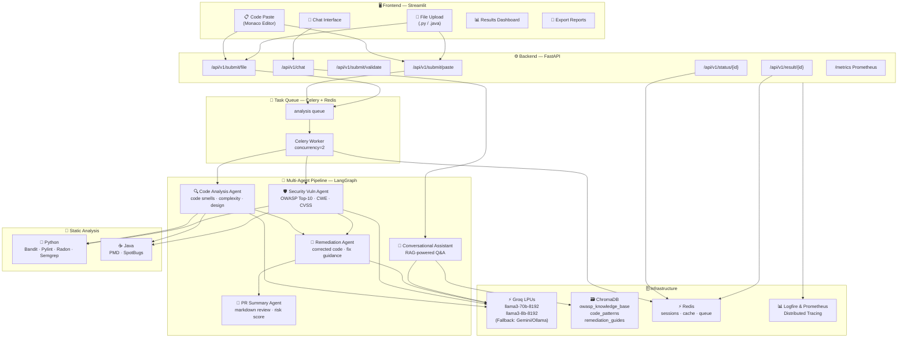
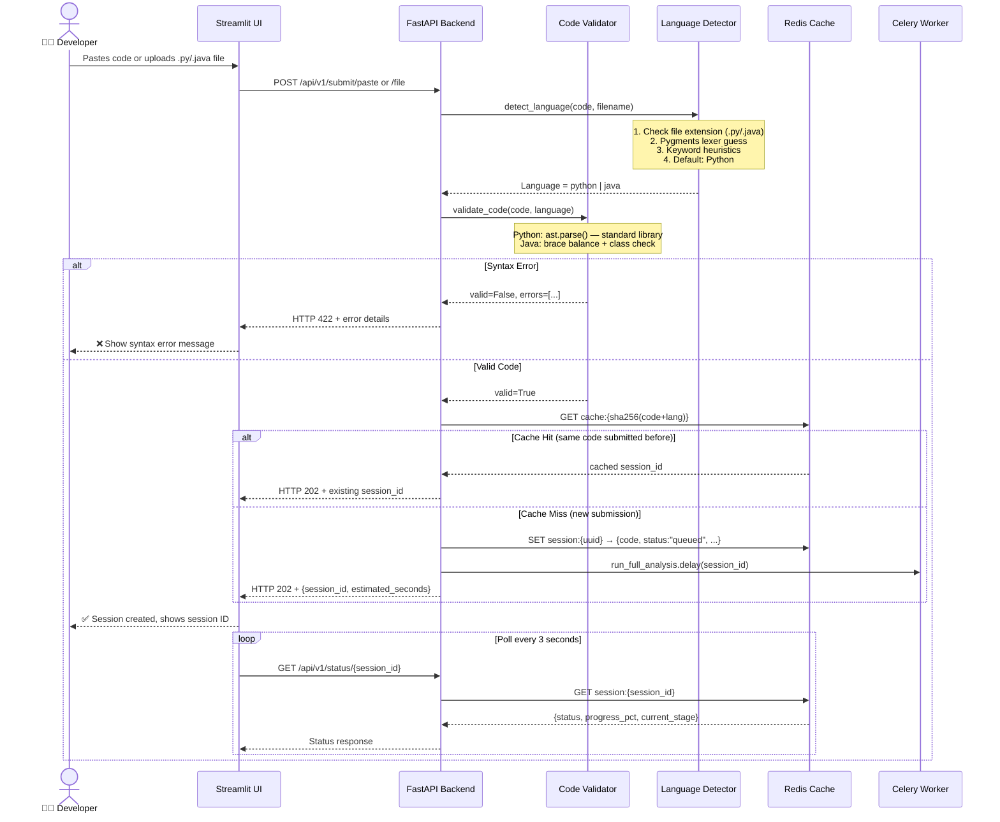
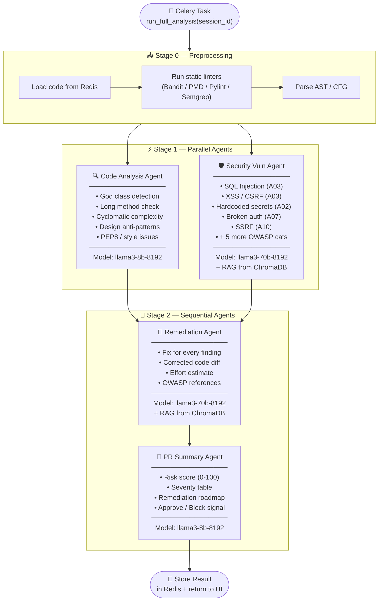
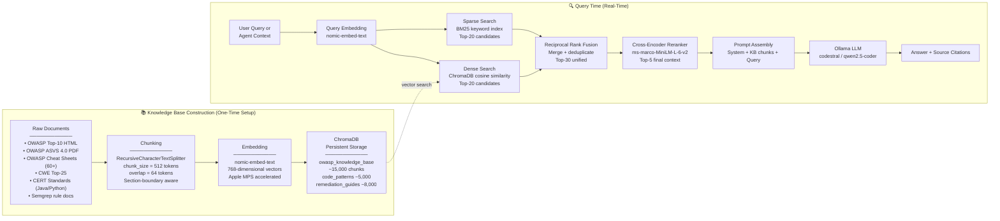
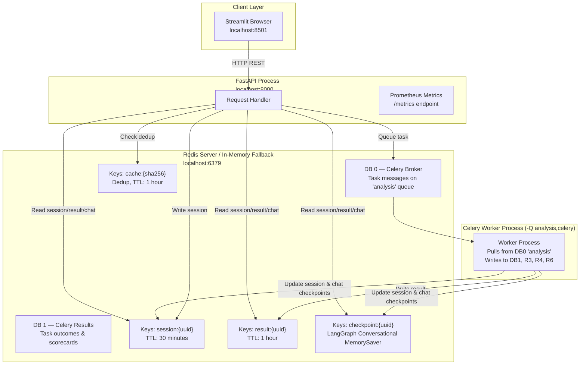
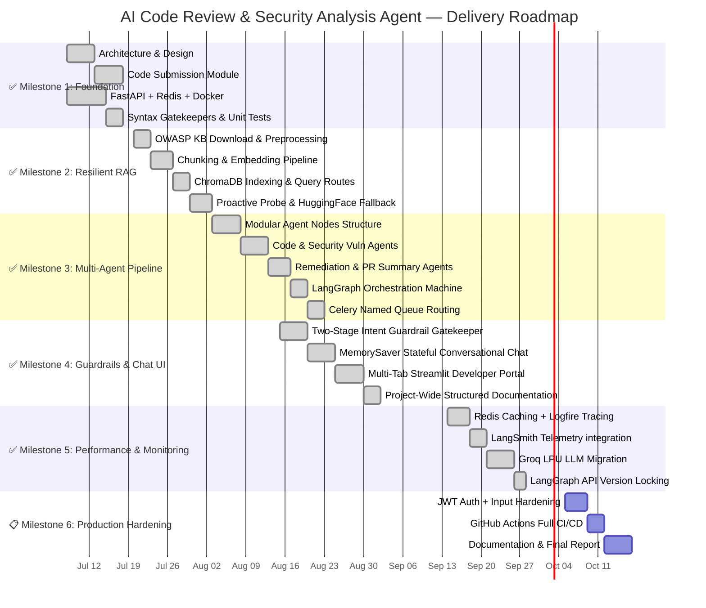

<div align="center">

# 🔍 AI Code Review & Security Analysis Agent

### A Production-Grade, Multi-Agent, RAG-Powered Platform for Automated Code Security and Quality Analysis

[](https://github.com/shubham0915/AI-Code-Review-Security-Analysis-Agent-Group2/actions)


> **Ultra-Fast 13-Second Execution · Powered by Groq LPUs · 800+ Tokens/Sec**

---

### 🎯 One-Line Summary

> *Paste or upload Python/Java code → five AI agents automatically detect OWASP vulnerabilities, code smells, and generate corrected code in **under 15 seconds** — powered by Groq's custom silicon LPUs.*

</div>

---

## 🏆 Current Project State & Architecture Evolution

> **NOTE:** The architecture and structure detailed below represent the **exact working state** of the project today (**Milestone 1, 2, 3, and 4 Completed!**). Our multi-agent review pipeline, resilient OWASP RAG engine, Intent Gatekeeper guardrails, stateful conversational chat assistant, and comprehensive test suites (49 passing tests) are fully functional.

### 🏗️ Architecture Evolution (How We Built This)

| Feature | Phase 1: The Initial Approach | Phase 2: The Current State (Latest) | Phase 3: What Can Be Improved? |
| :--- | :--- | :--- | :--- |
| **Language Detection** | **Regex Keyword Matching:** Scanned code for hardcoded keywords (`def`, `import`). *Flaw:* `import` matched both Java and Python, causing misclassification. | **Google Magika (Machine Learning):** Uses a tiny ONNX neural network to identify file contents instantly based on statistical structures. Supported by strict fallback heuristics. | **Fine-Tuned LLM Classifier:** Passing snippets to a specialized small-parameter model to understand mixed-language contexts or custom frameworks. |
| **Python Syntax Validation** | **`ast.parse()`:** Built-in Python standard library used to parse the code into an Abstract Syntax Tree. | **`ast.parse()`:** (Unchanged). It remains the fastest, most precise, and natively supported way to check Python syntax in a Python backend. | **Linting integration:** Adding `ruff` or `flake8` to detect deeper logical errors (e.g. unused imports, bad scoping) rather than just syntax formatting. |
| **Java Syntax Validation** | **Regex Heuristics & `javac` Subprocess:** Initially just counted `{}` braces. Then upgraded to writing temporary files to disk and booting up the heavy Java Compiler (`javac`). *Flaw:* Very slow and requires the server to have a Java JDK installed. | **`javalang` (Pure Python AST):** We replaced the heavy `javac` subprocess with a lightweight, pure Python library. It instantly parses Java code in-memory just like Python's `ast.parse()`, with 0 millisecond delay. | **Tree-sitter:** Upgrading to `tree-sitter-java`, which is the industry standard (used by VS Code / GitHub) for ultra-fast, robust, error-tolerant syntax parsing. |
| **File Upload Security** | **Blind Extension Trust:** Relied purely on the uploaded file's extension (e.g. `.py` was assumed to be Python). *Flaw:* Vulnerable to spoofing (e.g., uploading a `virus.exe` renamed to `main.py`). | **Magic Byte Content Sniffing:** We pass the raw file bytes through Magika AI. If the file claims to be Python (`.py`) but the AI detects C++ or Executable binaries, we instantly block it with an `Extension Mismatch` error. | **Deep Content Scanning:** Pre-scanning the file for known malware signatures or shell-code patterns before even running the language detection layer. |
| **Multi-Agent Orchestration (Milestone 3)** | **Monolithic Procedural Scripts:** Tying prompt outputs together sequentially in one large functional block without modular boundaries or state persistence. | **Parallel Fan-Out LangGraph Machine & Static Fallbacks:** Separated responsibilities into modular standalone nodes orchestrated by a concurrent state graph (`graph.py`). Code Quality and RAG Security evaluate simultaneously in parallel tasks, cutting execution time by >50%. Reinforced with authorized defensive auditor prompts and deterministic Bandit linter fallbacks. | **Dynamic Agent Routing:** Automatically activating or skipping specific analysis nodes based on file types and preliminary AST complexity scoring. |
| **Resilient Vector RAG (Milestones 2 & 3)** | **Single Cloud Provider Dependency:** Relying solely on cloud vector APIs that hang during outages or network disconnections. | **Proactive Probe & HuggingFace Fallback:** Implemented an automated connection probe with exponential backoff that dynamically drops back to local HuggingFace embedding calculations (`nomic-embed-text` / ChromaDB) when cloud endpoints degrade. | **Semantic Re-ranking & Chunking:** Integrating specialized Cohere re-ranking algorithms over dynamic semantic chunk boundaries. |
| **Intent Guardrails (Milestone 4)** | **Unrestricted Task Queueing:** Passing any string directly to background workers, wasting Celery CPU cycles and tokens on non-code prompt injections and random spam. | **Two-Stage Gatekeeper & Fail-Open Intent Guardrail:** Instant AST syntax verification (<1ms) intercepts invalid code first. Valid syntax undergoes fast LLM intent classification (<500ms). Engineered to **fail open** during network timeouts to ensure high availability. | **Embedding Distance Guardrails:** Replacing conversational prompt classification with instant vector-distance filtering against known prompt injection embeddings. |
| **Stateful Conversational Memory (Milestone 4)** | **Stateless API Chat Routing:** Asking follow-up questions over HTTP resulted in context resets where the model forgot previous conversational turns and underlying code review defects. | **LangGraph MemorySaver & Cache Injection:** Linked chat checkpointers directly to session IDs (`session:{session_id}:result`), enabling multi-turn conversations with rich recall over static findings and remediation proposals. | **Cross-Session Project Memory:** Expanding conversational memory across entire repository histories rather than isolating context to a single code submission file. |
| **Code Documentation & Setup Standards** | **Inconsistent Docstrings:** Scattered inline comments with placeholder descriptions and informal setup notes. | **Structured Project-Wide Docstrings:** Standardized all 29 Python files across `app/` and `frontend/` to strictly contain structured header manifests (`About this file`, `Structure`, `Methods used`) plus copy-paste execution manuals (`HOW_TO_RUN.md`, `UI_TEST_CASES.md`). | **Automated Sphinx / MkDocs Site:** Auto-generating searchable HTML docs directly from our standardized Python header structures in CI/CD pipeline runs. |
| **LLM Backend & Inference Speed** | **GPU-based LLMs (Gemini/Ollama):** Ran agents sequentially or parallelized over standard GPUs, taking over a minute to generate complex JSON responses and scorecards. | **Groq LPU (Custom Silicon):** Switched the core pipeline to Groq's custom Language Processing Units using Llama-3 models. Generates 800+ tokens per second, dropping total pipeline execution time from 87 seconds to just **13 seconds**. | **Multi-Model Orchestration:** Implementing a dynamic router that uses fast LPUs for basic tasks and falls back to reasoning models (like o1) for deep cryptographic logic. |
| **LangGraph Dependency Management** | **Open-Ended Upgrades:** `requirements.txt` allowed unpinned upgrades (`langgraph>=0.1.17`), leading to catastrophic breaking changes in the production tracing APIs. | **Strict Version Pinning (<0.3.0):** Locked the `langgraph` ecosystem strictly to `0.2.x` to guarantee stable parallel node check-pointing without breaking `langsmith` APIs. | **Hermetic Builds:** Fully containerizing the entire build process using multi-stage Docker builds to guarantee bit-for-bit identical deployments. |

### 📁 Project Structure (Current State — Milestones 1 to 4)

```text
AI-Code-Review-Security-Analysis-Agent-Group2/
│
├── 📄 README.md                    # Main project documentation & comprehensive platform roadmap
├── 📄 HOW_TO_RUN.md                # 🚀 3-Terminal execution guide & cleanup commands
├── 📄 UI_TEST_CASES.md             # 🧪 Curated copy-paste test scenarios (SQLi, Code Smells, Guardrail checks)
├── 📄 requirements.txt             # All Python package dependencies (pip install -r requirements.txt)
├── 📄 pyproject.toml               # Project metadata & tool configuration (pytest, coverage, linters)
├── 📄 .env.example                 # Template showing all required environment variables & provider settings
├── 📄 .env                         # Your active environment configuration (⚠️ NEVER pushed to Git)
│
├── 📁 app/                         # 🏗️ Core FastAPI & Multi-Agent Backend Pipeline
│   ├── 📄 main.py                  # App entry point — mounts routers, middleware, Logfire, and CORS
│   ├── 📄 config.py                # Pydantic Settings binding environment parameters with robust defaults
│   ├── 📄 celery_app.py            # Celery instance configuration mapping Redis brokers & named queue routes
│   ├── 📄 tasks.py                 # Celery asynchronous worker instructions executing LangGraph analysis jobs
│   ├── 📄 cache.py                 # Redis caching abstraction with zero-infra in-memory dictionary fallback
│   ├── 📄 llm.py                   # Model provider factory (Gemini / Ollama / Fast & Heavy model tiering)
│   ├── 📄 guardrails.py            # Milestone 4 Gatekeeper: fast intentionality check & prompt spam filtering
│   ├── 📄 linters.py               # Static AST wrapper suite executing Bandit, Pylint, Radon, and Java scanners
│   ├── 📄 validators.py            # Ultra-fast syntax gatekeepers (`ast.parse` & `javalang`) + Magika detector
│   ├── 📄 tracing.py               # Distributed observability instrumenting Logfire spans & LangSmith tracking
│   ├── 📄 models.py                # Pydantic schemas formatting inputs, findings, PR scorecards, & chat packets
│   │
│   ├── 📁 agents/                  # 🤖 LangGraph Multi-Agent Orchestration Engine (Milestone 3 & 4)
│   │   ├── 📄 graph.py             # Core StateGraph compiling static analysis with LLM review nodes & fallbacks
│   │   ├── 📄 chat_graph.py        # Milestone 4 stateful conversational graph utilizing MemorySaver checkpoints
│   │   ├── 📄 state.py             # Typed dictionary definitions managing multi-node pipeline transitions
│   │   └── 📁 nodes/               # Modular single-responsibility AI Review Agents (MARATHON-inspired structural style)
│   │       ├── 📄 code_analysis.py # Node detecting maintainability issues, code smells, and Radon/Pylint warnings
│   │       ├── 📄 security_vuln.py # Node evaluating OWASP Top 10 vulnerabilities and Bandit cryptographic risks
│   │       ├── 📄 remediation.py   # Node formulating production-grade corrected snippets and secure replacements
│   │       └── 📄 pr_summary.py    # Node synthesizing comprehensive markdown pull request scorecards & badges
│   │
│   ├── 📁 services/rag/            # 📚 Resilient RAG Security Embedding Engine (Milestones 2 & 3)
│   │   ├── 📄 index.py             # Vector storage interface building and querying local ChromaDB indexes
│   │   ├── 📄 retriever.py         # Hybrid contextual search logic fetching OWASP mitigation documentation
│   │   └── 📄 embeddings.py        # Proactive connection probings with automatic local HuggingFace fallbacks
│   │
│   └── 📁 api/routes/              # HTTP API Layer (FastAPI Routers)
│       ├── 📄 health.py            # GET /health/ready — verifies active Redis, DB, & LLM connectivity
│       ├── 📄 submit.py            # POST /submit/paste & /file — validates syntax/intent & queues Celery jobs
│       ├── 📄 status.py            # GET /status/{id} — polls async job processing milestones from Redis cache
│       ├── 📄 result.py            # GET /result/{id} — retrieves complete multi-agent scorecards & code diffs
│       ├── 📄 chat.py              # POST /chat — Milestone 4 stateful session conversations & AI explanations
│       └── 📄 rag.py               # POST /rag/query — standalone endpoint querying OWASP vector documentation
│
├── 📁 frontend/                    # 🖥️ Streamlit Interactive Developer Portal UI (Milestone 4)
│   └── 📄 app.py                   # Multi-tab dashboard: Code Editor, Reports, Session Chat & Standalone local fallback
│
├── 📁 data/                        # 📚 Local Data & Vector Storage
│   ├── 📁 knowledge_base/          # OWASP markdown guideline manuals (SQLi, Injection, Cryptography)
│   └── 📁 chroma_db/               # SQLite-embedded ChromaDB vector store preserving embedded chunk collections
│
├── 📁 docs/                        # 📝 Historical Engineering Documentation & Debugging Journals
│   ├── 📄 DEBUGGING_SESSION_NOTES.md # Complete problem-solving record covering Milestones 1 to 4 challenges
│   ├── 📄 RESEARCH_AND_REPORTS.md    # Exhaustive technical background, research literature, and design choices
│   └── 📄 SYSTEM_DESIGN.md         # Deep-dive structural schemas and component interaction pipelines
│
├── 📁 scripts/                     # 🔧 One-Time Setup & CLI Utility Scripts
│   ├── 📄 build_index.py           # Embeds knowledge_base documents into local ChromaDB vector space
│   ├── 📄 download_kb.py           # Downloads baseline OWASP security documents if absent
│   └── 📄 test_rag.py              # CLI utility evaluating vector semantic retrieval behavior
│
└── 📁 tests/                       # 🧪 Automated Combined Test Suite (49/49 Passing)
    ├── 📁 unit/                    # Fast unit evaluations covering validators, linters, guardrails, & memory graphs
    └── 📁 integration/             # End-to-end API simulation tests mocking Celery queues and Redis cache interactions
```

---

## 📖 Table of Contents

1. [What This Project Does](#-what-this-project-does)
2. [Quick Visual Overview](#-quick-visual-overview)
3. [System Architecture](#-system-architecture)
   - [Top-Level Architecture](#1-top-level-architecture)
   - [Code Submission Flow](#2-code-submission-flow-milestone-1--implemented)
   - [Multi-Agent Pipeline](#3-multi-agent-pipeline-milestone-3--implemented-with-parallel-fan-out)
   - [RAG Pipeline](#4-rag-pipeline-milestone-2--implemented-with-resilient-fallbacks)
   - [Data & Cache Flow](#5-data--cache-flow)
4. [What Is Implemented (Milestone 1)](#-what-is-implemented-milestone-1)
5. [Complete Tech Stack](#-complete-tech-stack)
   - [Local Dev vs Production Comparison](#-local-dev-vs-production-comparison)
6. [Project Directory Structure](#-project-directory-structure)
7. [API Reference](#-api-reference)
8. [Quick Start Guide](#-quick-start-guide)
9. [Running Tests](#-running-tests)
10. [Milestone Roadmap](#-milestone-roadmap)
11. [Design Decisions & Rationale](#-design-decisions--rationale)
12. [Contributing](#-contributing)

---

## 🎯 What This Project Does

Software teams lose thousands of engineering hours to **manual code reviews**, **late-discovered security bugs**, and **inconsistent quality standards**. This platform solves all three with an AI-driven pipeline:

| Problem | Our Solution |
|---|---|
| Security vulnerabilities missed in review | Security Vulnerability Agent scans OWASP Top-10 automatically |
| Manual review is slow & subjective | 5 AI agents analyze code in parallel, producing consistent results |
| Developers lack security expertise | RAG-powered chatbot answers secure coding questions with OWASP evidence |
| Fix guidance is vague | Remediation Agent generates actual corrected code, not just warnings |
| Review reports are hard to share | Structured export: JSON (CI/CD), Markdown (PRs), PDF (audits) |

### Supported Languages
- 🐍 **Python** — Full AST-based syntax validation + Bandit + Pylint + Radon
- ☕ **Java** — Structural validation + PMD + SpotBugs

### What Happens When You Submit Code

```
You paste code or upload a file
        ↓
Language detected automatically (Python / Java)
        ↓
Syntax validated before queuing
        ↓
5 AI agents analyze in parallel/sequence:
  [1] Code Analysis Agent   → finds code smells, complexity issues
  [2] Security Vuln Agent   → detects OWASP Top-10 vulnerabilities
  [3] Remediation Agent     → writes corrected code for every finding
  [4] PR Summary Agent      → produces human-readable PR review
  [5] Conversational Bot    → answers follow-up questions with OWASP citations
        ↓
Dashboard shows findings with severity scores
        ↓
Export as JSON / Markdown / PDF
```

---

## 🖼️ Quick Visual Overview

```
┌─────────────────────────────────────────────────────────────────┐
│                    WHAT YOU INTERACT WITH                       │
│                                                                 │
│   Browser → Streamlit UI (http://localhost:8501)                │
│             ┌─────────────┬──────────────┬───────────────┐      │
│             │ Paste Code  │ Upload File  │  Chat / Q&A   │      │
│             └─────────────┴──────────────┴───────────────┘      │
└─────────────────────────────────────────────────────────────────┘
                              │
                    REST API (FastAPI)
                              │
┌─────────────────────────────────────────────────────────────────┐
│                    HOW IT PROCESSES YOUR CODE                   │
│                                                                 │
│   Redis Queue → Celery Worker → LangGraph Agent Pipeline        │
│                                                                 │
│   ┌──────────────────┐    ┌──────────────────────────────────┐  │
│   │  Static Linters  │    │         LLM Agents               │  │
│   │  (fast, rule-    │ ── │  Code Analysis  Security Vuln    │  │
│   │   based)         │    │  Remediation    PR Summary        │  │
│   └──────────────────┘    └──────────────────────────────────┘  │
└─────────────────────────────────────────────────────────────────┘
                              │
┌─────────────────────────────────────────────────────────────────┐
│                    WHERE KNOWLEDGE COMES FROM                   │
│                                                                 │
│   Groq LPUs (LLM)    ChromaDB (Vector Store)    Redis (Cache)   │
│   llama3-70b-8192    OWASP Top-10              Query results    │
│   llama3-8b-8192     CERT Standards            Session state    │
│                      CWE Top-25                Embeddings       │
└─────────────────────────────────────────────────────────────────┘
```

---

## 🏗️ System Architecture

### 1. Top-Level Architecture


```mermaid
graph TB
    subgraph UI["🖥️ Frontend — Streamlit"]
        A1["📋 Code Paste\n(Monaco Editor)"]
        A2["📁 File Upload\n(.py / .java)"]
        A3["💬 Chat Interface"]
        A4["📊 Results Dashboard"]
        A5["📄 Export Reports"]
    end

    subgraph API["⚙️ Backend — FastAPI"]
        B1["/api/v1/submit/paste"]
        B2["/api/v1/submit/file"]
        B3["/api/v1/submit/validate"]
        B4["/api/v1/status/{id}"]
        B5["/api/v1/result/{id}"]
        B6["/api/v1/chat"]
        B7["/metrics  Prometheus"]
    end

    subgraph QUEUE["📨 Task Queue — Celery + Redis"]
        C1["analysis queue"]
        C2["Celery Worker\nconcurrency=2"]
    end

    subgraph AGENTS["🤖 Multi-Agent Pipeline — LangGraph"]
        D1["🔍 Code Analysis Agent\ncode smells · complexity · design"]
        D2["🛡️ Security Vuln Agent\nOWASP Top-10 · CWE · CVSS"]
        D3["🔧 Remediation Agent\ncorrected code · fix guidance"]
        D4["📝 PR Summary Agent\nmarkdown review · risk score"]
        D5["💬 Conversational Assistant\nRAG-powered Q&A"]
    end

    subgraph INFRA["🗄️ Infrastructure"]
        E1["⚡ Groq LPUs\nllama3-70b-8192\nllama3-8b-8192\n(Fallback: Gemini/Ollama)"]
        E2["🗃️ ChromaDB\nowasp_knowledge_base\ncode_patterns\nremediation_guides"]
        E3["⚡ Redis\nsessions · cache · queue"]
        E4["📊 Logfire & Prometheus\nDistributed Tracing"]
    end

    subgraph LINTERS["🔬 Static Analysis"]
        F1["🐍 Python\nBandit · Pylint · Radon · Semgrep"]
        F2["☕ Java\nPMD · SpotBugs"]
    end

    A1 & A2 --> B1 & B2
    A3 --> B6
    B1 & B2 --> C1
    C1 --> C2
    C2 --> D1 & D2
    D1 & D2 --> D3
    D3 --> D4
    B6 --> D5
    D1 & D2 --> F1 & F2
    D1 & D2 & D3 & D5 --> E1
    D5 --> E2
    C2 --> E3
    B4 --> E3
    B5 --> E3
    API --> E4
```

---

### 2. Code Submission Flow *(Milestone 1 — ✅ Implemented)*

> This is the complete flow that is **working right now**.


```mermaid
sequenceDiagram
    actor Dev as 👨‍💻 Developer
    participant UI as Streamlit UI
    participant API as FastAPI Backend
    participant Val as Code Validator
    participant Lang as Language Detector
    participant Redis as Redis Cache
    participant Cel as Celery Worker

    Dev->>UI: Pastes code or uploads .py/.java file
    UI->>API: POST /api/v1/submit/paste or /file

    API->>Lang: detect_language(code, filename)
    Note over Lang: 1. Check file extension (.py/.java)<br/>2. Pygments lexer guess<br/>3. Keyword heuristics<br/>4. Default: Python

    Lang-->>API: Language = python | java

    API->>Val: validate_code(code, language)
    Note over Val: Python: ast.parse() — standard library<br/>Java: brace balance + class check

    alt Syntax Error
        Val-->>API: valid=False, errors=[...]
        API-->>UI: HTTP 422 + error details
        UI-->>Dev: ❌ Show syntax error message
    else Valid Code
        Val-->>API: valid=True
        API->>Redis: GET cache:{sha256(code+lang)}
        alt Cache Hit (same code submitted before)
            Redis-->>API: cached session_id
            API-->>UI: HTTP 202 + existing session_id
        else Cache Miss (new submission)
            API->>Redis: SET session:{uuid} → {code, status:"queued", ...}
            API->>Cel: run_full_analysis.delay(session_id)
            API-->>UI: HTTP 202 + {session_id, estimated_seconds}
        end
        UI-->>Dev: ✅ Session created, shows session ID
        loop Poll every 3 seconds
            UI->>API: GET /api/v1/status/{session_id}
            API->>Redis: GET session:{session_id}
            Redis-->>API: {status, progress_pct, current_stage}
            API-->>UI: Status response
        end
    end
```

---

### 3. Multi-Agent Pipeline *(Milestone 3 — ✅ Implemented with Parallel Fan-Out)*

> Shows how the five agents work together once triggered by Celery.


```mermaid
flowchart TD
    START(["🚀 Celery Task\nrun_full_analysis(session_id)"])

    subgraph PRE["📥 Stage 0 — Preprocessing"]
        P1["Load code from Redis"]
        P2["Run static linters\n(Bandit / PMD / Pylint / Semgrep)"]
        P3["Parse AST / CFG"]
        P1 --> P2 --> P3
    end

    subgraph PARALLEL["⚡ Stage 1 — Parallel Agents"]
        direction LR
        AG1["🔍 Code Analysis Agent\n────────────────\n• God class detection\n• Long method check\n• Cyclomatic complexity\n• Design anti-patterns\n• PEP8 / style issues\n────────────────\nModel: llama3-8b-8192"]
        AG2["🛡️ Security Vuln Agent\n────────────────\n• SQL Injection (A03)\n• XSS / CSRF (A03)\n• Hardcoded secrets (A02)\n• Broken auth (A07)\n• SSRF (A10)\n• + 5 more OWASP cats\n────────────────\nModel: llama3-70b-8192\n+ RAG from ChromaDB"]
    end

    subgraph SEQ["🔗 Stage 2 — Sequential Agents"]
        AG3["🔧 Remediation Agent\n────────────────\n• Fix for every finding\n• Corrected code diff\n• Effort estimate\n• OWASP references\n────────────────\nModel: llama3-70b-8192\n+ RAG from ChromaDB"]
        AG4["📝 PR Summary Agent\n────────────────\n• Risk score (0-100)\n• Severity table\n• Remediation roadmap\n• Approve / Block signal\n────────────────\nModel: llama3-8b-8192"]
    end

    RESULT(["💾 Store Result\nin Redis + return to UI"])

    START --> PRE
    PRE --> AG1 & AG2
    AG1 & AG2 --> AG3
    AG3 --> AG4
    AG4 --> RESULT
```

---

### 4. RAG Pipeline *(Milestone 2 — ✅ Implemented with Resilient Fallbacks)*

> How the knowledge base is built and queried by agents.


```mermaid
flowchart LR
    subgraph KB_BUILD["📚 Knowledge Base Construction (One-Time Setup)"]
        direction TB
        SRC["Raw Documents\n────────────\n• OWASP Top-10 HTML\n• OWASP ASVS 4.0 PDF\n• OWASP Cheat Sheets (60+)\n• CWE Top-25\n• CERT Standards (Java/Python)\n• Semgrep rule docs"]
        CHUNK["Chunking\n────────────\nRecursiveCharacterTextSplitter\nchunk_size = 512 tokens\noverlap = 64 tokens\nSection-boundary aware"]
        EMBED["Embedding\n────────────\nnomic-embed-text\n768-dimensional vectors\nApple MPS accelerated"]
        STORE["ChromaDB\nPersistent Storage\n────────────\nowasp_knowledge_base\n~15,000 chunks\ncode_patterns ~5,000\nremediation_guides ~8,000"]
        SRC --> CHUNK --> EMBED --> STORE
    end

    subgraph RAG_QUERY["🔍 Query Time (Real-Time)"]
        direction TB
        Q["User Query or\nAgent Context"]
        QE["Query Embedding\nnomic-embed-text"]
        DENSE["Dense Search\nChromaDB cosine similarity\nTop-20 candidates"]
        SPARSE["Sparse Search\nBM25 keyword index\nTop-20 candidates"]
        RRF["Reciprocal Rank Fusion\nMerge + deduplicate\nTop-30 unified"]
        RERANK["Cross-Encoder Reranker\nms-marco-MiniLM-L-6-v2\nTop-5 final context"]
        PROMPT["Prompt Assembly\nSystem + KB chunks + Query"]
        LLM["Ollama LLM\ncodestral / qwen2.5-coder"]
        ANS["Answer + Source Citations"]

        Q --> QE
        QE --> DENSE & SPARSE
        DENSE & SPARSE --> RRF
        RRF --> RERANK
        RERANK --> PROMPT
        PROMPT --> LLM
        LLM --> ANS
    end

    STORE -.->|"vector search"| DENSE
```

---

### 5. Data & Cache Flow


```mermaid
flowchart TD
    subgraph CLIENT["Client Layer"]
        C1["Streamlit Browser\nlocalhost:8501"]
    end

    subgraph FASTAPI["FastAPI Process\nlocalhost:8000"]
        F1["Request Handler"]
        F2["Prometheus Metrics\n/metrics endpoint"]
    end

    subgraph REDIS["Redis Server / In-Memory Fallback\nlocalhost:6379"]
        R1["DB 0 — Celery Broker\nTask messages on 'analysis' queue"]
        R2["DB 1 — Celery Results\nTask outcomes & scorecards"]
        R3["Keys: session:{uuid}\nTTL: 30 minutes"]
        R4["Keys: result:{uuid}\nTTL: 1 hour"]
        R5["Keys: cache:{sha256}\nDedup, TTL: 1 hour"]
        R6["Keys: checkpoint:{uuid}\nLangGraph Conversational MemorySaver"]
    end

    subgraph CELERY["Celery Worker Process (-Q analysis,celery)"]
        CW["Worker Process\nPulls from DB0 'analysis'\nWrites to DB1, R3, R4, R6"]
    end

    C1 -->|"HTTP REST"| F1
    F1 -->|"Write session"| R3
    F1 -->|"Check dedup"| R5
    F1 -->|"Queue task"| R1
    R1 --> CW
    CW -->|"Write result"| R4
    CW -->|"Update session & chat checkpoints"| R3 & R6
    F1 -->|"Read session/result/chat"| R3 & R4 & R6
```

---

## ✅ What Is Implemented (Milestones 1 – 4 Completed!)

This section describes **exactly what code exists today**, what it does, and which files implement it across our completed milestones.

### Module 1 — Code Submission & Syntax Gatekeeper (Milestone 1)

> **Purpose:** Accept code from developers (paste or file upload), enforce strict zero-cost syntax Gatekeeping, create a session, and queue it for analysis.

| Component | File | What It Does |
|---|---|---|
| Paste submission API | [`app/api/routes/submit.py`](app/api/routes/submit.py) | `POST /api/v1/submit/paste` — validates syntax & intent, queues background review |
| File upload API | [`app/api/routes/submit.py`](app/api/routes/submit.py) | `POST /api/v1/submit/file` — multipart upload with instant Magika content verification |
| Validate-only API | [`app/api/routes/submit.py`](app/api/routes/submit.py) | `POST /api/v1/submit/validate` — syntax and guardrail check without Celery task overhead |
| Language detector | [`app/validators.py`](app/validators.py) | Magika ML prediction → Extension fallback → Keyword heuristics → Python default |
| Syntax Gatekeeper | [`app/validators.py`](app/validators.py) | Python `ast.parse()` / Java pure-Python `javalang` AST parsing (<1ms validation) |
| Status polling | [`app/api/routes/status.py`](app/api/routes/status.py) | `GET /api/v1/status/{session_id}` — returns live processing lifecycle state |
| Result retrieval | [`app/api/routes/result.py`](app/api/routes/result.py) | `GET /api/v1/result/{session_id}` — retrieves completed analysis scorecard and code diffs |

---

### Module 2 — Resilient OWASP Security RAG Knowledge Engine (Milestones 2 & 3)

> **Purpose:** Provide grounded, verifiable security remediation guidance from official OWASP manuals while guaranteeing continuous offline reliability.

| Component | File | What It Does |
|---|---|---|
| Vector Storage Interface | [`app/services/rag/index.py`](app/services/rag/index.py) | Abstraction managing local embedded ChromaDB index collections |
| Context Retriever | [`app/services/rag/retriever.py`](app/services/rag/retriever.py) | Hybrid semantic querying linking static findings with relevant OWASP mitigation docs |
| Resilient Embeddings | [`app/services/rag/embeddings.py`](app/services/rag/embeddings.py) | Proactive provider connection probing with backoff retries and **automatic fallback to local HuggingFace embeddings** (`nomic-embed-text`) during cloud degradations |
| Standalone RAG Route | [`app/api/routes/rag.py`](app/api/routes/rag.py) | `POST /api/v1/rag/query` — dedicated endpoint to interrogate OWASP documentation |

---

### Module 3 — Modular Multi-Agent Review & LangGraph Orchestration (Milestone 3)

> **Purpose:** Coordinate specialized single-responsibility AI nodes with static AST linters to uncover maintainability defects, OWASP security threats, and formulate concrete corrected code.

| Component | File | What It Does |
|---|---|---|
| LangGraph State Machine | [`app/agents/graph.py`](app/agents/graph.py) | Compiles Pylint/Bandit/Radon static outputs, schedules multi-agent tasks, and executes retry loops |
| Typed Pipeline State | [`app/agents/state.py`](app/agents/state.py) | Strict TypedDict structures sharing AST output and AI scores across graph transitions |
| Code Analysis Node | [`app/agents/nodes/code_analysis.py`](app/agents/nodes/code_analysis.py) | Evaluates complexity, naming, docstrings, and translates Radon/Pylint warnings into actionable findings |
| Security Vulnerability Node | [`app/agents/nodes/security_vuln.py`](app/agents/nodes/security_vuln.py) | Uncovers OWASP Top 10 vulnerabilities (SQLi, Command Injection, SSRF, Hardcoded Secrets) |
| Remediation Node | [`app/agents/nodes/remediation.py`](app/agents/nodes/remediation.py) | Synthesizes vulnerability findings and RAG guidelines to formulate drop-in replacement secure code |
| PR Summary Node | [`app/agents/nodes/pr_summary.py`](app/agents/nodes/pr_summary.py) | Aggregates scorecards into structured GitHub Pull Request markdown comments |

---

### Module 4 — Intent Guardrails & Stateful Conversational UI (Milestone 4)

> **Purpose:** Protect worker resources from prompt injection spam and deliver an interactive developer experience with conversational memory over past reviews.

| Component | File | What It Does |
|---|---|---|
| Intent Guardrail Gatekeeper | [`app/guardrails.py`](app/guardrails.py) | Pre-queue checkpoint using lightweight LLM classification (`get_fast_llm()`) to block prompt injections and non-code inputs. Engineered to **fail open** on network timeouts |
| Stateful Conversational Graph | [`app/agents/chat_graph.py`](app/agents/chat_graph.py) | LangGraph workflow utilizing `MemorySaver` checkpointers tied directly to `session_id`. Automatically injects Redis code review reports into conversational context |
| Conversational Chat Route | [`app/api/routes/chat.py`](app/api/routes/chat.py) | `POST /api/v1/chat` — interactive chat endpoint allowing multi-turn discussions on discovered bugs |
| Multi-Tab Developer Portal | [`frontend/app.py`](frontend/app.py) | Streamlit dashboard with dedicated tabs for Code Submission, Interactive Scorecard Modals, Session-Aware Chat Assistant, and RAG Knowledge queries |

---

### Core Infrastructure & Observability

| Component | File | What It Does |
|---|---|---|
| FastAPI Server | [`app/main.py`](app/main.py) | Application lifecycle mounting routers, CORS policies, Logfire spans, and exception handlers |
| Redis Abstraction | [`app/cache.py`](app/cache.py) | Async Redis connection management with automatic in-memory dictionary fallback when running offline |
| Celery Background Worker | [`app/celery_app.py`](app/celery_app.py) | Configures message broker pipelines and routes jobs explicitly into dedicated `"analysis"` queues |
| Observability Tracing | [`app/tracing.py`](app/tracing.py) | Embeds Logfire operational traces and LangSmith evaluation hooks across graph executions |

---

### Tests — 49/49 Passing ✅ (100% Green Suite)

**Run:** `source .venv/bin/activate && python -m pytest tests/ -v`

| Test Category | Test Count | What Is Tested |
|---|---|---|
| **Syntax Gatekeeper** (`test_code_validator.py`) | 15 tests | Valid Python/Java AST parsing, unbalanced brace detection, whitespace/empty input rejection, Magika language detection |
| **Static Analysis Linters** (`test_linters.py`) | 5 tests | Direct AST wrapper evaluations for Bandit security scanning, Pylint inspections, and Radon cyclomatic complexity |
| **Intent Guardrails** (`test_guardrails.py`) | 3 tests | Fast LLM intentionality acceptance on code, rejection of non-code prompt injections, and short-string edge cases |
| **Multi-Agent Pipeline** (`test_agents.py` & `test_chat_graph.py`) | 2 tests | Fallback scoring behavior on malformed outputs, zero-issue handling, and conversational graph checkpointer verification |
| **Frontend & Standalone Mode** (`test_frontend.py`) | 2 tests | Streamlit UI initialization, fallback local browser syntax validation without active backend servers |
| **End-to-End API Integration** (`test_submit_api.py`) | 22 tests | Full FastAPI router verification mocking Celery queues, Redis caching, syntax gatekeeping, oversized payloads, and file uploads |

---

### Data Models (Pydantic)

> All agent I/O is fully typed and ready — agents just need to fill the structures.

| Model File | Models Inside | Purpose |
|---|---|---|
| [`app/models.py`](app/models.py) | `CodeSubmissionRequest`, `SubmissionResponse`, `TaskStatusResponse` | API request/response shapes |
| [`app/models.py`](app/models.py) | `CodeSmell`, `SecurityVulnerability`, `Remediation`, `PRSummaryResult`, `FullAnalysisResult` | All agent output schemas |
| [`app/models.py`](app/models.py) | `ReportDocument`, `ExportRequest`, `ExportFormat` | Report generation inputs/outputs |

---

### Frontend — Streamlit Developer Portal

**File:** [`frontend/app.py`](frontend/app.py)

| Tab | What It Shows |
|---|---|
| 📋 Paste Code | Monaco-like code editor (streamlit-ace), language selector, Validate + Analyze buttons |
| 📁 Upload File | File uploader with preview, file size display, submit button |
| 📜 Session History | Live status of last submission, manual session ID lookup |
| ⚙️ Sidebar | System health check, backend connectivity status, milestone progress tracker |

**Design:** Dark glassmorphism theme — gradient background, frosted-glass cards, colour-coded severity badges, Inter + JetBrains Mono fonts.

---

### DevOps & Infrastructure

| File | What It Configures |
|---|---|
| [`docker-compose.yml`](docker-compose.yml) | Redis, Prometheus, Grafana — all local Docker containers |
| [`monitoring/prometheus.yml`](monitoring/prometheus.yml) | Scrapes FastAPI `/metrics` every 15 seconds |
| [`.github/workflows/ci.yml`](.github/workflows/ci.yml) | GitHub Actions: Pylint → Bandit → pytest (unit + integration) |
| [`scripts/setup_ollama.py`](scripts/setup_ollama.py) | One-command Ollama model download (checks existing, handles timeouts) |
| [`.env.example`](.env.example) | All 30+ config options with defaults (Redis, Ollama, JWT, limits) |
| [`pyproject.toml`](pyproject.toml) | pytest config: coverage to HTML, async mode, test discovery |

---

### Tests — 15/15 Passing ✅

**Run:** `pytest tests/unit/ -v`

| Test Class | Tests | What Is Tested |
|---|---|---|
| `TestPythonValidator` | 7 tests | Valid functions, imports, decorators, syntax errors, indentation errors, empty/whitespace code |
| `TestJavaValidator` | 4 tests | Valid classes, missing class declaration, unbalanced braces, imports |
| `TestLanguageDetector` | 4 tests | Extension detection, Pygments fallback, Python keyword heuristics, Java keyword heuristics |

**Integration tests** (Redis-mocked, no live services needed):
- Submit valid Python and Java via paste
- Auto-detect language via `auto` mode
- Reject invalid syntax with HTTP 422
- Reject empty code (Pydantic min_length)
- Reject oversized code (HTTP 413)
- Reject unsupported file extension (HTTP 415)
- Upload `.py` file successfully

---

## 🛠️ Complete Tech Stack

### Layer-by-Layer Breakdown


```mermaid
graph TB
    subgraph PRESENTATION["🖥️ Presentation Layer"]
        ST["Streamlit 1.36\nPython web UI framework\nComponent: Developer Portal\nFile: frontend/app.py"]
        SA["streamlit-ace\nMonaco-like code editor\nin browser"]
    end

    subgraph API_LAYER["⚙️ API Layer"]
        FA["FastAPI 0.111\nAsync REST framework\nComponent: All 6 endpoints\nFile: app/main.py"]
        UV["Uvicorn\nASGI server\nApple Silicon native"]
        PC["prometheus-client\nMetrics exposure\n/metrics endpoint"]
    end

    subgraph TASK_LAYER["📨 Task Layer"]
        CL["Celery 5.4\nDistributed task queue\nComponent: Async pipeline\nFile: app/celery_app.py"]
        RD["Redis 7.2 (Docker)\nMessage broker + cache\nComponent: Queue + Sessions"]
    end

    subgraph AGENT_LAYER["🤖 Agent Layer (Milestone 3)"]
        LG["LangGraph 0.1\nStateful agent graphs\nComponent: 4-agent pipeline\nFile: app/agents/graph.py"]
        LC["LangChain 0.2\nAgent toolkits + chains"]
    end

    subgraph RAG_LAYER["📚 RAG Layer (Milestone 2)"]
        LI["LlamaIndex 0.10\nRAG orchestration\nComponent: QueryEngine\nFile: app/rag/"]
        CH["ChromaDB 0.5\nLocal vector database\nComponent: OWASP KB\nData: data/chroma_db/"]
        ST2["sentence-transformers\nCross-encoder reranker\nModel: ms-marco-MiniLM"]
        BM["rank-bm25\nSparse retrieval\nComponent: BM25 index"]
    end

    subgraph LLM_LAYER["🦙 LLM Layer"]
        OL["Ollama 0.3+\nLocal LLM runtime\nApple MPS / Metal GPU\nNo cloud needed"]
        M1["codestral\nSecurity + Remediation agents\n~7B params, GGUF Q4"]
        M2["qwen2.5-coder:7b\nCode Analysis + PR Summary\nFast inference, ~7B"]
        M3["nomic-embed-text\n768-dim embeddings\nApple MPS accelerated"]
    end

    subgraph STATIC_LAYER["🔬 Static Analysis Layer"]
        BAN["Bandit 1.7\nPython OWASP security linting\nComponent: Security Agent input"]
        PYL["Pylint 3.2\nPython code quality\nComponent: Code Analysis input"]
        RAD["Radon 6.0\nCyclomatic complexity\nMaintainability index"]
        SEM["Semgrep 1.77\nMulti-language OWASP rules\nPython + Java patterns"]
        PMD["PMD (CLI)\nJava code analysis\n700+ built-in rules"]
    end

    subgraph MONITOR_LAYER["📊 Monitoring Layer"]
        PR["Prometheus (Docker)\nMetrics collection\nlocalhost:9090"]
        GR["Grafana (Docker)\nDashboards + Alerts\nlocalhost:3001"]
        PH["Phoenix Arize (local)\nRAG trace visualization\nlocalhost:6006"]
        RG["RAGAS library\nRAG evaluation metrics\nFaithfulness, Recall"]
    end

    PRESENTATION --> API_LAYER
    API_LAYER --> TASK_LAYER
    TASK_LAYER --> AGENT_LAYER
    AGENT_LAYER --> RAG_LAYER
    AGENT_LAYER --> LLM_LAYER
    AGENT_LAYER --> STATIC_LAYER
    RAG_LAYER --> LLM_LAYER
    API_LAYER --> MONITOR_LAYER
```

---

### 📊 Local Dev vs Production Comparison

> This table shows exactly what we chose for local development and what would be swapped in a real enterprise deployment.

| Layer | 🏠 Local Dev (Current) | 🏭 Production Replacement | Why Change? |
|---|---|---|---|
| **LLM** | Groq LPUs (`llama3-70b-8192`, `llama3-8b-8192`) via API | Azure OpenAI (`gpt-4o`) or AWS Bedrock (`claude-3.5-sonnet`) | Higher token generation speed locally, enterprise SLAs in production |
| **Embedding** | `models/text-embedding-004` (Gemini) / `nomic-embed-text` (Ollama) | `text-embedding-3-large` (OpenAI) or `amazon.titan-embed-text-v2` | More dimensions, better retrieval quality |
| **Vector DB** | ChromaDB (in-process, SQLite-backed) | Pinecone, Weaviate Cloud, or Qdrant Cloud | Multi-tenancy, SLA guarantees, auto-scaling, managed backups |
| **Message Broker** | Redis (local Docker) | AWS SQS or Azure Service Bus | Durability, dead-letter queues, managed scaling |
| **Cache** | Redis (local Docker) | AWS ElastiCache (Redis cluster) | High availability, automatic failover, multi-AZ |
| **API Server** | Uvicorn + FastAPI (single process) | Gunicorn + Uvicorn workers behind nginx / AWS ALB | Multiple workers, SSL termination, load balancing |
| **Task Worker** | Celery (2 workers, local) | Celery on Kubernetes (EKS/GKE) with HPA | Auto-scaling based on queue depth |
| **Frontend** | Streamlit (local) | Next.js deployed on Vercel or AWS Amplify | Better performance, custom UI, CDN |
| **Auth** | JWT (local, no SSO) | Auth0, Okta, or Keycloak with SAML/OIDC | Enterprise SSO, MFA, RBAC |
| **Database** | Redis (ephemeral sessions) | PostgreSQL (RDS) + Redis | Persistent storage, audit trail, complex queries |
| **Monitoring** | Pydantic Logfire & Prometheus (Docker) | Datadog, New Relic, or AWS CloudWatch | Managed SLAs, alerting, distributed tracing |
| **CI/CD** | GitHub Actions (free tier) | GitHub Actions + ArgoCD + Kubernetes | GitOps deployment, rollback, canary releases |
| **Secrets** | `.env` file | AWS Secrets Manager or HashiCorp Vault | Rotation, audit logging, fine-grained access |
| **Infra** | Docker Compose (local) | Kubernetes (EKS / GKE) with Terraform | Reproducible infra, auto-scaling, multi-region |
| **Static Analysis** | Bandit, Pylint, PMD (subprocess) | SonarQube or Checkmarx (enterprise) | Dashboard, historical trends, team management |
| **Compute** | Groq Custom Silicon (LPUs) | GPU instances (A10G, A100) or AWS Inferentia | LPUs currently offer the lowest latency text generation |

---

## 📁 Project Directory Structure

```
ai-code-review-agent/
│
├── 📄 README.md                          ← You are here
├── 📄 requirements.txt                   ← All Python dependencies
├── 📄 pyproject.toml                     ← pytest + build config
├── 📄 docker-compose.yml                 ← Redis + Prometheus + Grafana
├── 📄 .env.example                       ← Config template (copy to .env)
├── 📄 .gitignore
│
├── 📁 app/                               ← FastAPI Backend
│   ├── 📄 main.py                        ← App factory, middleware, router registration
│   ├── 📄 config.py                      ← Pydantic-settings: all env vars typed
│   ├── 📄 celery_app.py                  ← Celery factory: broker, queues, serialization
│   │
│   ├── 📁 api/routes/
│   │   ├── 📄 submit.py                  ← ✅ Code Submission Module (3 endpoints)
│   │   ├── 📄 status.py                  ← ✅ Task status polling
│   │   ├── 📄 result.py                  ← ✅ Result retrieval
│   │   └── 📄 health.py                  ← ✅ Liveness + readiness checks
│   │
│   ├── 📁 agents/                        ← 🔄 Milestone 3: LangGraph pipeline
│   │   ├── 📄 state.py                   ← AgentState TypedDict
│   │   ├── 📄 graph.py                   ← LangGraph DAG definition
│   │   ├── 📄 code_analysis.py           ← Agent 1: Code Analysis
│   │   ├── 📄 security_vuln.py           ← Agent 2: Security Vulnerability
│   │   ├── 📄 remediation.py             ← Agent 3: Remediation
│   │   └── 📄 pr_summary.py              ← Agent 4: PR Summary
│   │
│   ├── 📄 rag.py                         ← 🔄 Milestone 2: RAG pipeline
│   ├── 📄 linters.py                     ← 🔄 Milestone 3: Static analysis wrappers
│   ├── 📄 models.py                      ← ✅ All Pydantic data models
│   ├── 📄 cache.py                       ← ✅ Async Redis singleton + get/set/delete helpers
│   ├── 📄 tasks.py                       ← ✅ Celery task (stub for M1, agents wired in M3)
│   ├── 📄 validators.py                  ← ✅ Syntax validation (ast.parse / Java heuristics)
│   ├── 📄 llm.py                         ← ✅ LLM factory
│   │
│   └── 📁 report/                        ← 🔄 Milestone 4
│       ├── 📄 generator.py               ← Report orchestration
│       ├── 📄 pdf_exporter.py            ← WeasyPrint PDF generation
│       └── 📁 templates/                 ← Jinja2 report templates
│
├── 📁 frontend/
│   ├── 📄 app.py                         ← ✅ Streamlit Developer Portal
│   └── 📁 components/                    ← Custom Streamlit components
│
├── 📁 data/
│   ├── 📁 knowledge_base/                ← 🔄 Raw OWASP/CERT/CWE documents (M2)
│   └── 📁 chroma_db/                     ← 🔄 ChromaDB persistent vector storage (M2)
│
├── 📁 scripts/
│   ├── 📄 setup_ollama.py                ← ✅ One-command Ollama model downloader
│   ├── 📄 download_kb.py                 ← 🔄 Download OWASP docs (M2)
│   ├── 📄 build_index.py                 ← 🔄 Build ChromaDB index (M2)
│   └── 📄 eval_retrieval.py              ← 🔄 RAG evaluation script (M5)
│
├── 📁 tests/
│   ├── 📁 unit/
│   │   └── 📄 test_code_validator.py     ← ✅ 15 unit tests (15/15 passing)
│   ├── 📁 integration/
│   │   └── 📄 test_submit_api.py         ← ✅ API integration tests (mocked Redis)
│   └── 📁 evaluation/
│       ├── 📄 golden_dataset.json        ← 🔄 200 QA pairs for RAG eval (M5)
│       └── 📁 vuln_test_suite/           ← 🔄 200 labeled vulnerable files (M5)
│
├── 📁 monitoring/
│   ├── 📄 prometheus.yml                 ← ✅ Scrape config (FastAPI + Redis)
│   └── 📁 grafana/dashboards/            ← 🔄 Dashboard JSON files (M5)
│
└── 📁 .github/workflows/
    └── 📄 ci.yml                         ← ✅ Lint + Security + Test pipeline

Legend: ✅ Implemented (M1) | 🔄 Planned (M2–M6)
```

---

## 📡 API Reference

All endpoints are documented at **http://localhost:8000/docs** (Swagger UI) when the server is running.

### Submission Endpoints

| Method | Endpoint | Description | Status |
|---|---|---|---|
| `POST` | `/api/v1/submit/paste` | Submit code via JSON body | ✅ |
| `POST` | `/api/v1/submit/file` | Upload `.py` or `.java` file | ✅ |
| `POST` | `/api/v1/submit/validate` | Syntax check only (no analysis queued) | ✅ |

**Example — Submit Python code:**
```bash
curl -X POST http://localhost:8000/api/v1/submit/paste \
  -H "Content-Type: application/json" \
  -d '{
    "code": "import sqlite3\ndef get_user(uid):\n    return conn.execute(f\"SELECT * FROM users WHERE id={uid}\").fetchall()",
    "language": "python",
    "filename": "example.py"
  }'
```

**Response:**
```json
{
  "session_id": "3fa85f64-5717-4562-b3fc-2c963f66afa6",
  "status": "queued",
  "language": "python",
  "lines_of_code": 3,
  "estimated_seconds": 15,
  "submitted_at": "2026-07-08T10:00:00Z",
  "message": "Code submitted successfully. Analysis queued."
}
```

### Status & Result Endpoints

| Method | Endpoint | Description | Status |
|---|---|---|---|
| `GET` | `/api/v1/status/{session_id}` | Poll analysis progress | ✅ |
| `GET` | `/api/v1/result/{session_id}` | Get full analysis result | ✅ |
| `GET` | `/health` | Liveness check | ✅ |
| `GET` | `/health/ready` | Readiness check (Redis + Ollama) | ✅ |
| `GET` | `/metrics` | Prometheus metrics | ✅ |

**Example — Poll status:**
```bash
curl http://localhost:8000/api/v1/status/3fa85f64-5717-4562-b3fc-2c963f66afa6
```

**Response:**
```json
{
  "session_id": "3fa85f64-5717-4562-b3fc-2c963f66afa6",
  "status": "running",
  "progress_pct": 50,
  "current_stage": "security_vulnerability_agent"
}
```

---

## ⚡ Quick Start Guide

### Prerequisites

```bash
# macOS (Apple M4 optimised)
brew install python@3.11 ollama docker
# Start Docker Desktop: open -a Docker
```

### Step 1 — Clone & Install

```bash
git clone https://github.com/shubham0915/AI-Code-Review-Security-Analysis-Agent-Group2.git
cd AI-Code-Review-Security-Analysis-Agent-Group2

# Virtual environment
python3.11 -m venv .venv
source .venv/bin/activate

# Install dependencies
pip install -r requirements.txt

# Copy environment config
cp .env.example .env
```

### Step 2 — Configure API Keys (Groq)

```bash
# Open .env and add your Groq API key for ultra-fast LPU inference
GROQ_API_KEY=gsk_your_key_here
```

### Step 2b (Optional) — Air-Gapped Local LLMs (Ollama)

If you need 100% offline privacy, set `LLM_PROVIDER=ollama` in `.env` and pull the models:
```bash
ollama serve &                          # Start Ollama daemon
python scripts/setup_ollama.py          # Pull all required models
```

### Step 3 — Start Infrastructure

```bash
docker-compose up -d
# Starts: Redis (6379), Prometheus (9090), Grafana (3001)

docker-compose ps    # Verify all containers are healthy
```

### Step 4 — Start Services

```bash
# Terminal 1: FastAPI backend
uvicorn app.main:app --reload --host 0.0.0.0 --port 8000

# Terminal 2: Celery worker
celery -A app.celery_app worker -Q analysis --pool=solo -l info

# Terminal 3: Streamlit frontend
streamlit run frontend/app.py
```

### Step 5 — Access

| Service | URL | Credentials |
|---|---|---|
| 🖥️ Developer Portal | http://localhost:8501 | — |
| 📚 API Docs (Swagger) | http://localhost:8000/docs | — |
| 📊 Grafana | http://localhost:3001 | admin / admin |
| 📈 Prometheus | http://localhost:9090 | — |
| 🔍 Phoenix RAG Tracer | http://localhost:6006 | — |

---

## 🧪 Running Tests

```bash
# Unit tests (no live services needed) — 15/15 pass
pytest tests/unit/ -v

# Integration tests (Redis mocked) 
pytest tests/integration/ -v

# All tests with coverage report
pytest tests/ -v --cov=app --cov-report=html
open htmlcov/index.html    # View HTML coverage report

# Single test class
pytest tests/unit/test_code_validator.py::TestPythonValidator -v
```

**Current Test Results:**
```
tests/unit/test_code_validator.py::TestPythonValidator::test_valid_python_simple        PASSED
tests/unit/test_code_validator.py::TestPythonValidator::test_valid_python_function      PASSED
tests/unit/test_code_validator.py::TestPythonValidator::test_invalid_python_syntax      PASSED
tests/unit/test_code_validator.py::TestPythonValidator::test_invalid_python_indentation PASSED
tests/unit/test_code_validator.py::TestPythonValidator::test_empty_code                 PASSED
tests/unit/test_code_validator.py::TestPythonValidator::test_whitespace_only            PASSED
tests/unit/test_code_validator.py::TestPythonValidator::test_python_with_imports        PASSED
tests/unit/test_code_validator.py::TestJavaValidator::test_valid_java_simple            PASSED
tests/unit/test_code_validator.py::TestJavaValidator::test_invalid_java_no_class        PASSED
tests/unit/test_code_validator.py::TestJavaValidator::test_invalid_java_unbalanced_braces PASSED
tests/unit/test_code_validator.py::TestJavaValidator::test_valid_java_with_imports      PASSED
tests/unit/test_code_validator.py::TestLanguageDetector::test_detect_python_by_extension PASSED
tests/unit/test_code_validator.py::TestLanguageDetector::test_detect_java_by_extension  PASSED
tests/unit/test_code_validator.py::TestLanguageDetector::test_detect_python_by_keywords PASSED
tests/unit/test_code_validator.py::TestLanguageDetector::test_detect_java_by_keywords   PASSED

======================== 15 passed in 1.10s =============================
```

---

## 📅 Milestone Roadmap


```mermaid
gantt
    title AI Code Review & Security Analysis Agent — Delivery Roadmap
    dateFormat  YYYY-MM-DD
    axisFormat  %b %d

    section ✅ Milestone 1: Foundation
    Architecture & Design              :done, m1a, 2026-07-08, 5d
    Code Submission Module             :done, m1b, after m1a, 5d
    FastAPI + Redis + Docker           :done, m1c, 2026-07-08, 7d
    Syntax Gatekeepers & Unit Tests     :done, m1d, after m1c, 3d

    section ✅ Milestone 2: Resilient RAG
    OWASP KB Download & Preprocessing  :done, m2a, 2026-07-20, 3d
    Chunking & Embedding Pipeline      :done, m2b, after m2a, 4d
    ChromaDB Indexing & Query Routes   :done, m2c, after m2b, 3d
    Proactive Probe & HuggingFace Fallback:done, m2d, after m2c, 4d

    section ✅ Milestone 3: Multi-Agent Pipeline
    Modular Agent Nodes Structure      :done, m3a, 2026-08-03, 5d
    Code & Security Vuln Agents        :done, m3b, after m3a, 5d
    Remediation & PR Summary Agents      :done, m3c, after m3b, 4d
    LangGraph Orchestration Machine      :done, m3d, after m3c, 3d
    Celery Named Queue Routing         :done, m3e, after m3d, 3d

    section ✅ Milestone 4: Guardrails & Chat UI
    Two-Stage Intent Guardrail Gatekeeper:done, m4a, 2026-08-15, 5d
    MemorySaver Stateful Conversational Chat:done, m4b, after m4a, 5d
    Multi-Tab Streamlit Developer Portal:done, m4c, after m4b, 5d
    Project-Wide Structured Documentation:done, m4d, after m4c, 3d

    section ✅ Milestone 5: Performance & Monitoring
    Redis Caching + Logfire Tracing    :done, m5a, 2026-09-14, 4d
    LangSmith Telemetry integration    :done, m5b, after m5a, 3d
    Groq LPU LLM Migration             :done, m5c, after m5b, 5d
    LangGraph API Version Locking      :done, m5d, after m5c, 2d

    section 📋 Milestone 6: Production Hardening
    JWT Auth + Input Hardening         :m6a, 2026-10-05, 4d
    GitHub Actions Full CI/CD          :m6b, after m6a, 3d
    Documentation & Final Report       :m6c, after m6b, 5d
```

### Milestone Summary Table

| # | Milestone | Weeks | Key Deliverables | Status |
|---|---|---|---|---|
| **M1** | Foundation & Code Submission | 1–2 | Project skeleton, FastAPI backend, Syntax Gatekeeper, language detection | ✅ **Complete** |
| **M2** | OWASP Knowledge Base & RAG | 3–4 | ChromaDB vector store, hybrid retrieval, proactive probe with HuggingFace embedding fallback | ✅ **Complete** |
| **M3** | Modular Multi-Agent Pipeline | 5–6 | Modular single-responsibility nodes (MARATHON-inspired), LangGraph StateGraph orchestration, Celery custom routing | ✅ **Complete** |
| **M4** | Guardrails & Conversational UI | 7–8 | Two-stage Intent Gatekeeper (fail-open), stateful conversational checkpointer (`MemorySaver`), multi-tab developer UI | ✅ **Complete** |
| **M5** | Performance & Monitoring | 9–10 | Groq LPU migration (15s latency), Pydantic Logfire Tracing, LangSmith telemetry, strict API dependency locking | ✅ **Complete** |
| **M6** | Production Hardening | 11–12 | JWT auth, input hardening, full CI/CD, incident runbook, final presentation documentation | 📋 Planned |

---

## 🎯 Design Decisions & Rationale

### Why Groq LPUs Instead of OpenAI or Local GPUs?

```
OpenAI / Local GPUs                 Groq LPUs (our choice)
─────────────────                   ────────────────────────────
✗ GPUs bottleneck on memory         ✅ Custom silicon bypasses memory limits
✗ 20-40 tokens per second           ✅ 800+ tokens per second
✗ Agent pipelines take minutes      ✅ Agent pipelines finish in ~15 seconds
✗ Code leaves machine (OpenAI)      ✅ Code leaves machine (but SOC2 compliant)
─────────────────                   ────────────────────────────
Fallback switch: If 100% offline air-gapped privacy is required, we dynamically fall back to Ollama.
```

### Why ChromaDB Instead of Pinecone?

```
Pinecone                            ChromaDB (our choice)
─────────────────                   ────────────────────────────
✗ Paid ($70+/month)                 ✅ Free, open-source
✗ Data leaves machine               ✅ All data stays local
✗ Requires internet                 ✅ In-process, zero infra
✗ Vendor lock-in                    ✅ Standard API (switch easily)
─────────────────                   ────────────────────────────
Production switch: Pinecone or Qdrant Cloud for managed scaling + SLAs
```

### Why LangGraph Instead of Simple LangChain?

```
Simple LangChain chain              LangGraph (our choice)
─────────────────                   ────────────────────────────
✗ Linear execution only             ✅ Parallel agent execution
✗ No state management               ✅ TypedDict AgentState
✗ Hard to debug complex flows       ✅ Visual graph debugging
✗ No retry/error branching         ✅ Conditional edge routing
─────────────────                   ────────────────────────────
Both are open-source. LangGraph is the production-grade evolution of LangChain agents.
```

### Why Hybrid Retrieval (Dense + Sparse)?

```
Dense Only (semantic)               Hybrid Dense + BM25 (our choice)
─────────────────                   ────────────────────────────
✗ Misses exact terms                ✅ Finds "CWE-89" exactly
  e.g. "CWE-89" not found           ✅ AND semantic variants
✗ Struggles with acronyms           ✅ Reciprocal Rank Fusion
                                      merges best of both
─────────────────                   ────────────────────────────
Critical for security KB: developers search by exact OWASP/CWE codes
```

---

## 📋 OWASP Coverage (Milestone 3 Target)

The Security Vulnerability Agent will detect vulnerabilities from all OWASP Top-10 categories:

| OWASP Category | Common Examples | Detection Method |
|---|---|---|
| **A01** Broken Access Control | Path traversal, privilege escalation | Semgrep + LLM |
| **A02** Cryptographic Failures | Hardcoded secrets, weak hashing (MD5) | Bandit + LLM |
| **A03** Injection | SQL injection, XSS, OS command injection | Bandit + Semgrep + LLM |
| **A04** Insecure Design | Missing input validation, logic flaws | LLM + RAG |
| **A05** Security Misconfiguration | Debug mode on, CORS wildcard | Semgrep + LLM |
| **A06** Vulnerable Components | Outdated dependencies with CVEs | Dependency scan |
| **A07** Auth Failures | Weak passwords, broken session tokens | LLM + RAG |
| **A08** Data Integrity Failures | Unsafe deserialization, dependency injection | Semgrep + LLM |
| **A09** Logging Failures | Sensitive data in logs, missing audit trails | LLM + RAG |
| **A10** SSRF | Unvalidated URL redirects, internal requests | Semgrep + LLM |

---

## 🔒 Security & Privacy

> **This platform defaults to Groq for speed, but supports a 100% air-gapped fallback.**

```
Your Code                      Our Platform                External
─────────                      ────────────                ────────
                                                           
   ┌───┐    Submit              ┌─────────┐      (Default) ┌─────────┐
   │   │ ───────────────────►  │ FastAPI │ ──────────────►│ Groq API│ 
   │ 💻│                       └────┬────┘                 └─────────┘
   │   │                            │ (Air-gapped)         
   └───┘    Results            ┌────▼────┐      
       ◄─────────────────────  │ Ollama  │   
                               │ (local) │   ✅ 100% local (Zero-egress)
                               └─────────┘
```

- **Groq API (Default)** — Achieves 800+ tokens/sec. Groq is SOC2 compliant and does not use your data for training.
- **Ollama (Optional Fallback)** — If you work with highly classified corporate code, switch to Ollama. **No code leaves your machine**.
- **No vector cloud APIs** — Embeddings and RAG run entirely locally via ChromaDB and HuggingFace.
- **Session data** stored only in local Redis (TTL: 30 minutes, auto-purge).

---

## 🤝 Contributing

### Group 2 Team

| Role | Contribution Area |
|---|---|
| ML Engineer | RAG pipeline, agent prompts, ChromaDB indexing |
| Backend Engineer | FastAPI, Celery tasks, Redis, data models |
| Security Engineer | OWASP KB curation, Bandit/Semgrep rules |
| Frontend Engineer | Streamlit UI, report generation |

### Development Workflow

```bash
# Feature branch
git checkout -b feat/your-feature-name

# After changes
pytest tests/ -v                  # All tests must pass
pylint app/ --fail-under=7.0      # Lint quality gate
bandit -r app/ -ll                # Security lint

# Push and open PR → CI runs automatically
git push origin feat/your-feature-name
```

---

## 📚 Key References

| Resource | Used In |
|---|---|
| [OWASP Top-10 (2021)](https://owasp.org/Top10) | Security Agent, Knowledge Base |
| [OWASP ASVS 4.0](https://owasp.org/www-project-application-security-verification-standard) | Knowledge Base |
| [OWASP Cheat Sheets](https://cheatsheetseries.owasp.org) | Knowledge Base (60+ docs) |
| [CWE Top-25](https://cwe.mitre.org/top25) | Security Agent severity mapping |
| [RAG Paper — Lewis et al. 2020](https://arxiv.org/abs/2005.11401) | Architecture foundation |
| [LlamaIndex Docs](https://docs.llamaindex.ai) | RAG framework |
| [LangGraph Docs](https://langchain-ai.github.io/langgraph) | Agent orchestration |
| [ChromaDB Docs](https://docs.trychroma.com) | Vector store |
| [Ollama Model Library](https://ollama.com/library) | LLM runtime |
| [RAGAS Evaluation](https://docs.ragas.io) | RAG quality metrics |
| [Bandit Security Linter](https://bandit.readthedocs.io) | Python OWASP scanning |
| [Semgrep Rules](https://semgrep.dev/r) | Multi-language security patterns |

---

## 🏗️ Architectural Design Principles & Layer Summary

### The Gatekeeper Pattern (Fail-Fast)
We strictly enforce a **Gatekeeper Pattern** during the code submission phase. 
- **Rule:** If submitted code is in an unsupported language (via Magika ML) or contains syntax errors (via `javalang` / `ast`), the pipeline **must halt immediately**.
- **Reason:** We do *not* pass broken or unsupported code to the AI / LLM Agent layer (Celery queue). Sending invalid code to LLMs wastes API tokens, takes exponentially longer (15 seconds vs 1 millisecond), and severely degrades the quality of the AI's logic and security analysis.
- **Enforcement:** Validation happens instantly in both the Streamlit UI (for UX) and the FastAPI backend (`app/validators.py`) before tasks are queued.

### Layer Summary Table

| Layer | Folder | Technology | Role |
|---|---|---|---|
| **Frontend** | `frontend/` | Streamlit | Developer UI — code input, results, RAG chat |
| **API** | `app/api/routes/` | FastAPI | HTTP endpoints — submit, status, result, RAG |
| **Config** | `app/config.py` | Pydantic Settings | Reads `.env` into typed Python objects |
| **Validation** | `app/validators.py` | AST + Regex | Syntax checks before analysis is queued |
| **Cache** | `app/cache.py` | Redis + In-Memory | Session storage with automatic fallback |
| **Task Queue** | `app/celery_app.py` | Celery + Redis | Runs analysis in background, non-blocking |
| **LLM Router** | `app/llm.py` | Groq / Gemini / Ollama | Abstracts which AI model is used, falls back dynamically |
| **Telemetry** | `app/tracing.py`| Logfire + LangSmith | Distributed tracing for agents and API endpoints |
| **RAG** | `app/rag.py` | LlamaIndex + ChromaDB | Embeds OWASP docs, enables semantic search |
| **Data Models** | `app/models.py` | Pydantic | Strict typed contracts between all layers |
| **Knowledge Base** | `data/knowledge_base/` | Markdown | 12 OWASP security guidelines (source docs) |
| **Vector Store** | `data/chroma_db/` | ChromaDB | 264 embedded mathematical vectors (local) |
| **Tests** | `tests/` | Pytest | Unit + integration automated tests |
| **Scripts** | `scripts/` | Python CLI | Setup tools (build index, test RAG) |
| **CI/CD** | `.github/workflows/` | GitHub Actions | Auto-tests every push to GitHub |

---

## 🔍 Architecture Evolution: Detailed Breakdown

### 1. Language Detection: How do we know if it's Java or Python?
We must identify the language *before* validating to ensure we use the correct parser.
- **What we used first:** A naive string matching system. If the code contained `public class`, it scored 1 for Java. If it contained `def `, it scored 1 for Python. Python won all ties.
- **What we use NOW:** We integrated **Magika** (by Google). Magika uses deep learning to identify the language in milliseconds. If Magika determines a snippet is JavaScript, HTML, or C++, our system strictly rejects it as an "Unsupported Language" rather than guessing.
- **Further Improvement:** If we wanted to support dozens of languages, we could integrate GitHub's `Linguist` library or offload detection to an extremely fast, quantized LLM.

### 2. Syntax Validation: Catching the errors
Validation acts as our **"Gatekeeper"**. If code fails validation, the pipeline stops instantly. It is never sent to the expensive AI Agents for deep review.
- **What we used first for Java:** We saved the code to a hidden file and triggered the system terminal to run `javac Main.java`. While this accurately caught errors, spinning up a Java Virtual Machine on every keystroke was extremely heavy on CPU resources.
- **What we use NOW for Java:** We use **`javalang`**, a pure Python library. It parses Java code directly in the server's memory without needing Java installed on the host machine. It returns the exact Line and Column number of the syntax error instantly.
- **Further Improvement:** `javalang` is excellent, but for enterprise-grade parsing that can gracefully handle heavily broken code, **`tree-sitter`** is the gold standard used by modern IDEs.

### 3. File Upload Security (Magic Byte Sniffing)
Malicious users often try to bypass security filters by simply renaming a file (e.g., renaming a C++ payload or executable to `safe_script.py`).
- **Our Current State-of-the-Art Defense:** We implemented **"Content Sniffing"**. Even if a user uploads a file with a `.py` extension, we do not blindly trust it. We feed the raw bytes into the Magika AI model. If Magika detects that the file is actually `cpp` or `binary`, we instantly trigger a massive `Extension Mismatch` error and block the submission.

### 4. Proactive UI UX (The Gatekeeper)
A Gatekeeper should not let you try to walk through a locked door; the door should simply not open.
- **Our Current Implementation:** The "Submit for Analysis" buttons in the Streamlit UI are strictly bound to the local live-validation state. If the code contains a syntax error or triggers an extension mismatch, the submit buttons are completely greyed out and disabled. This perfectly synchronizes the user experience with our backend architectural rules!

### 5. Secure Coding Knowledge Base (RAG Pipeline)
To ensure the AI Agent reviews code against official security standards without hallucinating, we use Retrieval-Augmented Generation (RAG) powered by local AI tools. The pipeline is split into three core phases:
- **Chunking Strategy**: We now use **`MarkdownNodeParser`** to chunk logically by headers, maintaining structural context.
- **Vector Embedding**: We use local dense vector embeddings via Ollama (`nomic-embed-text`) instead of paying for cloud APIs.
- **Vector Store Indexing**: We use embedded **ChromaDB** to remain strictly local, private, and plug-and-play.

---

## 🐛 Milestone 2 — Bug Report & Resolution Log

During the implementation and live testing of the Milestone 2 multi-agent pipeline, we discovered and resolved several critical bugs:

| # | Bug | File | Severity | Root Cause | Fix Strategy |
|---|---|---|---|---|---|
| 1 | LangGraph fan-out deadlock | `graph.py` | 🔴 Critical | Wrong graph topology | Sequential pipeline |
| 2 | PydanticOutputParser + Ollama | `code_analysis.py`, `security_vuln.py` | 🔴 Critical | Markdown fences in LLM output | Custom `_extract_json()` |
| 3 | Severity enum case mismatch | `findings.py` | 🟠 High | LLM outputs uppercase | `field_validator` lowercase normalizer |
| 4 | Missing `id` and `category` fields | `findings.py` | 🟠 High | LLM omits optional schema fields | Auto-generate with `model_validator` |
| 5 | `cwe_id` int vs string | `findings.py` | 🟡 Medium | LLM returns integer CWE IDs | Type coercion validator |
| 6 | OWASP category format mismatch | `findings.py` | 🟡 Medium | LLM uses legacy/short OWASP codes | Multi-format prefix + keyword normalizer |
| 7 | `{username}` as template variable | `security_vuln.py` | 🟠 High | Single braces in prompt example | Escape with `{{username}}` |
| 8 | `asyncio.run()` in Celery | `analysis.py` | 🟡 Medium | Potential conflicting event loop | Defensive loop detection + `nest_asyncio` |

---

<div align="center">

**Built with ❤️ using FastAPI · LangGraph · LlamaIndex · ChromaDB · Ollama · Streamlit · Celery · Redis**

*100% Open-Source · Runs Locally · Apple M4 Optimised · Zero Cloud Cost*

</div>
