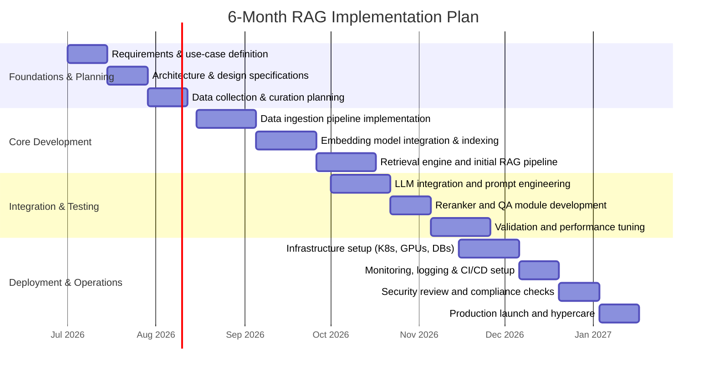

# Roadmap to Production-Grade RAG Architecture

This roadmap outlines a comprehensive curriculum of topics for building a corporate-grade Retrieval-Augmented Generation (RAG) system. It starts with foundational theory (IR, LLMs, RAG basics) and progresses through retrieval models, embeddings, indexing, vector stores, and LLM integration. Advanced sections cover system architecture, scalability, latency and throughput, caching, and infra orchestration (Kubernetes, GPUs/CPUs). It also addresses data pipelines (ingestion, chunking, annotation, synthetic data), evaluation metrics, monitoring/observability (RAGOps), testing (A/B, canary, blue/green), security/privacy/compliance (encryption, differential privacy, GDPR, IP), cost optimisation, MLOps/CI-CD, model governance, explainability and adversarial robustness. We include best practices for hybrid retrieval (sparse+dense), reranking, caching, sharding, replication, disaster recovery, multi-modal retrieval, knowledge graphs, semantic search, query expansion/feedback, GPU/CPU infra, autoscaling, feature stores, quantisation, approximate nearest neighbour (ANN) algorithms (HNSW, IVF, PQ), index maintenance, incremental updates, cold-start/warm-up strategies, evaluation metrics, legal/ethical issues, logging/alerting, SLO/SLA compliance, incident response, team roles, and tools/frameworks. Tables compare ANN algorithms and deployment options (open-source vs managed). A final Gantt chart lays out a 6-month implementation timeline, and a checklist of deliverables ensures production readiness.  

## 1. Foundations & Theory  
- **Information Retrieval (IR) fundamentals:** inverted indexes, TF–IDF, BM25; keyword vs semantic search.  
- **Large Language Model (LLM) basics:** transformer architectures, embeddings, pretraining and fine-tuning, contextual representations, inference.  
- **RAG concept and history:** integration of retrieval with generation; reduction of hallucinations; RAG components (retriever + LLM).  
- **Key research:** seminal RAG paper (Lewis *et al.*, 2020); RAGOps/LLOps frameworks; related surveys (e.g. RAG evaluation).  
- **Information retrieval theory:** semantic vs lexical approaches; evaluation basics (precision, recall); IR underpinnings of vector search.  

## 2. Retrieval Models & Techniques  
- **Sparse (lexical) retrieval:** keyword matching, BM25/Tf–IDF, inverted-index engines (Lucene/Elasticsearch).  
- **Dense (vector) retrieval:** embedding-based search (e.g. Sentence-BERT, dense encoder models); vector similarity measures.  
- **Hybrid retrieval:** combining dense + sparse queries (semantic + exact match); trade-offs of dual-index systems.  
- **Multi-modal retrieval:** cross-modal embeddings (text, image, audio); unified search across modalities.  
- **Semantic search & knowledge graphs:** concept search, entity linking, ontologies; integrating knowledge graph queries.  
- **Query understanding and expansion:** query parsing, intent classification, synonyms, relevance feedback loops.  

## 3. Embeddings & Representations  
- **Embedding types:** static (word2vec, GloVe) vs contextual (BERT, SBERT, GPT) models.  
- **Embedding model selection:** dimensionality, accuracy vs cost; OpenAI/third-party APIs vs open-source models; self-hosting for privacy.  
- **Vector quantization & compression:** product quantization, pruning, and low-precision quantisation to reduce index size.  
- **Multi-modal embeddings:** CLIP and other joint text-image/audio embeddings for visual and audio search.  
- **Data augmentation:** synthetic query/document generation, QA pair creation, noise injection for robustness.  
- **Annotation and curation:** labelled datasets for retrieval and RAG (e.g. question-answer pairs), taxonomy and metadata tagging.  

## 4. Indexing & Vector Stores  
- **ANN algorithms:** approximate nearest neighbour methods: Hierarchical Navigable Small World (HNSW), Inverted File (IVF), Product Quantization (PQ).  
  - *HNSW:* graph-based, high recall and accuracy, but memory-intensive.  
  - *IVF:* clustering-based, fast search for large data, trade-off precision.  
  - *PQ:* compresses vectors, memory-efficient, faster, but lower precision.  

| Algorithm | Trade-offs (accuracy vs speed/memory) |
|-----------|--------------------------------------|
| HNSW      | High recall/precision; high memory and index build time |
| IVF       | Fast search (data partitioning); moderate recall dependent on clustering quality |
| PQ        | Compressed vectors (low memory); fast query; potential precision loss |

- **Index maintenance:** batch vs real-time indexing; incremental/streaming index updates; warm-up vs cold-start handling.  
- **Vector DB systems:** open-source (FAISS, Milvus, Weaviate, Qdrant, Annoy) vs managed (Pinecone, Weaviate Cloud).  
- **Open-source vs managed:** comparison of control, cost, scalability, maintenance overhead.  
- **Key features:** multi-tenancy, metadata filtering, hybrid search support; performance vs ease-of-use.  

| Deployment      | Pros                                | Cons                                   |
|-----------------|-------------------------------------|----------------------------------------|
| Managed (e.g. Pinecone) | Auto-scaling, SLA, minimal ops | Higher cost, vendor lock-in  |
| Self-hosted (e.g. Milvus/Qdrant) | Full control, lower licensing cost | Requires infra setup and maintenance  |

- **Cloud vs on-prem:** vector search services (AWS OpenSearch kNN, Amazon Kendra, Azure Cognitive Search, Google Vertex AI Search) – feature comparison (scalability, security compliance, LLM integration).  
- **Sharding & replication:** distributed index across nodes, replication strategies for fault tolerance; backup and disaster recovery plans for vector data.  

## 5. LLM Integration & Prompt Engineering  
- **LLM selection:** cloud APIs (OpenAI, Azure, Anthropic) vs on-prem (Llama, GPT-NeoX); considerations of throughput, latency, licensing.  
- **Prompt engineering:** few-shot/zero-shot prompts, chain-of-thought prompting, prompt templates; instruction tuning.  
- **Context injection:** embedding retrieval results into the LLM prompt (context window management, truncation strategies).  
- **Conversation management:** dialogue memory, multi-turn context, session handling.  
- **LLM fine-tuning/in-context learning:** optional specialised fine-tuning or in-context examples to adapt generation to domain.  
- **Output control:** temperature, biases, filters; constraint handling (safety filters).  

## 6. Ranking & Reranking  
- **Initial ranking:** scoring of retrieved documents (cosine similarity, dot-product).  
- **Reranking models:** cross-encoder transformers for fine-grained relevance; learning-to-rank methods; open-source and API-based options.  
- **Reranking trade-offs:** improved precision vs added latency and cost.  
- **Answer extraction:** extractive QA models (span extraction) vs generative answer synthesis.  
- **Relevance feedback & iterative refinement:** user feedback loops, query reformulation based on click data or interaction.  

## 7. System Architecture & Infrastructure  
- **Pipeline components:** data sources (DBs, docs, APIs), ingestion/ETL, vector store, retriever service, LLM service, user interface.  
- **Microservices design:** modular services for ingestion, indexing, retrieval, generation, separate databases and LLM hosts.  
- **Orchestration (Kubernetes, Docker):** containerised components, service discovery, load balancing, auto-scaling policies (horizontal/vertical).  
- **Compute infrastructure:** GPU vs CPU usage (GPU for embedding generation or FAISS GPU mode); serverless vs managed instances; cloud (EC2, GKE) vs on-prem.  
- **Autoscaling strategies:** metrics-triggered scaling (latency, CPU/GPU util); hot vs cold instance scaling; spot instances for cost-saving.  
- **Caching layers:** query result caching, vector cache (for common queries), LLM response caching.  
- **Orchestration tools:** airflow, Kubeflow, MLFlow integration for workflow scheduling.  
- **Feature store integration:** storing and serving computed features (embeddings, metadata) for reuse.  

## 8. Data Pipeline & Curation  
- **Data ingestion:** batch and streaming pipelines for text/image data; source connectors (APIs, databases, file stores).  
- **Chunking strategies:** fixed-size vs semantic vs hierarchical chunking; overlap strategies to preserve context.  
- **Preprocessing:** cleaning, deduplication, normalization of text; OCR for scanned docs.  
- **Metadata management:** tagging documents with source, date, category for filtering.  
- **Annotation & labeling:** creating ground-truth for IR/retrieval tasks (e.g. relevant docs for queries), quality control.  
- **Synthetic data:** generating synthetic question-answer pairs or paraphrases to augment training or evaluation.  
- **Cold-start & warm-up:** precomputing embeddings for initial load; lazy vs eager indexing for new data.  
- **Data lineage & provenance:** tracking source and transformations of knowledge documents.  

## 9. Performance & Scalability  
- **Latency targets (SLAs):** define acceptable query response times; measure tail latencies and optimize.  
- **Throughput (QPS):** support expected query volumes; horizontal scaling of retrieval and LLM inference.  
- **Batching:** batch multiple queries for embedding computation or vector search to increase throughput.  
- **GPU/CPU optimization:** use vectorised operations (BLAS libraries), GPU acceleration for FAISS/ANN.  
- **Quantization:** reduce model size (e.g. int8 quantization) to speed up inference.  
- **Caching strategies:** document and embedding caches to reduce repeated computation.  
- **Monitoring bottlenecks:** profile CPU, memory, I/O, network to identify hot spots.  

## 10. Monitoring & Observability (RAGOps)  
- **Logging:** structured logs of queries, retrieved doc IDs, LLM outputs, errors.  
- **Metrics & SLOs:** track search recall, precision, query latency, LLM response quality, usage; define SLOs/SLAs.  
- **Dashboards & Alerts:** Prometheus/Grafana or cloud native monitoring; set alerts on error rates, latency breaches, abnormal outputs.  
- **Distributed tracing:** end-to-end traces across ingestion, retrieval, generation services.  
- **Data & Model drift detection:** monitor changes in query characteristics, relevance over time.  
- **Observability tooling:** use LangChain’s LangSmith, Databricks MLflow, New Relic, OpenTelemetry for RAG pipelines.  

## 11. Testing & Evaluation  
- **Retrieval metrics:** precision@K, recall@K, MAP, MRR for retrieval component.  
- **Generation metrics:** BLEU, ROUGE, METEOR, F1 for response quality.  
- **End-to-end RAG metrics:** combination (e.g. QA accuracy, relevance-weighted F1).  
- **Benchmark datasets:** use standard QA or retrieval benchmarks; create domain-specific test sets.  
- **User feedback testing:** collect user ratings or A/B test answers.  
- **A/B testing & rollouts:** canary releases, blue-green deployment to compare model versions or pipeline changes.  
- **Load/performance testing:** simulate high QPS; measure system under stress.  
- **Unit/integration tests:** validate each module (ingestion, indexing, API endpoints).  

## 12. Security, Privacy & Compliance  
- **Access control:** authentication/authorization (OAuth, API keys) for data and APIs.  
- **Encryption:** TLS for data in transit; encryption at rest for indexes and data stores.  
- **Data governance:** GDPR/CCPA compliance, data retention policies.  
- **Differential privacy:** privacy-preserving embeddings or query logs.  
- **Adversarial robustness:** guard against malicious inputs, retrieval poisoning attacks.  
- **Legal & ethical:** content filtering, copyright checks, bias auditing.  

## 13. Cost Optimisation & Vendor Evaluation  
- **Cost modelling:** estimate compute (GPU hours), storage (vector DB), and API usage costs.  
- **Cloud vendor comparison:** AWS (Bedrock/Athena/Kendra), Azure (Cognitive Search + OpenAI), GCP (Vertex AI); features and pricing.  
- **Managed vs OSS:** trade-offs in total cost of ownership; break-even analysis (e.g. self-host vs Pinecone).  
- **Autoscaling controls:** use spot/discounted instances; scale down idle services.  
- **Chargeback and monitoring:** track expenses per team/project, set budgets.  

## 14. MLOps, CI/CD & Governance  
- **CI/CD pipelines:** automated build/test/deploy (Jenkins, GitHub Actions) for code, infra (Terraform) and models.  
- **Model versioning:** MLflow or DVC for tracking model/artifact versions.  
- **Continuous evaluation:** performance/regression tests on each update.  
- **Deployment strategies:** blue-green, canary releases for updates.  
- **Runbooks & incident response:** documented processes for outages.  
- **Team roles & skills:** define roles (ML Engineers, Data Engineers, SRE, Product Owner); skills (ML/IR knowledge, DevOps, Kubernetes, Python) checklist.  

## 15. Tools, Frameworks & Resources  
- **Vector databases:** FAISS, Annoy (libraries); Milvus, Weaviate, Qdrant (open-source); Pinecone, Zilliz Cloud, AWS/Kendra (managed).  
- **Retrieval frameworks:** Elasticsearch, Lucene (with vector plugins), Vespa.  
- **RAG frameworks:** LangChain, LlamaIndex, Haystack.  
- **LLM libraries:** Hugging Face Transformers, OpenAI SDK, Ollama.  
- **MLOps tools:** MLflow, DVC, Kubeflow, Seldon Core, BentoML, LangSmith (monitoring).  
- **DevOps & infra:** Docker, Kubernetes, Terraform, ArgoCD.  
- **Monitoring & logging:** Prometheus, Grafana, ELK/EFK stack, Datadog, OpenTelemetry.  
- **Evaluation suites:** LangChain evals, Hugging Face Datasets, Pytorch lightning.  
- **Key papers:** Lewis *et al.* “RAG” (2020); Auepora RAG Eval survey (2024); RAGOps (2025); vector search (FAISS 2017).  
- **Industry resources:** AWS RAG guide, Google Cloud RAG docs; n8n RAG architecture; PingCAP ANN article.  

## Deliverables & Milestones  
- Data ingestion and chunking pipeline deployed.  
- Embedding generation service and vector index built.  
- Retrieval API integrated with vector store and LLM.  
- Prompt templates and reranking module in place.  
- Performance tests completed (latency, throughput) and optimised.  
- Monitoring/observability dashboards and alerts configured.  
- CI/CD pipeline for code/model updates.  
- Security/compliance audit passed (encryption, access controls).  
- Production launch with rollback and incident runbook ready.  

**Sources:** Standard AI/ML and IR literature and industry references were used to select and organise topics (e.g. RAG definition, RAGOps/MLOps, ANN/indexing, architecture guides).