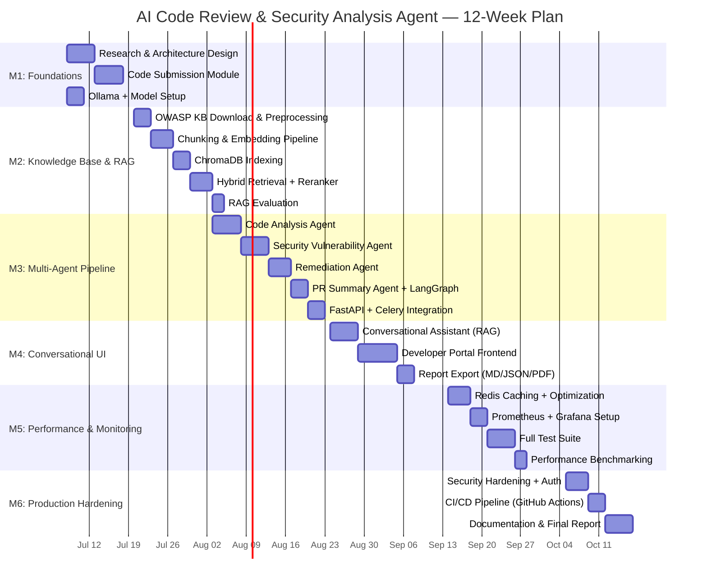
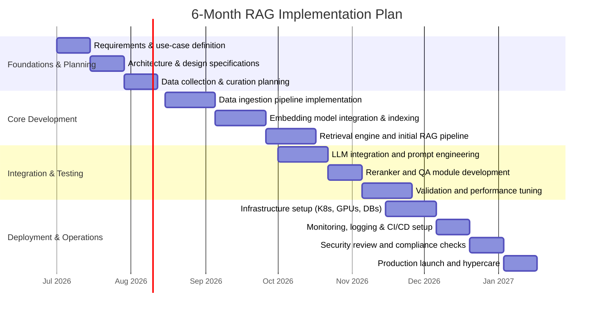

# Research and Reports

# AI Code Review & Security Analysis Agent
## Final Project Report — Production-Grade RAG Architecture

> **Constraint**: All components must be **free / open-source** and runnable **locally on an Apple MacBook M4** (arm64, Apple Silicon).

---

## Table of Contents

1. [Executive Summary](#1-executive-summary)
2. [Problem Statement & Objectives](#2-problem-statement--objectives)
3. [Open-Source Tech Stack M4-Compatible](#3-open-source-tech-stack-m4-compatible)
4. [System Architecture Overview](#4-system-architecture-overview)
5. [Agent Definitions & Responsibilities](#5-agent-definitions--responsibilities)
6. [Module Breakdown](#6-module-breakdown)
7. [RAG Pipeline Design](#7-rag-pipeline-design)
8. [Data Pipeline & Knowledge Base Construction](#8-data-pipeline--knowledge-base-construction)
9. [LLM Integration & Prompt Engineering](#9-llm-integration--prompt-engineering)
10. [Retrieval, Ranking & Reranking](#10-retrieval-ranking--reranking)
11. [Performance & Scalability on M4](#11-performance--scalability-on-m4)
12. [Monitoring, Observability & RAGOps](#12-monitoring-observability--ragops)
13. [Testing & Evaluation Strategy](#13-testing--evaluation-strategy)
14. [Security, Privacy & Compliance](#14-security-privacy--compliance)
15. [CI/CD & MLOps](#15-cicd--mlops)
16. [Milestone & Delivery Plan](#16-milestone--delivery-plan)
17. [Project Directory Structure](#17-project-directory-structure)
18. [Implementation Gantt Chart](#18-implementation-gantt-chart)
19. [Deliverables Checklist](#19-deliverables-checklist)
20. [Appendix A: Quick Start Guide](#appendix-a-quick-start-guide)
21. [Appendix B: Key References](#appendix-b-key-references--standards)

---

## 1. Executive Summary

The **AI Code Review & Security Analysis Agent** is a production-grade, multi-agent, RAG-powered platform that automatically analyzes Python and Java source code for:

- **Code quality issues** — code smells, complexity, anti-patterns, design violations
- **Security vulnerabilities** — OWASP Top-10 (SQL Injection, XSS, CSRF, hardcoded secrets, broken access controls, insecure authentication, etc.)
- **Actionable remediation** — corrected code examples, refactoring suggestions, best-practice explanations
- **Conversational Q&A** — a RAG-powered chatbot grounded in an indexed secure coding knowledge base

The system is built entirely on **open-source, locally executable** components, making it cost-free to run and privacy-safe (no code leaves the developer's machine).

---

## 2. Problem Statement & Objectives

### The Problem

Software development teams face three core pain points:

| Pain Point | Impact |
|---|---|
| Inconsistent code quality | Technical debt accumulates; maintenance cost grows |
| Undetected security vulnerabilities | Late-stage discovery is 10x–100x more expensive to fix |
| Slow, subjective manual reviews | Bottleneck at PR stage; reviewer fatigue; knowledge silos |

### Objectives

1. Build a **multi-agent pipeline** that fires automatically on code submission.
2. Detect **OWASP-standard vulnerabilities** with severity scoring (Critical / High / Medium / Low / Informational).
3. Generate **corrected code examples** and refactoring suggestions grounded in secure coding standards.
4. Provide a **RAG-powered Conversational Code Assistant** for follow-up queries.
5. Produce **structured, exportable code review reports** (JSON, Markdown, PDF).

### Expected Outcomes

- >= 85% detection rate on known OWASP vulnerability patterns (Python/Java test suite)
- < 30 seconds end-to-end pipeline on a single code file (M4 local inference)
- Zero external API cost (fully open-source)
- Conversational Q&A accuracy >= 75% (RAGAS faithfulness metric)

---

## 3. Open-Source Tech Stack (M4-Compatible)

All components are **free, open-source**, and confirmed to run natively on **Apple Silicon (arm64 / M4)**.

### Core LLM — Local Inference

| Component | Choice | Why |
|---|---|---|
| LLM Runtime | **Ollama** (v0.3+) | Native Apple Silicon support; pulls GGUF models; REST API |
| Primary LLM | **Codestral (7B)** via Ollama | State-of-the-art code understanding; runs well on M4 |
| Fast LLM | **Qwen2.5-Coder:7b** via Ollama | Lighter, faster for latency-sensitive agents |
| Heavy LLM (optional) | **DeepSeek-Coder-V2-Lite (16B Q4)** | Higher accuracy; requires 24 GB unified memory |

```bash
ollama pull codestral
ollama pull qwen2.5-coder:7b
ollama pull nomic-embed-text
```

### Embedding Model

| Component | Choice | Why |
|---|---|---|
| Embedding Model | **nomic-embed-text** via Ollama | 768-dim; fast on Apple MPS |
| Library | `sentence-transformers` (HuggingFace) | Apple MPS acceleration supported |

### Vector Store

| Component | Choice | Why |
|---|---|---|
| Primary | **ChromaDB** (local persistent mode) | Zero-config, embedded, SQLite-backed; Python-native |
| Alternative | **Qdrant** (Docker local) | Better for hybrid search at scale |

### RAG & Agent Frameworks

| Component | Choice | Why |
|---|---|---|
| RAG Orchestration | **LlamaIndex** (v0.10+) | Code-aware RAG; chunking; rerankers |
| Agent Orchestration | **LangGraph** (open-source) | Stateful multi-agent graphs |
| Task Queue | **Celery + Redis** (Docker) | Async parallel agent execution |

### Reranking

| Component | Choice |
|---|---|
| Cross-Encoder | **cross-encoder/ms-marco-MiniLM-L-6-v2** (HuggingFace) |

### Static Code Analysis

| Language | Tools |
|---|---|
| Python | **Bandit** + **Pylint** + **radon** + **Semgrep** |
| Java | **PMD** + **SpotBugs** (via CLI) |
| Language Detection | `pygments` / `guesslang` |

### Web Stack

| Layer | Choice |
|---|---|
| Backend | **FastAPI** + **Celery** |
| Frontend | **Streamlit** (prototype) / **Next.js** (production) |
| Code Editor | **Monaco Editor** (embedded) |
| Report Export | **WeasyPrint** + **reportlab** |

### Monitoring

| Component | Choice |
|---|---|
| Metrics | **Prometheus** + **Grafana** (Docker) |
| Logging | **structlog** + **Loguru** |
| RAG Tracing | **Phoenix Arize** (100% local) |
| RAG Eval | **RAGAS** library |

---

## 4. System Architecture Overview

```
+----------------------------------------------------------+
|                  Developer Portal (UI)                   |
|          Streamlit / Next.js + Monaco Editor             |
+---------------------------+------------------------------+
                            | HTTP (FastAPI)
+---------------------------v------------------------------+
|                    FastAPI Backend                       |
|     /submit-code    /chat    /report    /status          |
+------+-------------------+-------------------+----------+
       | Celery Task        | RAG Query         | Export
+------v-----------+ +-----v----------+ +------v---------+
| Multi-Agent      | | Conversational | | Report         |
| Orchestration    | | Code Assistant | | Generator      |
| (LangGraph)      | | (LlamaIndex)   | | (MD/PDF/JSON)  |
+------+-----------+ +-----+----------+ +----------------+
       |                   |
+------v-------------------v-------------------------------+
|               LangGraph Agent Pipeline                   |
|                                                          |
| [Code Analysis] --> [Security Vuln] --> [Remediation]   |
|   (parallel)          (parallel)       (sequential)      |
|                                    --> [PR Summary]      |
+----------------------------------------------------------+
       |                   |
+------v-----------+ +-----v-------------------------------+
| Ollama (LLM)     | | ChromaDB (Vector Store)            |
| codestral:7b     | | - owasp_knowledge_base             |
| qwen2.5-coder    | | - code_patterns                   |
+------------------+ | - remediation_guides              |
                     +------------------------------------+
+----------------------------------------------------------+
| Static Linters: Bandit + PMD + Semgrep + Pylint + radon |
+----------------------------------------------------------+
```

---

## 5. Agent Definitions & Responsibilities

### Agent 1: Code Analysis Agent

**Purpose:** Reviews code structure; detects code smells, design anti-patterns, complexity.

**Tools:** Bandit / Pylint / radon (Python) | PMD / SpotBugs (Java) | Codestral (LLM)

**Output Schema:**
```json
{
  "agent": "CodeAnalysisAgent",
  "findings": [
    {
      "id": "CA-001",
      "type": "code_smell",
      "category": "god_class | long_method | magic_number | duplicate_code",
      "severity": "medium",
      "line_range": [10, 45],
      "description": "Function exceeds 50 lines; violates Single Responsibility Principle.",
      "snippet": "..."
    }
  ],
  "complexity_score": { "cyclomatic": 12, "cognitive": 8 },
  "summary": "3 code smells detected. Overall quality: C"
}
```

---

### Agent 2: Security Vulnerability Agent

**Purpose:** Scans for OWASP Top-10 and CWE vulnerabilities.

**OWASP Coverage:**

| OWASP Category | CWEs Covered |
|---|---|
| A01 Broken Access Control | CWE-22, CWE-285, CWE-862 |
| A02 Cryptographic Failures | CWE-327, CWE-330, CWE-798 (hardcoded secrets) |
| A03 Injection | CWE-89 (SQL), CWE-79 (XSS), CWE-78 (OS Command) |
| A04 Insecure Design | CWE-657, CWE-73 |
| A05 Security Misconfiguration | CWE-16, CWE-611 |
| A07 Authentication Failures | CWE-287, CWE-384 |
| A08 Data Integrity Failures | CWE-829, CWE-494 |
| A09 Logging Failures | CWE-778, CWE-532 |
| A10 SSRF | CWE-918 |

**Tools:** Semgrep + Bandit (Python) | PMD (Java) | LLM + RAG context from OWASP KB

**Output Schema:**
```json
{
  "agent": "SecurityVulnerabilityAgent",
  "vulnerabilities": [
    {
      "id": "SEC-001",
      "owasp_category": "A03 - Injection",
      "cwe": "CWE-89",
      "severity": "critical",
      "cvss_score": 9.8,
      "line": 34,
      "description": "Unsanitized user input passed directly to SQL query.",
      "evidence": "cursor.execute(f'SELECT * FROM users WHERE id={user_id}')",
      "confidence": "high"
    }
  ]
}
```

---

### Agent 3: Remediation Agent

**Purpose:** Generates fix recommendations with corrected code per finding.

**Tools:** ChromaDB RAG retrieval + Codestral LLM (chain-of-thought prompting)

**Output Schema:**
```json
{
  "agent": "RemediationAgent",
  "remediations": [
    {
      "finding_id": "SEC-001",
      "recommendation": "Use parameterized queries to prevent SQL injection.",
      "corrected_code": "cursor.execute('SELECT * FROM users WHERE id = %s', (user_id,))",
      "explanation": "Parameterized queries separate SQL logic from data.",
      "references": ["OWASP A03:2021", "CWE-89 Mitigation Guide"],
      "effort": "low"
    }
  ]
}
```

---

### Agent 4: PR Summary Agent

**Purpose:** Compiles all findings into a structured PR-style review.

**Output:** Markdown PR review with:
- Executive summary (overall risk rating)
- Critical / High / Medium / Low finding tables
- Remediation priority roadmap
- Metrics: total issues, security score (0-100), quality score (0-100)

---

### Agent 5: Conversational Code Assistant

**Purpose:** RAG-powered Q&A chatbot for follow-up queries.

**Architecture:** Query --> Embedding --> ChromaDB Search --> Reranker --> LLM --> Streamed Answer

**Features:**
- Multi-turn conversation with Redis session memory
- Auto-inject current session findings as conversation context
- Streaming responses via SSE
- Source citations per answer

---

## 6. Module Breakdown

### Module 1: Code Submission Module

- Direct code paste (Monaco Editor, syntax highlighting)
- File upload (.py, .java) with MIME validation
- Syntax validation (Python: ast.parse; Java: basic parse check)
- Language auto-detection (pygments)
- Code size limits: max 10,000 lines

**API:**
```
POST /api/v1/submit
Body: { code: string | file, language: "python"|"java"|"auto" }
Response: { session_id: uuid, status: "queued" }
```

---

### Module 2: Secure Coding Knowledge Base & RAG Pipeline

**Knowledge Sources (open-license):**
1. OWASP Top-10 (2021)
2. OWASP ASVS 4.0
3. OWASP Cheat Sheet Series (60+ documents)
4. CWE/SANS Top 25
5. CERT Secure Coding Standards (Java, Python)
6. Python PEP8 + PEP20
7. Semgrep open-source rule documentation
8. NIST SP 800-53 summary

**Indexing Pipeline:**
```
Raw Docs (PDF/HTML/Markdown)
    |
    v
LlamaIndex SimpleDirectoryReader
    |
    v
RecursiveCharacterTextSplitter
  chunk_size: 512 tokens | overlap: 64 tokens
    |
    v
nomic-embed-text (768-dim vectors)
    |
    v
ChromaDB Persistent Collections:
  - owasp_knowledge_base   (~15,000 chunks)
  - code_patterns          (~5,000 chunks)
  - remediation_guides     (~8,000 chunks)
```

**Metadata Per Chunk:**
```json
{
  "source": "OWASP_Cheat_Sheets/SQL_Injection_Prevention",
  "owasp_category": "A03",
  "cwe_ids": ["CWE-89"],
  "severity_tags": ["critical", "injection"],
  "language": "general"
}
```

---

### Module 3: Multi-Agent Orchestration & Analysis Pipeline

**LangGraph State:**
```python
class AgentState(TypedDict):
    code: str
    language: str
    session_id: str
    linter_results: dict
    code_analysis: dict
    security_findings: dict
    remediations: dict
    pr_summary: str
    error: Optional[str]
```

**Execution Flow:**
```
[Preprocess: linters + AST]
         |
   +-----+-----+
   |             |
[Code Analysis] [Security Vuln]  <-- PARALLEL (asyncio)
   |             |
   +-----+-------+
         |
   [Remediation Agent]           <-- Sequential
         |
   [PR Summary Agent]            <-- Sequential
```

Agents 1 & 2 run in parallel — ~40% wall-clock time reduction.

---

### Module 4: Findings Display & Severity Scoring

**Severity Scoring:**

| Dimension | Weight |
|---|---|
| CVSS Base Score (security) | 40% |
| Exploitability Confidence | 25% |
| Code Complexity Impact | 20% |
| Business Impact Estimate | 15% |

**Risk Score (0-100):**
- 0-30: Low (Green)
- 31-60: Medium (Yellow)
- 61-80: High (Orange)
- 81-100: Critical (Red)

---

### Module 5: Conversational Code Assistant Interface

**RAG Query Flow:**
```
User Query
  --> Query Embedding (nomic-embed-text)
  --> ChromaDB Similarity Search (top-20)
  --> BM25 Sparse Search (top-20)
  --> RRF Fusion (top-30)
  --> Cross-Encoder Reranker (top-5)
  --> Context Assembly (findings + KB chunks)
  --> LLM (Codestral via Ollama)
  --> Streamed Response + Citations
```

---

### Module 6: Code Review Report Generation & Export

**Report Sections:**
1. Executive Summary (risk score, finding counts by severity)
2. Code Quality Analysis (Code Analysis Agent output)
3. Security Vulnerability Report (per OWASP category)
4. Remediation Roadmap (prioritized, effort-tagged)
5. Code Metrics (cyclomatic complexity, LOC, duplication %)
6. References & Standards

**Export Formats:** Markdown | JSON | PDF (WeasyPrint)

**CLI Integration:**
```bash
python cli_review.py --file mycode.py --format json --output report.json
# Non-zero exit code if Critical findings detected (CI/CD gate)
```

---

## 7. RAG Pipeline Design

### Architecture: Advanced RAG (Hybrid + Reranking)

```python
# Dense retrieval
dense_results = chroma_collection.query(
    query_embeddings=[embed(query)],
    n_results=20,
    where={"owasp_category": owasp_filter}
)

# Sparse retrieval (BM25)
bm25 = BM25Okapi(corpus_tokens)
sparse_scores = bm25.get_scores(tokenize(query))
sparse_results = top_k(sparse_scores, k=20)

# Reciprocal Rank Fusion
final_results = reciprocal_rank_fusion([dense_results, sparse_results])

# Cross-encoder reranking
reranker = CrossEncoder("cross-encoder/ms-marco-MiniLM-L-6-v2")
scores = reranker.predict([(query, doc) for doc in final_results[:30]])
final_top_5 = sort_by_score(final_results, scores)[:5]
```

### Chunking Strategy

| Document Type | Strategy | Chunk Size | Overlap |
|---|---|---|---|
| OWASP HTML pages | Semantic (section-aware) | 400-600 tokens | 64 tokens |
| CERT PDFs | Recursive character split | 512 tokens | 64 tokens |
| Cheat sheets | Header-based hierarchical | Variable | 32 tokens |
| Code examples | Whole function / class | As-is | None |

---

## 8. Data Pipeline & Knowledge Base Construction

```bash
# 1. Install all dependencies
pip install llama-index chromadb sentence-transformers rank_bm25 \
            langchain langchain-community langgraph \
            bandit pylint radon semgrep \
            fastapi celery redis streamlit \
            weasyprint structlog loguru ragas arize-phoenix

# 2. Pull Ollama models
ollama pull nomic-embed-text
ollama pull codestral
ollama pull qwen2.5-coder:7b

# 3. Download OWASP Knowledge Base
python scripts/download_kb.py

# 4. Build vector index (~20-40 min on first run)
python scripts/build_index.py

# 5. Start infrastructure
docker-compose up -d redis prometheus grafana

# 6. Start backend + workers
uvicorn app.main:app --host 0.0.0.0 --port 8000 &
celery -A app.celery_app worker --concurrency=2 &

# 7. Start frontend
streamlit run frontend/app.py
```

---

## 9. LLM Integration & Prompt Engineering

### Agent Prompt Templates

**Code Analysis Agent:**
```
You are an expert software engineer and code quality reviewer.
Analyze the following {language} code for:
1. Code smells (God Class, Long Method, Feature Envy, etc.)
2. Design anti-patterns (Singleton abuse, tight coupling, etc.)
3. Complexity issues (cyclomatic complexity > 10)
4. PEP8/Java style violations

Linter output: {linter_results}

Code:
```{language}
{code}
```

Return structured JSON: {output_schema}
```

**Security Vulnerability Agent:**
```
You are a senior application security engineer specializing in OWASP Top-10.
Secure coding knowledge base excerpts: {rag_context}

Analyze this {language} code for security vulnerabilities:
```{language}
{code}
```

Linter security findings: {linter_security_results}

For each vulnerability: OWASP category, CWE ID, severity, line number, evidence, confidence.
Return structured JSON: {output_schema}
```

**Remediation Agent:**
```
You are a secure coding expert.
Findings: {code_analysis_findings} | {security_vulnerability_findings}
Guidance: {rag_remediation_context}
Original code: {code}

For each finding provide:
1. Specific actionable fix
2. Corrected code snippet (minimal diff)
3. Explanation of why the fix works
4. Effort estimate (low/medium/high)

Return structured JSON: {output_schema}
```

### Context Window Management

- Max context: 8,192 tokens (Codestral/Qwen2.5)
- Code: analyzed in 200-line windows, 20-line overlap
- RAG context: top-5 chunks x ~400 tokens = ~2,000 tokens
- System prompt: ~500 tokens fixed
- Remaining: ~5,700 tokens for code + history

---

## 10. Retrieval, Ranking & Reranking

### Why Hybrid Retrieval?

| Method | Strength | Weakness |
|---|---|---|
| Dense (semantic) | Finds conceptually similar content | Misses exact terms like "CWE-89" |
| Sparse (BM25) | Exact keyword matching | Misses semantic variants |
| Hybrid + Reranking | Best precision for security knowledge | Slightly higher latency |

### Retrieval Quality Targets

| Metric | Target |
|---|---|
| Recall@5 | >= 0.85 |
| Precision@5 | >= 0.75 |
| MRR | >= 0.80 |
| NDCG@10 | >= 0.78 |

---

## 11. Performance & Scalability on M4

### M4 Hardware Profile
- CPU: 10-core | GPU: 10-core | Memory: 24 GB unified (shared)
- MPS (Metal Performance Shaders): Full PyTorch support

### Optimization Strategies

| Layer | Optimization | Expected Gain |
|---|---|---|
| LLM Inference | GGUF Q4_K_M quantization via Ollama | 4x faster, 75% memory reduction |
| Embeddings | Apple MPS acceleration | 3x faster than CPU |
| Vector Search | ChromaDB HNSW index | Sub-10ms for 30K chunks |
| Agents 1+2 | Parallel async execution | ~40% wall-clock reduction |
| Caching | Redis (query + embedding + LLM) | 0ms on cache hits |

### Expected Latency (single file, ~200 lines)

| Stage | Time |
|---|---|
| Static linters | 0.5-2s |
| Code Analysis Agent (LLM) | 8-15s |
| Security Vuln Agent (LLM) | 10-18s (parallel with Agent 1) |
| RAG retrieval + reranking | 0.5-2s |
| Remediation Agent (LLM) | 8-15s |
| PR Summary Agent (LLM) | 5-10s |
| **Total (parallel execution)** | **~35-50s** |

### Caching Architecture (Redis)

```
Query Cache:      Key=SHA256(code+language)  TTL=3600s
Embedding Cache:  Key=SHA256(text_chunk)     TTL=86400s
LLM Cache:        Key=SHA256(prompt)         TTL=3600s
```

---

## 12. Monitoring, Observability & RAGOps

### Docker Compose Monitoring Stack

```yaml
services:
  prometheus:
    image: prom/prometheus
    ports: ["9090:9090"]
  grafana:
    image: grafana/grafana
    ports: ["3001:3000"]
  redis:
    image: redis:alpine
    ports: ["6379:6379"]
```

### Key Metrics & Alert Thresholds

| Category | Metric | Alert Threshold |
|---|---|---|
| Performance | P95 end-to-end latency | > 120s |
| Retrieval | Recall@5 on eval set | < 0.75 |
| LLM Quality | RAGAS faithfulness | < 0.70 |
| Security | False negative rate | > 15% |
| System | Redis memory | > 80% |
| System | Ollama GPU memory | > 90% |

### RAGAS Evaluation

```python
from ragas.metrics import faithfulness, answer_relevancy, context_recall
results = evaluate(dataset=golden_dataset,
                   metrics=[faithfulness, answer_relevancy, context_recall])
```

### Phoenix Arize Local RAG Tracing

```bash
pip install arize-phoenix
python -m phoenix.server.main &  # Local UI at http://localhost:6006
```

### Structured Log Format

```json
{
  "timestamp": "2026-07-08T10:30:00Z",
  "session_id": "abc-123",
  "agent": "SecurityVulnerabilityAgent",
  "event": "finding_detected",
  "severity": "critical",
  "owasp_category": "A03",
  "latency_ms": 12450,
  "tokens_used": 2847,
  "retrieval_recall": 0.88
}
```

---

## 13. Testing & Evaluation Strategy

### Vulnerability Detection (Primary Eval)

**Test Suite:** 100 Python + 100 Java files with known vulnerabilities (labeled)

| Metric | Target |
|---|---|
| True Positive Rate | >= 85% |
| False Positive Rate | <= 20% |
| F1 Score | >= 0.80 |
| Critical Vuln Recall | >= 95% |

### RAG Quality Evaluation

**Golden Dataset:** 200 QA pairs from OWASP docs

| Metric | Target | Tool |
|---|---|---|
| Recall@5 | >= 0.85 | Custom script |
| RAGAS Faithfulness | >= 0.80 | ragas library |
| Answer Relevancy | >= 0.78 | ragas library |

### Test Structure

```bash
pytest tests/ -v --cov=app --cov-report=html

tests/
  unit/
    test_chunking.py
    test_embedding.py
    test_agents.py
    test_report_generator.py
  integration/
    test_rag_pipeline.py
    test_agent_orchestration.py
    test_api_endpoints.py
  evaluation/
    test_retrieval_quality.py
    test_vuln_detection.py
    test_ragas_metrics.py
```

---

## 14. Security, Privacy & Compliance

### Local-First Privacy (By Design)

- NO code leaves the machine — all LLM inference via Ollama locally
- NO external API calls — no OpenAI, no cloud LLM
- NO telemetry — OLLAMA_NOPRUNE=1

### Application Security Controls

| Control | Implementation |
|---|---|
| Authentication | JWT tokens (PyJWT) |
| Session management | Redis-backed; 30-min TTL |
| Input validation | Code size limits; file type validation |
| Prompt injection defense | Strict system prompt boundaries; input sanitization |
| HTTPS | Self-signed cert locally; nginx reverse proxy |
| Secrets management | .env + python-dotenv; never log secrets |

### Data Retention Policy

- Analysis results: SQLite locally; 30-day auto-purge
- Redis cache: 1h (analysis), 24h (embeddings)
- Audit logs: 7-day retention, gzip compressed
- No PII collected; only code + session ID stored

---

## 15. CI/CD & MLOps

### GitHub Actions CI Pipeline

```yaml
name: CI Pipeline
on: [push, pull_request]
jobs:
  test:
    runs-on: macos-latest
    steps:
      - uses: actions/checkout@v4
      - name: Install dependencies
        run: pip install -r requirements.txt
      - name: Lint
        run: pylint app/ && bandit -r app/
      - name: Unit Tests
        run: pytest tests/unit/ -v
      - name: Integration Tests
        run: pytest tests/integration/ -v
      - name: Retrieval Eval
        run: python scripts/eval_retrieval.py --threshold 0.80
```

### Model Versioning (DVC)

```bash
pip install dvc
dvc init
dvc add data/knowledge_base/
dvc add models/chroma_index/
git add .dvc && git commit -m "Track KB and index with DVC"
```

### Deployment Strategy

| Environment | Stack |
|---|---|
| Local dev | docker-compose up |
| Staging | Single-machine Docker Compose |
| Production LAN | k3s (lightweight Kubernetes) |

---

## 16. Milestone & Delivery Plan

### Milestone 1 — Foundations (Week 1-2)

**Goal:** Research, design, and foundational setup.

**Tasks:**
- [ ] Study OWASP Top-10, ASVS, CWE Top-25, CERT secure coding standards
- [ ] Study RAG architecture, LangGraph multi-agent patterns
- [ ] Design and finalize system architecture (component diagram)
- [ ] Define agent input/output JSON schemas
- [ ] Set up project repository + Docker Compose baseline
- [ ] Install Ollama; pull codestral + qwen2.5-coder + nomic-embed-text
- [ ] Develop Code Submission Module (paste + file upload + syntax validation)

**Deliverables:**
- Finalized architecture diagram
- Agent JSON schema definitions
- Working Code Submission UI (Streamlit prototype)
- All Ollama models confirmed working

---

### Milestone 2 — Knowledge Base & RAG Pipeline (Week 3-4)

**Goal:** Build indexed secure coding knowledge base and full RAG pipeline.

**Tasks:**
- [ ] Download/preprocess OWASP, CERT, CWE documents (scripts/download_kb.py)
- [ ] Implement chunking pipeline (LlamaIndex)
- [ ] Embed all chunks (nomic-embed-text)
- [ ] Store in ChromaDB with full metadata schema
- [ ] Build BM25 index for sparse retrieval
- [ ] Implement hybrid retrieval with RRF fusion
- [ ] Integrate cross-encoder reranker
- [ ] Build LlamaIndex RAG QueryEngine
- [ ] Evaluate: Recall@5 >= 0.80 on 50-query golden set

**Deliverables:**
- ChromaDB persistent index (~28K chunks across 3 collections)
- RAG pipeline with hybrid retrieval + reranking
- Retrieval evaluation report

---

### Milestone 3 — Multi-Agent Pipeline (Week 5-6)

**Goal:** Implement and test all 4 analysis agents.

**Tasks:**
- [ ] Implement Code Analysis Agent (linters + LLM)
- [ ] Implement Security Vulnerability Agent (Semgrep + Bandit + LLM + RAG)
- [ ] Implement Remediation Agent (LLM + RAG remediation context)
- [ ] Implement PR Summary Agent (LLM synthesis)
- [ ] Implement LangGraph state graph + parallel execution
- [ ] Connect agents to FastAPI backend
- [ ] Implement Celery async task pipeline
- [ ] Test with 20 known-vulnerable code samples (Python + Java)

**Deliverables:**
- Working 4-agent LangGraph pipeline
- FastAPI backend: /submit, /status, /result endpoints
- Agent test results: >= 80% detection on test suite

---

### Milestone 4 — Conversational Assistant & Frontend (Week 7-8)

**Goal:** Build Conversational Code Assistant and polished Developer Portal UI.

**Tasks:**
- [ ] Implement Conversational Code Assistant (RAG + Redis session memory)
- [ ] Implement streaming responses (SSE)
- [ ] Build Developer Portal UI (Streamlit or Next.js)
  - [ ] Code submission form + Monaco Editor
  - [ ] Findings dashboard (severity-scored, color-coded cards)
  - [ ] Chat interface with source citations
  - [ ] Report export (MD / JSON / PDF)
- [ ] Run RAGAS evaluation: faithfulness >= 0.78

**Deliverables:**
- Full working Conversational Assistant
- Developer Portal UI (functional, production-ready)
- RAGAS evaluation report

---

### Milestone 5 — Performance, Monitoring & Testing (Week 9-10)

**Goal:** Optimize performance, set up observability, comprehensive testing.

**Tasks:**
- [ ] Implement Redis query/embedding/LLM caching
- [ ] Optimize LLM selection per agent (speed vs. accuracy)
- [ ] Set up Prometheus + Grafana monitoring (Docker)
- [ ] Set up Phoenix Arize local RAG tracing
- [ ] Write 100+ unit + integration tests (>= 80% coverage)
- [ ] Run full vulnerability test suite (200 files)
- [ ] Performance benchmark: P95 latency <= 120s
- [ ] Implement structured logging (structlog + Loguru)

**Deliverables:**
- Grafana dashboards running with all key metrics
- Test suite: >= 80% coverage, >= 85% vulnerability detection
- Performance benchmark report

---

### Milestone 6 — Security Hardening, CI/CD & Production Readiness (Week 11-12)

**Goal:** Production hardening, CI/CD, full documentation.

**Tasks:**
- [ ] Implement JWT authentication
- [ ] Add input validation + prompt injection defenses
- [ ] Set up GitHub Actions CI/CD pipeline
- [ ] DVC versioning for KB index
- [ ] Write incident runbook
- [ ] Final end-to-end integration testing
- [ ] Write README, API docs, deployment guide
- [ ] Create PDF report export template
- [ ] Final evaluation: all metrics at target

**Deliverables:**
- Production-ready system (local deployment)
- GitHub Actions CI pipeline active
- Complete documentation package
- Final project report

---

## 17. Project Directory Structure

```
ai-code-review-agent/
├── README.md
├── docker-compose.yml
├── requirements.txt
├── .env.example
├── cli_review.py                     # CLI for CI/CD integration
│
├── app/
│   ├── main.py                       # FastAPI application
│   ├── celery_app.py                 # Celery configuration
│   ├── api/routes/
│   │   ├── submit.py                 # Code submission endpoint
│   │   ├── chat.py                   # Conversational assistant
│   │   ├── report.py                 # Report export
│   │   └── status.py                 # Task status
│   ├── agents/
│   │   ├── state.py                  # LangGraph AgentState
│   │   ├── graph.py                  # LangGraph pipeline
│   │   ├── code_analysis.py          # Agent 1
│   │   ├── security_vuln.py          # Agent 2
│   │   ├── remediation.py            # Agent 3
│   │   └── pr_summary.py             # Agent 4
│   ├── rag/
│   │   ├── indexer.py                # Chunking + embedding + ChromaDB
│   │   ├── retriever.py              # Hybrid retrieval (dense + BM25 + RRF)
│   │   ├── reranker.py               # Cross-encoder reranker
│   │   └── chat_engine.py            # Conversational assistant
│   ├── linters/
│   │   ├── python_linter.py          # Bandit + Pylint + radon
│   │   └── java_linter.py            # PMD + SpotBugs CLI wrappers
│   ├── models/
│   │   ├── findings.py               # Pydantic finding models
│   │   ├── report.py                 # Report data models
│   │   └── session.py                # Session models
│   ├── report/
│   │   ├── generator.py              # Report orchestrator
│   │   ├── pdf_exporter.py           # WeasyPrint PDF
│   │   └── templates/                # Jinja2 templates
│   └── cache/
│       └── redis_cache.py            # Redis caching layer
│
├── frontend/
│   ├── app.py                        # Streamlit frontend
│   └── components/                   # Custom Streamlit components
│
├── data/
│   ├── knowledge_base/               # Raw OWASP/CERT/CWE documents
│   └── chroma_db/                    # ChromaDB persistent storage
│
├── scripts/
│   ├── download_kb.py                # Download OWASP knowledge base
│   ├── build_index.py                # Build ChromaDB index
│   ├── update_kb.py                  # Incremental KB updates
│   └── eval_retrieval.py             # Retrieval quality evaluation
│
├── tests/
│   ├── unit/
│   ├── integration/
│   └── evaluation/
│       ├── golden_dataset.json       # 200 QA pairs
│       └── vuln_test_suite/          # 200 labeled vulnerable code files
│
├── monitoring/
│   ├── prometheus.yml
│   └── grafana/dashboards/
│
└── .github/workflows/
    └── ci.yml
```

---

## 18. Implementation Gantt Chart



---

## 19. Deliverables Checklist

### Core Functionality
- [ ] Code Submission Module (paste + file upload, Python/Java)
- [ ] Secure Coding Knowledge Base (~28K chunks in ChromaDB)
- [ ] Hybrid RAG pipeline (dense + sparse + reranker)
- [ ] Code Analysis Agent (smells, complexity, design)
- [ ] Security Vulnerability Agent (OWASP Top-10, CVSS scoring)
- [ ] Remediation Agent (corrected code, effort tags)
- [ ] PR Summary Agent (structured Markdown PR review)
- [ ] Conversational Code Assistant (multi-turn, session memory)
- [ ] Developer Portal UI (findings dashboard, chat, export)
- [ ] Report Export (JSON, Markdown, PDF)

### Quality & Testing
- [ ] Vulnerability detection: >= 85% TPR on test suite
- [ ] RAG retrieval: Recall@5 >= 0.85 on golden dataset
- [ ] RAGAS faithfulness: >= 0.80
- [ ] P95 latency: <= 120s per analysis (M4 local)
- [ ] Unit + integration test coverage: >= 80%

### Operations
- [ ] Prometheus + Grafana dashboards running
- [ ] Phoenix Arize local RAG tracing active
- [ ] Structured JSON logging with audit trail
- [ ] Redis caching (query + embedding + LLM response)
- [ ] GitHub Actions CI/CD pipeline active
- [ ] DVC model/index versioning

### Security & Compliance
- [ ] JWT authentication
- [ ] Input validation + prompt injection defenses
- [ ] 100% local inference (no code egress)
- [ ] Audit logging (7-day retention)
- [ ] 30-day data auto-purge policy

### Documentation
- [ ] README with full setup guide
- [ ] API documentation (FastAPI /docs)
- [ ] Architecture diagram
- [ ] Incident runbook
- [ ] Deployment guide

---

## Appendix A: Quick Start Guide

```bash
# Prerequisites
brew install ollama docker python@3.11 java

# Clone repo
git clone https://github.com/your-org/ai-code-review-agent.git
cd ai-code-review-agent

# Pull LLMs (run ollama first)
ollama serve &
ollama pull nomic-embed-text
ollama pull codestral
ollama pull qwen2.5-coder:7b

# Python environment
python3.11 -m venv .venv && source .venv/bin/activate
pip install -r requirements.txt

# Start infrastructure
docker-compose up -d redis prometheus grafana

# Build knowledge base (first run only, ~20-40 min)
python scripts/download_kb.py
python scripts/build_index.py

# Start services
uvicorn app.main:app --reload &
celery -A app.celery_app worker --concurrency=2 &
streamlit run frontend/app.py
```

**Access Points:**
- Developer Portal:    http://localhost:8501
- API Documentation:  http://localhost:8000/docs
- Grafana Dashboards: http://localhost:3001
- RAG Tracing (Phoenix): http://localhost:6006

---

## Appendix B: Key References & Standards

| Resource | Used By |
|---|---|
| OWASP Top-10 (2021) — https://owasp.org/Top10 | Security Agent, KB |
| OWASP ASVS 4.0 — https://owasp.org/www-project-application-security-verification-standard | KB |
| OWASP Cheat Sheet Series — https://cheatsheetseries.owasp.org | KB |
| CWE Top-25 (2023) — https://cwe.mitre.org/top25 | Security Agent |
| CERT Secure Coding — https://wiki.sei.cmu.edu/confluence/display/seccode | KB |
| RAG Paper (Lewis et al., 2020) — https://arxiv.org/abs/2005.11401 | Architecture |
| LlamaIndex — https://docs.llamaindex.ai | RAG Framework |
| LangGraph — https://langchain-ai.github.io/langgraph | Agent Orchestration |
| ChromaDB — https://docs.trychroma.com | Vector Store |
| Ollama — https://ollama.com/library | LLM Runtime |
| Semgrep Rules — https://semgrep.dev/r | Security Linting |
| RAGAS — https://docs.ragas.io | RAG Evaluation |
| Bandit (Python) — https://bandit.readthedocs.io | Python Security Linting |
| PMD (Java) — https://pmd.github.io | Java Static Analysis |
| Phoenix Arize — https://docs.arize.com/phoenix | Local RAG Tracing |

---

*Report Version: 1.0*
*Date: 2026-07-08*
*Constraint: 100% Open-Source, Local, Apple M4 Compatible*
*Status: Ready for Implementation*


# Roadmap to Production-Grade RAG Architecture

This roadmap outlines a comprehensive curriculum of topics for building a corporate-grade Retrieval-Augmented Generation (RAG) system. It starts with foundational theory (IR, LLMs, RAG basics) and progresses through retrieval models, embeddings, indexing, vector stores, and LLM integration. Advanced sections cover system architecture, scalability, latency and throughput, caching, and infra orchestration (Kubernetes, GPUs/CPUs). It also addresses data pipelines (ingestion, chunking, annotation, synthetic data), evaluation metrics, monitoring/observability (RAGOps), testing (A/B, canary, blue/green), security/privacy/compliance (encryption, differential privacy, GDPR, IP), cost optimisation, MLOps/CI-CD, model governance, explainability and adversarial robustness. We include best practices for hybrid retrieval (sparse+dense), reranking, caching, sharding, replication, disaster recovery, multi-modal retrieval, knowledge graphs, semantic search, query expansion/feedback, GPU/CPU infra, autoscaling, feature stores, quantisation, approximate nearest neighbour (ANN) algorithms (HNSW, IVF, PQ), index maintenance, incremental updates, cold-start/warm-up strategies, evaluation metrics, legal/ethical issues, logging/alerting, SLO/SLA compliance, incident response, team roles, and tools/frameworks. Tables compare ANN algorithms and deployment options (open-source vs managed). A final Gantt chart lays out a 6-month implementation timeline, and a checklist of deliverables ensures production readiness.  

## 1. Foundations & Theory  
- **Information Retrieval (IR) fundamentals:** inverted indexes, TF–IDF, BM25; keyword vs semantic search.  
- **Large Language Model (LLM) basics:** transformer architectures, embeddings, pretraining and fine-tuning, contextual representations, inference.  
- **RAG concept and history:** integration of retrieval with generation; reduction of hallucinations; RAG components (retriever + LLM).  
- **Key research:** seminal RAG paper (Lewis *et al.*, 2020); RAGOps/LLOps frameworks; related surveys (e.g. RAG evaluation).  
- **Information retrieval theory:** semantic vs lexical approaches; evaluation basics (precision, recall); IR underpinnings of vector search.  

## 2. Retrieval Models & Techniques  
- **Sparse (lexical) retrieval:** keyword matching, BM25/Tf–IDF, inverted-index engines (Lucene/Elasticsearch).  
- **Dense (vector) retrieval:** embedding-based search (e.g. Sentence-BERT, dense encoder models); vector similarity measures.  
- **Hybrid retrieval:** combining dense + sparse queries (semantic + exact match); trade-offs of dual-index systems.  
- **Multi-modal retrieval:** cross-modal embeddings (text, image, audio); unified search across modalities.  
- **Semantic search & knowledge graphs:** concept search, entity linking, ontologies; integrating knowledge graph queries.  
- **Query understanding and expansion:** query parsing, intent classification, synonyms, relevance feedback loops.  

## 3. Embeddings & Representations  
- **Embedding types:** static (word2vec, GloVe) vs contextual (BERT, SBERT, GPT) models.  
- **Embedding model selection:** dimensionality, accuracy vs cost; OpenAI/third-party APIs vs open-source models; self-hosting for privacy.  
- **Vector quantization & compression:** product quantization, pruning, and low-precision quantisation to reduce index size.  
- **Multi-modal embeddings:** CLIP and other joint text-image/audio embeddings for visual and audio search.  
- **Data augmentation:** synthetic query/document generation, QA pair creation, noise injection for robustness.  
- **Annotation and curation:** labelled datasets for retrieval and RAG (e.g. question-answer pairs), taxonomy and metadata tagging.  

## 4. Indexing & Vector Stores  
- **ANN algorithms:** approximate nearest neighbour methods: Hierarchical Navigable Small World (HNSW), Inverted File (IVF), Product Quantization (PQ).  
  - *HNSW:* graph-based, high recall and accuracy, but memory-intensive.  
  - *IVF:* clustering-based, fast search for large data, trade-off precision.  
  - *PQ:* compresses vectors, memory-efficient, faster, but lower precision.  

| Algorithm | Trade-offs (accuracy vs speed/memory) |
|-----------|--------------------------------------|
| HNSW      | High recall/precision; high memory and index build time |
| IVF       | Fast search (data partitioning); moderate recall dependent on clustering quality |
| PQ        | Compressed vectors (low memory); fast query; potential precision loss |

- **Index maintenance:** batch vs real-time indexing; incremental/streaming index updates; warm-up vs cold-start handling.  
- **Vector DB systems:** open-source (FAISS, Milvus, Weaviate, Qdrant, Annoy) vs managed (Pinecone, Weaviate Cloud).  
- **Open-source vs managed:** comparison of control, cost, scalability, maintenance overhead.  
- **Key features:** multi-tenancy, metadata filtering, hybrid search support; performance vs ease-of-use.  

| Deployment      | Pros                                | Cons                                   |
|-----------------|-------------------------------------|----------------------------------------|
| Managed (e.g. Pinecone) | Auto-scaling, SLA, minimal ops | Higher cost, vendor lock-in  |
| Self-hosted (e.g. Milvus/Qdrant) | Full control, lower licensing cost | Requires infra setup and maintenance  |

- **Cloud vs on-prem:** vector search services (AWS OpenSearch kNN, Amazon Kendra, Azure Cognitive Search, Google Vertex AI Search) – feature comparison (scalability, security compliance, LLM integration).  
- **Sharding & replication:** distributed index across nodes, replication strategies for fault tolerance; backup and disaster recovery plans for vector data.  

## 5. LLM Integration & Prompt Engineering  
- **LLM selection:** cloud APIs (OpenAI, Azure, Anthropic) vs on-prem (Llama, GPT-NeoX); considerations of throughput, latency, licensing.  
- **Prompt engineering:** few-shot/zero-shot prompts, chain-of-thought prompting, prompt templates; instruction tuning.  
- **Context injection:** embedding retrieval results into the LLM prompt (context window management, truncation strategies).  
- **Conversation management:** dialogue memory, multi-turn context, session handling.  
- **LLM fine-tuning/in-context learning:** optional specialised fine-tuning or in-context examples to adapt generation to domain.  
- **Output control:** temperature, biases, filters; constraint handling (safety filters).  

## 6. Ranking & Reranking  
- **Initial ranking:** scoring of retrieved documents (cosine similarity, dot-product).  
- **Reranking models:** cross-encoder transformers for fine-grained relevance; learning-to-rank methods; open-source and API-based options.  
- **Reranking trade-offs:** improved precision vs added latency and cost.  
- **Answer extraction:** extractive QA models (span extraction) vs generative answer synthesis.  
- **Relevance feedback & iterative refinement:** user feedback loops, query reformulation based on click data or interaction.  

## 7. System Architecture & Infrastructure  
- **Pipeline components:** data sources (DBs, docs, APIs), ingestion/ETL, vector store, retriever service, LLM service, user interface.  
- **Microservices design:** modular services for ingestion, indexing, retrieval, generation, separate databases and LLM hosts.  
- **Orchestration (Kubernetes, Docker):** containerised components, service discovery, load balancing, auto-scaling policies (horizontal/vertical).  
- **Compute infrastructure:** GPU vs CPU usage (GPU for embedding generation or FAISS GPU mode); serverless vs managed instances; cloud (EC2, GKE) vs on-prem.  
- **Autoscaling strategies:** metrics-triggered scaling (latency, CPU/GPU util); hot vs cold instance scaling; spot instances for cost-saving.  
- **Caching layers:** query result caching, vector cache (for common queries), LLM response caching.  
- **Orchestration tools:** airflow, Kubeflow, MLFlow integration for workflow scheduling.  
- **Feature store integration:** storing and serving computed features (embeddings, metadata) for reuse.  

## 8. Data Pipeline & Curation  
- **Data ingestion:** batch and streaming pipelines for text/image data; source connectors (APIs, databases, file stores).  
- **Chunking strategies:** fixed-size vs semantic vs hierarchical chunking; overlap strategies to preserve context.  
- **Preprocessing:** cleaning, deduplication, normalization of text; OCR for scanned docs.  
- **Metadata management:** tagging documents with source, date, category for filtering.  
- **Annotation & labeling:** creating ground-truth for IR/retrieval tasks (e.g. relevant docs for queries), quality control.  
- **Synthetic data:** generating synthetic question-answer pairs or paraphrases to augment training or evaluation.  
- **Cold-start & warm-up:** precomputing embeddings for initial load; lazy vs eager indexing for new data.  
- **Data lineage & provenance:** tracking source and transformations of knowledge documents.  

## 9. Performance & Scalability  
- **Latency targets (SLAs):** define acceptable query response times; measure tail latencies and optimize.  
- **Throughput (QPS):** support expected query volumes; horizontal scaling of retrieval and LLM inference.  
- **Batching:** batch multiple queries for embedding computation or vector search to increase throughput.  
- **GPU/CPU optimization:** use vectorised operations (BLAS libraries), GPU acceleration for FAISS/ANN.  
- **Quantization:** reduce model size (e.g. int8 quantization) to speed up inference.  
- **Caching strategies:** document and embedding caches to reduce repeated computation.  
- **Monitoring bottlenecks:** profile CPU, memory, I/O, network to identify hot spots.  

## 10. Monitoring & Observability (RAGOps)  
- **Logging:** structured logs of queries, retrieved doc IDs, LLM outputs, errors.  
- **Metrics & SLOs:** track search recall, precision, query latency, LLM response quality, usage; define SLOs/SLAs.  
- **Dashboards & Alerts:** Prometheus/Grafana or cloud native monitoring; set alerts on error rates, latency breaches, abnormal outputs.  
- **Distributed tracing:** end-to-end traces across ingestion, retrieval, generation services.  
- **Data & Model drift detection:** monitor changes in query characteristics, relevance over time.  
- **Observability tooling:** use LangChain’s LangSmith, Databricks MLflow, New Relic, OpenTelemetry for RAG pipelines.  

## 11. Testing & Evaluation  
- **Retrieval metrics:** precision@K, recall@K, MAP, MRR for retrieval component.  
- **Generation metrics:** BLEU, ROUGE, METEOR, F1 for response quality.  
- **End-to-end RAG metrics:** combination (e.g. QA accuracy, relevance-weighted F1).  
- **Benchmark datasets:** use standard QA or retrieval benchmarks; create domain-specific test sets.  
- **User feedback testing:** collect user ratings or A/B test answers.  
- **A/B testing & rollouts:** canary releases, blue-green deployment to compare model versions or pipeline changes.  
- **Load/performance testing:** simulate high QPS; measure system under stress.  
- **Unit/integration tests:** validate each module (ingestion, indexing, API endpoints).  

## 12. Security, Privacy & Compliance  
- **Access control:** authentication/authorization (OAuth, API keys) for data and APIs.  
- **Encryption:** TLS for data in transit; encryption at rest for indexes and data stores.  
- **Data governance:** GDPR/CCPA compliance, data retention policies.  
- **Differential privacy:** privacy-preserving embeddings or query logs.  
- **Adversarial robustness:** guard against malicious inputs, retrieval poisoning attacks.  
- **Legal & ethical:** content filtering, copyright checks, bias auditing.  

## 13. Cost Optimisation & Vendor Evaluation  
- **Cost modelling:** estimate compute (GPU hours), storage (vector DB), and API usage costs.  
- **Cloud vendor comparison:** AWS (Bedrock/Athena/Kendra), Azure (Cognitive Search + OpenAI), GCP (Vertex AI); features and pricing.  
- **Managed vs OSS:** trade-offs in total cost of ownership; break-even analysis (e.g. self-host vs Pinecone).  
- **Autoscaling controls:** use spot/discounted instances; scale down idle services.  
- **Chargeback and monitoring:** track expenses per team/project, set budgets.  

## 14. MLOps, CI/CD & Governance  
- **CI/CD pipelines:** automated build/test/deploy (Jenkins, GitHub Actions) for code, infra (Terraform) and models.  
- **Model versioning:** MLflow or DVC for tracking model/artifact versions.  
- **Continuous evaluation:** performance/regression tests on each update.  
- **Deployment strategies:** blue-green, canary releases for updates.  
- **Runbooks & incident response:** documented processes for outages.  
- **Team roles & skills:** define roles (ML Engineers, Data Engineers, SRE, Product Owner); skills (ML/IR knowledge, DevOps, Kubernetes, Python) checklist.  

## 15. Tools, Frameworks & Resources  
- **Vector databases:** FAISS, Annoy (libraries); Milvus, Weaviate, Qdrant (open-source); Pinecone, Zilliz Cloud, AWS/Kendra (managed).  
- **Retrieval frameworks:** Elasticsearch, Lucene (with vector plugins), Vespa.  
- **RAG frameworks:** LangChain, LlamaIndex, Haystack.  
- **LLM libraries:** Hugging Face Transformers, OpenAI SDK, Ollama.  
- **MLOps tools:** MLflow, DVC, Kubeflow, Seldon Core, BentoML, LangSmith (monitoring).  
- **DevOps & infra:** Docker, Kubernetes, Terraform, ArgoCD.  
- **Monitoring & logging:** Prometheus, Grafana, ELK/EFK stack, Datadog, OpenTelemetry.  
- **Evaluation suites:** LangChain evals, Hugging Face Datasets, Pytorch lightning.  
- **Key papers:** Lewis *et al.* “RAG” (2020); Auepora RAG Eval survey (2024); RAGOps (2025); vector search (FAISS 2017).  
- **Industry resources:** AWS RAG guide, Google Cloud RAG docs; n8n RAG architecture; PingCAP ANN article.  

## Deliverables & Milestones  
- Data ingestion and chunking pipeline deployed.  
- Embedding generation service and vector index built.  
- Retrieval API integrated with vector store and LLM.  
- Prompt templates and reranking module in place.  
- Performance tests completed (latency, throughput) and optimised.  
- Monitoring/observability dashboards and alerts configured.  
- CI/CD pipeline for code/model updates.  
- Security/compliance audit passed (encryption, access controls).  
- Production launch with rollback and incident runbook ready.  



**Sources:** Standard AI/ML and IR literature and industry references were used to select and organise topics (e.g. RAG definition, RAGOps/MLOps, ANN/indexing, architecture guides).

