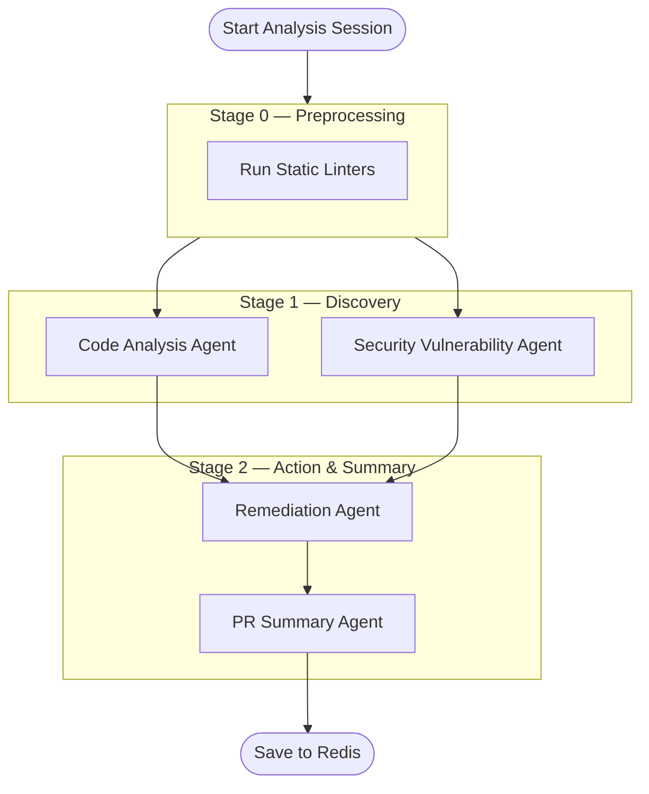

# System Design

# Agent Contracts & Orchestration

This document maps out the inputs, outputs, and responsibilities of the LangGraph multi-agent pipeline. Each agent is designed to run sequentially or in parallel, adhering strictly to the Pydantic data contracts defined in `app/models/findings.py`.

## 1. Code Analysis Agent

- **Input:** Source Code + Language Context + Linter Output (Pylint/Radon/PMD)
- **Output:** `CodeAnalysisResult` (containing a list of `CodeSmell`s and a `ComplexityScore`)
- **Responsibilities:** 
  - Structural review and static analysis.
  - Detect code smells, cyclomatic complexity issues, design anti-patterns, and bad practices.
  - Uses `qwen2.5-coder:7b` for fast, logic-focused reasoning.
- **Out of Scope:** It does not flag security vulnerabilities or rewrite code.

## 2. Security Vulnerability Agent

- **Input:** Source Code + RAG Knowledge Base Context + Linter Output (Bandit/Semgrep)
- **Output:** `SecurityAnalysisResult` (containing a list of `SecurityVulnerability`s)
- **Responsibilities:** 
  - Detect OWASP Top 10 vulnerabilities (SQLi, XSS, CSRF, broken auth, hardcoded secrets, etc).
  - Ground its findings using ChromaDB RAG retrieval (e.g. citing CWE IDs and OWASP categories).
  - Determine exploitability confidence and severity.
  - Uses `codestral` due to its superior security and reasoning capabilities.

## 3. Remediation Agent

- **Input:** All previous findings (`CodeAnalysisResult` + `SecurityAnalysisResult`) + Source Code + RAG Context
- **Output:** `RemediationResult` (a list of `Remediation` objects)
- **Responsibilities:**
  - Provide actionable, precise fixes for every flagged code smell and vulnerability.
  - Generate actual `corrected_code` snippets/diffs.
  - Estimate the refactoring effort (low/medium/high).
  - Explain the fix using secure-coding best practices.

## 4. PR Summary Agent

- **Input:** `FullAnalysisResult` (containing all enriched findings and remediations)
- **Output:** `PRSummaryResult`
- **Responsibilities:**
  - Act as the "Lead Reviewer".
  - Synthesize a comprehensive PR markdown review.
  - Calculate the final `security_score` and `composite_risk_score`.
  - Provide an `Approve` or `Request Changes` signal based on critical findings.
  - It does not generate new findings; it only summarizes.

## Pipeline Orchestration (LangGraph Flow)




# Data Models

Canonical shapes shared across the backend, frontend, and all AI Agents. These models are strictly enforced via Pydantic in `app/models/`.

## 1. Submission & Session Lifecycle (`app/models/session.py`)

### `CodeSubmissionRequest`
The payload sent by the frontend when pasting code or uploading a file.
```yaml
CodeSubmissionRequest:
  code: str          # Raw source code
  language: enum     # "python" | "java" | "auto"
  filename: str?     # Optional file name
```

### `SubmissionResponse`
Returned immediately upon a valid submission, initiating the async session.
```yaml
SubmissionResponse:
  session_id: str (uuid)
  status: enum       # "queued" | "running" | "completed" | "failed"
  language: enum
  lines_of_code: int
  estimated_seconds: int
```

### `TaskStatusResponse`
Polled by the frontend to render the progress stepper.
```yaml
TaskStatusResponse:
  session_id: str
  status: enum
  progress_pct: int (0-100)
  current_stage: str?
  error_message: str?
```

## 2. Findings & Outputs (`app/models/findings.py`)

### `CodeSmell`
Produced by the Code Analysis Agent.
```yaml
CodeSmell:
  id: str (uuid)
  category: str      # e.g., "Complexity", "Maintainability"
  severity: enum     # "critical" | "high" | "medium" | "low" | "informational"
  line_start: int?
  line_end: int?
  description: str
  snippet: str?
  suggestion: str?
```

### `SecurityVulnerability`
Produced by the Security Vulnerability Agent.
```yaml
SecurityVulnerability:
  id: str (uuid)
  owasp_category: enum # e.g., "A03:2021 - Injection"
  cwe_id: str?         # e.g., "CWE-89"
  severity: enum
  cvss_score: float?
  line: int?
  title: str?
  description: str
  evidence: str?
  confidence: enum     # "high" | "medium" | "low"
  tool_source: str?    # "bandit" | "semgrep" | "llm"
```

### `Remediation`
Produced by the Remediation Agent, linking a fix to a specific finding.
```yaml
Remediation:
  finding_id: str      # Maps to CodeSmell.id or SecurityVulnerability.id
  recommendation: str
  corrected_code: str? # The actual diff or fixed snippet
  explanation: str
  references: str[]    # RAG chunks or external URLs
  effort: enum         # "low" | "medium" | "high"
```

### `PRSummaryResult`
Produced by the PR Summary Agent.
```yaml
PRSummaryResult:
  overall_risk: enum   # "CRITICAL" | "HIGH" | "MEDIUM" | "LOW" | "CLEAN"
  security_score: int  # 0-100
  quality_score: int   # 0-100
  total_findings: int
  markdown_review: str # Human-readable PR comment block
  remediation_priority_list: str[]
  approved: bool
```

### `FullAnalysisResult`
The final payload aggregated by LangGraph and cached in Redis.
```yaml
FullAnalysisResult:
  session_id: str
  language: str
  code_analysis: CodeAnalysisResult?
  security_analysis: SecurityAnalysisResult?
  remediation: RemediationResult?
  pr_summary: PRSummaryResult?
```


